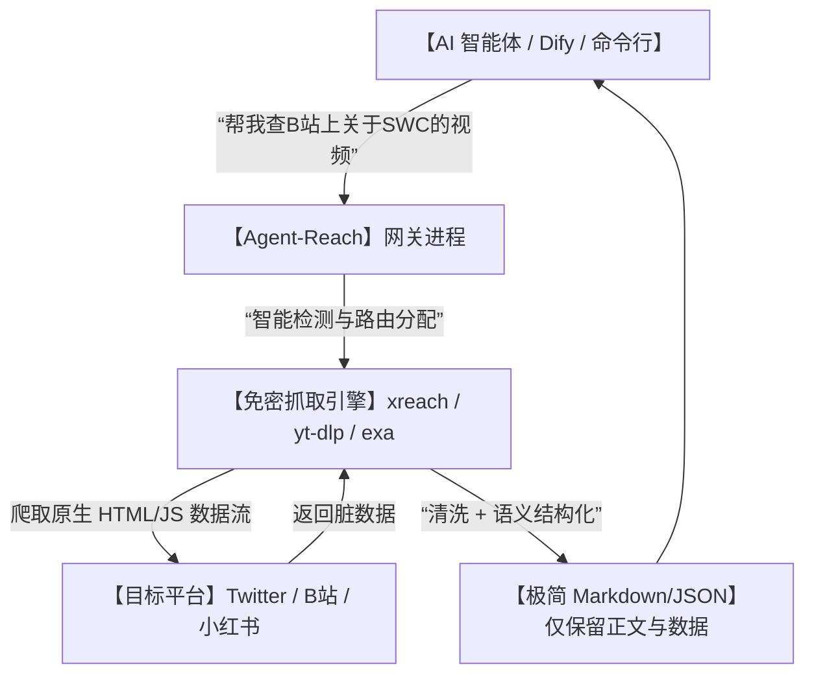

# 🚀给AI插上“黄金眼”！开源 Agent-Reach 让智能体免 API 费狂扫 Twitter、B站和红小书！

## 赛博信息茧房：为什么你的 AI 助手一联网，就被各种 API 限制卡成“残疾人”？


每个想自己手搓 AI Agent（智能体）、自动化情报分析仪或者竞品监控器的开发者，在第一步都会遭遇迎头痛击：

1. **“买路钱贵得像抢劫”**：为了让 AI 监控一下推特（X）上关于某个新开源项目的讨论，你去申请官方 API。一看价格，每个月基础版就要上百美刀，而且限制几百条请求，普通开发者根本用不起。
2. **“封闭生态的防火墙”**：小红书、B站、微博、Reddit 等平台，别说 API 极其难申请，就算你用普通的网页爬虫去抓，两三下就会被各种人脸验证码（Captcha）和 IP 封禁卡死，AI 瞬间变瞎子。
3. **“凌乱的数据清洗地狱”**：即便你历经千辛万苦写出了爬虫把网页抓了下来，网页里充斥着乱七八糟的广告代码、导航栏、CSS 样式，AI 读了半天抓不住重点，还白白浪费了一大堆 Token 钱。

**把 AI 锁在冷冰冰的离线预训练库里，不给它一双能实时洞察主流舆论的眼睛，它终究只是个“只会说好听话的复读机”！**

就在今天，GitHub 开源社区爆出了一款革命性的工具——**`Agent-Reach`**！

它用最纯粹的极简主义，帮所有开发者解决这个痛点：**不需要任何官方 API 密钥，也不需要给各大平台充钱，一行命令就能让你的 AI 拥有横跨 16 个全球主流社交平台、知识库的“黄金眼”！**

---

## 降维打击：大白话拆解，Agent-Reach 是怎么“白嫖”全网实时数据的？

很多人一听到“免 API 扫网”，第一反应就是：这不就是换壳爬虫吗？

其实，Agent-Reach 的架构设计非常高级，它并不是简单的网页抓取，而是定位为一个**“面向 AI 的语义重构智能路由”**。



我们用三个大白话核心概念，来彻底看清它的底层原理：

1. **“自适应智能引擎分配” (Smart Backend Routing)**
   当你让 Agent-Reach 去抓取一个 YouTube 视频的字幕、或者一条推特长推时，它会自动在后台调配最适合的开源套件（比如针对视频的 `yt-dlp`，针对社交媒体的 `xreach` 和 `exa` 搜索引擎）。它知道每家平台的防御机制是什么，自动帮你绕开坑洼，实现零门槛数据回流。
   
2. **“为 LLM 订制的语义清洗” (Markdown Reconstruct)**
   对于 AI 来说，直接读几万行的 HTML 代码无异于灾难。Agent-Reach 拿到数据后，会瞬间把无用标签全部剃光，只保留发布时间、作者、正文、点赞数，并重新排版成大模型最喜欢的极简 Markdown。这就像是把满是泥沙的河水过滤成了纯净水，直接喂给 AI 喝！
   
3. **“本地沙箱与隐私盾” (Local Cache & Privacy Shield)**
   所有抓取的账号 Cookie、历史缓存和本地会话信息，完全储存在你自己的电脑本地，不会上传给任何第三方。甚至它还内置了 `doctor`（医生）自检机制，当你无法连接某个平台时，一行命令就能自动检测是网络代理配置错了，还是对方的抓取接口升级了，极其省心。

---

## 零基础狂飙：手把手教你给 AI 装上“全网雷达”

Agent-Reach 的安装与运行极其简单，哪怕你是刚入门的编程小白，只要会复制粘贴，就能瞬间跑起来。

### 第一步：安装依赖库

在终端中运行以下一键安装命令：

```bash
# 1. 使用 pip 极速安装 Agent-Reach
pip install agent-reach

# 2. 运行一键配置检查，确保环境依赖（如 Chromium 和网络代理）正常
agent-reach doctor
```
*如果 `doctor` 指令有提示某些浏览器依赖缺失，它会直接给出类似 `playwright install` 的修复提示，照着运行即可。*

### 第二步：极简命令行测试（让 AI 睁眼看世界）

你可以直接在终端中，以人话的形式搜索任何主流平台的实时内容：

```bash
# 查询 Twitter/X 上关于 #ClaudeCode 的最新火热讨论
agent-reach search twitter "Claude Code" --limit 5

# 一键爬取小红书（XiaoHongShu）上关于“大理避坑指南”的热门笔记
agent-reach fetch xhs "https://www.xiaohongshu.com/explore/xxxxxx"
```

终端会瞬间吐出清晰、结构化的 Markdown 文本，包含了正文、点赞数和发布者！

### 第三步：集成进你的 Python AI 智能体

你可以把这个库作为 Tool 导入到你的 Python 脚本中，让 AI 真正学会自我检索：

```python
from agent_reach import AgentReachClient

client = AgentReachClient()

# 1. 让 AI 在做决策前，先去 B站 搜索一下最新的 AI 视频教程
video_info = client.search_platform(
    platform="bilibili",
    query="Agent-Reach 使用教程",
    count=3
)

# 2. 把清洗好的纯文本喂给你的大模型
prompt = f"请根据以下最新的B站视频搜索结果，总结 Agent-Reach 的最新功能：\n{video_info}"
# 接下来调用你的 OpenAI/Claude API 即可
```

---

## 玩出花来：Agent-Reach 的 3 个硬核实战场景

### 1. 24小时无人值守“全网竞品雷达”
你可以写一个极简脚本，让 Agent-Reach 每小时在 Twitter、小红书和 GitHub 上检索你的竞品词。一旦发现有人发帖吐槽竞品 Bug、或者有爆火的讨论，自动让 AI 撰写一份分析简报发到你的企业微信或飞书，让你瞬间掌握市场先机。

### 2. 零成本“全视频字幕 & 论文摘要提炼仪”
想白嫖一个上百分钟的 YouTube 视频或者 B站 长视频的核心内容？不用花钱买商业摘要工具。用 Agent-Reach 一键把视频的语音文案和元数据抓取下来，直接丢给大模型总结。一分钱不花，三秒钟提炼出长视频的干货脑图。

### 3. 出海私域“全网舆情监控与自动回复”
做海外业务最怕品牌出事。让 Agent-Reach 在后台实时扫描 Twitter 和 Reddit 上带有你品牌名字的话题。AI 检测到负面情绪发帖时，自动根据预设态度撰写安抚回复，并通过 OpenWA 或其他网关自动发送，将危机扼杀在萌芽状态。

---

## 价值提示词：全网社交舆情提炼专家提示词

有了 Agent-Reach 提供的结构化 Markdown 数据，你可以配合这套**“全网社交舆情黄金提炼提示词”**，让 AI 瞬间变身顶尖的情报分析官：

```markdown
# Role: 全网社交网络情报专家 (Social Intelligence Analyst)

## Context:
我使用 Agent-Reach 网关抓取了一批来自 Twitter、小红书和 Reddit 关于指定话题的原始 Markdown 数据。我需要你从中提炼出网民的真实痛点、情绪倾向和传播核心。

## Analysis Process:
1. **情绪光谱分析 (Sentiment Spectrum)**:
   - 统计抓取数据中，正面、中立、负面评论的比例。
   - 提取负面评论中频次最高的前 3 个核心吐槽点（如“Bug太多”、“价格贵”）。
2. **KOL/关键传播节点识别**:
   - 找出点赞数、转发数最高的“明星贴”，分析其观点为什么能引发病毒式传播。
3. **行动策略推演 (Actionable Insights)**:
   - 基于舆情走向，给出 3 个针对性的公关建议、或者产品功能迭代方向。

## Output Format:
- **舆情温度计**: 表格形式列出各平台用户对该话题的情绪打分。
- **用户痛点排雷**: 详细描述最核心的 3 个用户诉求。
- **下阶段攻坚方案**: 一句话总结你的核心行动建议。
```

---

## 多角度辩证分析：它真的很完美吗？

任何利用抓取技术的工具，在带来极高自由度的同时，也伴随着天然的约束：

| 维度 | 优势（极速爽快） | 局限（避坑指南） |
| :--- | :--- | :--- |
| **数据成本** | **绝对的 0 元**。彻底省去了动辄几百美元的官方 API 账单，无门槛起飞。 | 因为不是官方通道，当各大平台修改前端页面结构时，底层的抓取脚本可能会短暂失效，需要等待项目更新。 |
| **集成门槛** | **极度舒适**。提供 CLI 和 SDK，三行代码无缝对接 Dify、FastGPT 等主流 agent 框架。 | 高频、大规模抓取时，容易触发目标平台的 IP 封禁，必须在后台配置代理 IP 池（Proxy Pool）来轮询。 |
| **数据质量** | **高保真**。自动过滤广告和多余的布局代码，只给 AI 留最纯粹的结构化正文。 | 无法抓取需要深度登录、或者带有强力人机验证码（滑块验证）的保密数据。 |

**总结一句话**：Agent-Reach 是给 AI 接入真实世界实时信息的一把“万能钥匙”。它不光为小微开发者省下了数额不菲的 API 账单，更用极简的 Markdown 重构方案，让 AI 的思考逻辑第一次与这个真实的赛博世界同频共振！

--- 
> 别再让你的 AI 在信息盲区里瞎猜了，赶紧给它装上 Agent-Reach，让它出去“看看世界”吧！
