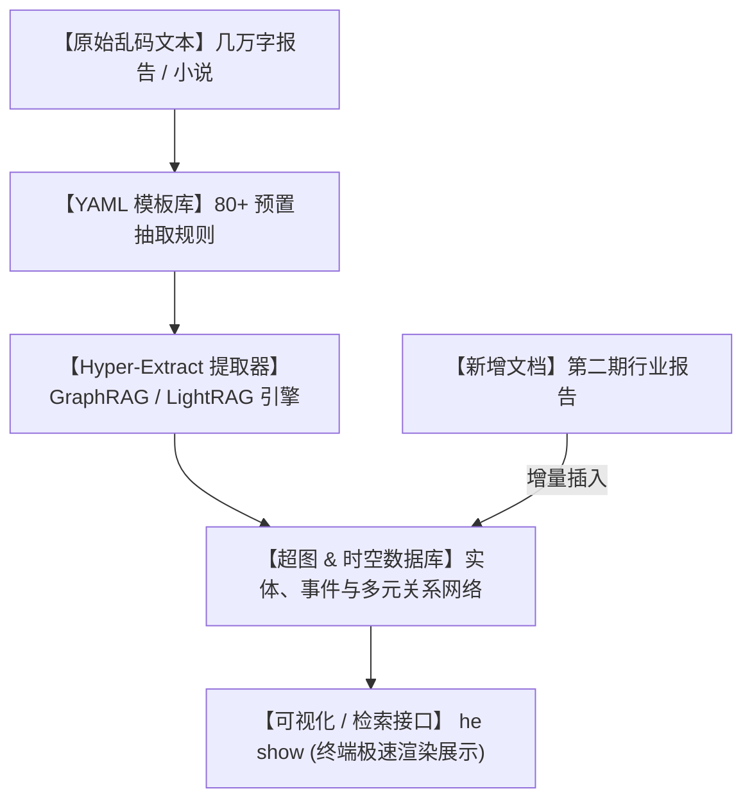

# 🚀一键提取知识图谱！爆火的 Hyper-Extract，把乱七八糟的文档直接变成“赛博外脑”！

## 传统 RAG 之痛：为什么丢给 AI 一整本电子书，它给你的回答却总是丢三落四？


在建设企业本地知识库、RAG（检索增强生成）或者个人知识系统时，大家都会遇到一个共同的痛点：

1. **“瞎子摸象式检索”**：你问 AI：“这个项目的底层架构里，A 模块是怎么通过 B 接口影响 C 数据的？”。传统的 RAG 会把文档切成无数个碎片。AI 只拿到了包含 A 和 B 的碎片，却弄丢了 C 的上下文，给你的回答永远是支离破碎的。
2. **“复杂关系连线难”**：读一本复杂的长篇小说或商业调查，里面有上百个人物、复杂的股权纠葛和时间线。只用文字记录，大模型根本理不清谁是谁的子公司，谁跟谁又有不可告人的交易。
3. **“清洗与建模的头发地狱”**：为了建一个知识图谱，你得去写复杂的 Python 代码，手动去定义什么是实体（Entity）、什么是三元组（Triples），还要折腾 Neo4j 数据库。前前后后倒腾一个星期，最后发现还不如自己人肉画图来得快。

**让 AI 像看废纸堆一样去死记硬背非结构化文本，无异于缘木求鱼！真正的高智商大脑，在记忆知识时，全都是以“逻辑网络”的形式在大脑皮层铺开的！**

就在今天，GitHub 开源社区爆红的神器 **`Hyper-Extract`** 彻底解决了这个大难题！

它是一个**大模型驱动的、零代码、一键式非结构化文本结构化提取引擎**。

它能用极速的性能，把你手头乱七八糟的文档，瞬间提炼成连线精密的**“超图（Hypergraph）”与“时空轨迹图谱”**！

---

## 降维打击：大白话拆解，Hyper-Extract 是怎么一键榨干文档干货的？

许多人觉得，做个图谱提取有啥难的？不就是让 ChatGPT 写几句 JSON 格式输出吗？

Hyper-Extract 的精妙之处，在于它把复杂的图谱提取逻辑，包装成了一个极其简单且支持**“增量进化”**的系统：



我们可以用三个“大白话”概念来理解 Hyper-Extract 的底层架构：

1. **“打破二元连线的‘超图’ (Hypergraph)”**
   传统的知识图谱只能做“二元关系”连接（比如：张三 —是— 李四的爸爸）。但在真实世界里，关系往往是多元且复杂的（比如：张三、李四和王五在 2026 年共同成立了 A 公司，且控股比例不同）。Hyper-Extract 引入了“超图”和“时空图谱”技术，一个节点可以同时连结多个实体，把时间、空间和事件关系像拧麻花一样牢牢拧在一起，信息还原度高达 100%！
   
2. **“开箱即用的 80+ YAML 模板” (Zero-code Schema Template)**
   你不需要懂任何算法知识。项目内置了涵盖金融审计、法律诉讼、医疗诊断、人物传记等 80 多个领域的结构模板。你只需要告诉它：“我给你一份病历，请用医疗模板提取。”它就会像一个资深医生一样，精准把病历里的“症状”、“药方”、“检查指标”分门别类挑出来，自动织成网。
   
3. **“滚雪球式的增量演进” (Incremental Evolution)**
   普通的提取器每次加新文档，都得把以前所有的文档合在一起重新解析，费时又费钱。而 Hyper-Extract 支持增量更新。你可以今天塞给它一章小说，明天塞给它第二章，它会自动把新人物和旧网络进行合并，让你的本地外脑“像滚雪球一样”自己长大！

---

## 零基础上手：手把手用一行命令搭建你的“赛博外脑”

得益于目前最火的 Python 管理工具 `uv`，你可以在 1 分钟内把 Hyper-Extract 跑起来。

### 第一步：一键全局安装

在终端中运行：

```bash
# 使用 uv 一键全局安装命令行工具（也支持普通的 pip install hyperextract）
uv tool install hyperextract
```

### 第二步：配置你的大模型 API 密钥

Hyper-Extract 需要大模型来理解文本的语义，你可以使用 OpenAI、Claude 或者国内的各种大模型 API：

```bash
# 配置你的 API Key 和基础 URL（以 Windows/Mac 终端为例）
export OPENAI_API_KEY="your-api-key-here"
export OPENAI_BASE_URL="https://api.openai.com/v1"
```

### 第三步：一键运行提取与可视化

假设你有一个名为 `sushi.md` 的人物自传，你想把他的关系网提炼出来并可视化展示：

```bash
# 1. 运行提取命令（使用人物关系图谱模板，指定中文输出）
he examples/zh/sushi.md -t general/biography_graph -o ./output/ -l zh

# 2. 对着刚刚生成的知识库进行智能检索
he search ./output/ "苏轼在黄州期间写了哪些代表作？"

# 3. 极其震撼的可视化展示（在浏览器或终端里直接画出拓扑网络）
he show ./output/
```

运行 `he show` 后，你会看到屏幕上弹出一个极其精致的关系网大屏。每一个节点都是一个人名或地点，鼠标悬浮上去，就能看清他们之间的爱恨情仇！

---

## 玩出花来：Hyper-Extract 的 3 个硬核实战场景

### 1. 瞬间理清复杂案件的“刑侦追踪仪”
律师或刑警在面对几百页的案件卷宗、笔录和聊天记录时。直接用 Hyper-Extract 运行“法律诉讼”模板。系统会以秒级的速度，在时空图谱上画出“张三在几点几分出现在了什么地方，与谁通了电话，产生了什么账目往来”，让所有犯罪嫌疑人的蛛丝马迹一目了然。

### 2. 读透几百页招股书与财报的“投研神器”
投资经理需要分析一家公司的股权结构、关联交易和上下游供应商。把多份招股书和年度财报一股脑丢给 Hyper-Extract，它能瞬间剔除无用的排版和官话，自动勾勒出包含“股东、子公司、代持人、空壳公司、资金流向”在内的巨型超图，帮你一眼看穿暴雷风险。

### 3. 打造“永不遗忘”的个人第二大脑
把你多年来随手写的笔记、日记、看过的文章全部导入到一个文件夹里，让 Hyper-Extract 在后台默默对它们进行语义关联。时间久了，你的电脑里就会长出一个由你自己的思想和经历织成的“神经网络图谱”，当你想回忆某个多年前的点子时，轻轻一查，所有关联的记忆节点瞬间被全部唤醒。

---

## 价值提示词：电影级多元超图关系提取提示词

如果你想让你的 AI 助手在平时聊天时，也能以 Hyper-Extract 的超图模式去分析一段话的复杂人物关系，你可以把这套**“超图语义抽取提示词”**塞给它：

```markdown
# Role: Hyper-Extract 多元关系超图构建器 (Hypergraph Knowledge Builder)

## Context:
我需要你扮演一个高精度知识提炼引擎。你的目标是从我给出的非结构化文本中，提取出实体（Entities）和多元超边（Hyperedges，即连接两个以上实体的复杂关系）。

## Extraction Rules:
1. **实体识别 (Nodes)**:
   - 提取 [人物]、[组织]、[地点]、[时间节点]、[关键事件] 并定性。
2. **多元超关系构建 (Hyperedges)**:
   - 拒绝简单的 A 连 B。必须构建“多元关联组”（例如：`[事件E1]: 成员{张三, 李四} 于 {2026年6月} 在 {北京} 共同参与了 {项目开发}`）。
3. **时空线索锚定 (Spatio-Temporal Anchoring)**:
   - 每一个关系必须尽可能绑定明确的 [时间戳] 和 [物理坐标]。

## Output Format:
请用如下 Markdown 结构输出提取结果：
- **Entities**:
  - `[ID]: [名称] ([类型])`
- **Hyperedges**:
  - `[关系ID]: {实体列表} - 关联属性: [描述]`
```

---

## 辩证分析：Hyper-Extract 的硬币两面

尽管 Hyper-Extract 被誉为大模型时代的“知识炼金术”，但在实际落地时也伴随着成本的制约：

| 维度 | 优势（极速爽快） | 局限（避坑指南） |
| :--- | :--- | :--- |
| **知识还原度** | **满分**。引入超图和时空概念，还原了真实世界里错综复杂的网状逻辑，检索准确度远超切片 RAG。 | 对大模型的“推理能力”要求极高。如果使用性能较差的便宜小模型，抽取的实体和关系网会出现大量重复和断链。 |
| **集成门槛** | **极度舒适**。内置 80+ 常用模板，开箱即用，支持增量演进，不需要繁琐的本地数据库配置。 | **Token 账单高昂**。由于需要对全文进行深度语义解析和多次 Prompt 提问，处理超大文档（如整本书）时，API 消费会比较显著。 |
| **可视化体验** | 极佳。`he show` 提供了极具冲击力的前端图谱展示，让数据流动一目了然。 | 如果提取出的节点过多（如几万个实体），关系网络图会变成密密麻麻的“大毛线球”，需要配合子图筛选。 |

**总结一句话**：Hyper-Extract 带领我们迈出了大模型知识库的下一阶段——**从“死记硬背文本切片”走向“构建语义逻辑超图”**。它是每一个独立开发者、科研人员和数据分析师榨干海量文档信息差的终极武器！

--- 
> 别再对着几万字的文档犯愁了，赶紧装上 Hyper-Extract，去看看你的数据里藏着什么交错的关系吧！
 
 
