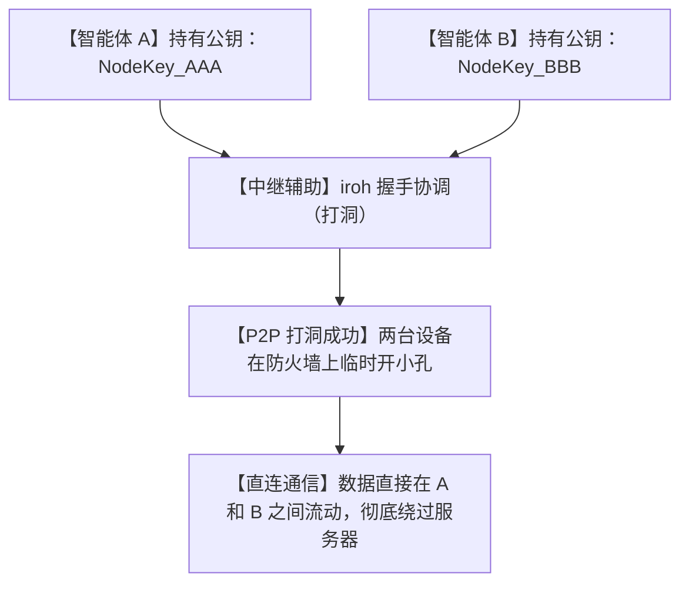

# 🌐IP 经常变？今天爆红的 iroh 彻底封神，让你的 AI 智能体隔墙实现 P2P 连麦！

## 网络深渊：为什么想让两个 AI 智能体“说句悄悄话”会这么难？


在多智能体（Multi-Agent）大行其道的今天，我们常常构想着这样的未来：你手机上的“私人助理 Agent”可以和家里电脑上的“代码专家 Agent”协同工作，一起帮你改代码。

但只要你开始动手写代码连接它们，你就会撞上一堵坚不可摧的“网络防盗门”：
1. **“动态 IP 折磨”**：家里宽带的公网 IP 每天都在变，只要路由器一重启，你的智能体就找不到对方了。
2. **“NAT 防火墙阻隔”**：公司局域网、学校校园网或者家里的路由器都带有严苛的 NAT 防火墙。你的两个智能体分属于不同的网络，根本无法直接连上。
3. **“内网穿透的沉重成本”**：为了打通网络，你不得不去折腾 FRP、花生壳或者搭建中转服务器。不仅速度慢，而且还要持续花钱租带宽。

**这合理吗？这不合理！** 智能体之间明明都连着互联网，为什么非要经过一个“昂贵且脆弱”的中心化服务器做传话筒？

今天在 GitHub 疯狂飙升的 **`iroh`** 项目彻底打破了这个宿命！它向全世界宣告：**网络不应该是围绕“IP地址”建起来的，而应该围绕“身份密钥”来建！**

---

## 降维打击：大白话拆解，iroh 是怎么实现“无视 IP 强力穿墙”的？

iroh 的底层网络革命，其实就像是**“用电话号码代替家庭住址”**。



我们可以用三个“人话”概念来理解 iroh 的穿墙神技：

1. **“拨打加密电话”（Cryptographic Dialing）**
   在 iroh 的世界里，设备没有 IP 地址，只有“公钥（PublicKey）”。这就像是你找人不需要知道他现在住在哪条街哪个房间（动态 IP），只要知道他的电话号码（公钥）直接拨过去就行。不管他是在家里、公司还是咖啡馆，哪怕他刚上了火车（网络切换），电话线依然能死死锁住他！

2. **“神级自动打洞”（ Hole Punching）**
   两台处于内网的设备无法直接建立连接，因为防火墙会拦住不请自来的流量。iroh 会利用巧妙的 UDP 打洞技术（STUN/TURN 机制），让两台设备同时向外发送一个特制的探测包，在各自的防火墙上“震出一个小孔”，在一瞬间实现两端直连！

3. **“模块化缝合” (Modular P2P Components)**
   它不是一整个笨重的框架，而是把 P2P 通信拆成了极其精细的积木：iroh-net（负责穿墙连线）、iroh-blobs（负责超高速文件传输）、iroh-gossip（负责多智能体广播消息）。你需要什么，直接拿去拼装即可。

---

## 零基础狂飙：手把手教你搭建 P2P 智能体通道

iroh 采用高性能的 Rust 开发，但也提供了极度好用的多种语言 SDK。我们以纯 Rust/命令行来体验它的极速连接。

### 第一步：安装准备

```bash
# 1. 克隆 iroh 官方仓库
git clone https://github.com/n0-computer/iroh.git

# 2. 进入项目并编译核心工具
cd iroh
cargo build --release
```

### 第二步：启动第一个节点（你的“代码专家”智能体）

运行以下命令启动一个节点，它会给你生成一个专属的 Node ID（公钥）：

```bash
# 启动 iroh 节点服务
./target/release/iroh start
```
*在输出的日志中，你会看到一行类似：`Node ID: a1b2c3d4e5...` 的长字符串。这就是这个智能体在宇宙中的唯一电话号码！*

### 第三步：让第二个节点（你的“私人助手机器人”）连过来！

在另一台电脑（哪怕是在隔壁办公室的内网环境中），运行以下命令直接拨号：

```bash
# 直接拨号连接到 Node A，不需要知道它的 IP！
./target/release/iroh connect a1b2c3d4e5...
```
*你会看到绿色的连接成功提示。现在，两个智能体已经处于绝对安全的 P2P 加密隧道中，数据开始疯狂对飙！*

---

## 玩出花来：iroh 的 3 个高频实战场景

### 1. 全球分布式的“多智能体圆桌会议”
你写了 5 个不同功能的 Agent 跑在不同的服务器上：一个在 AWS，一个在腾讯云，一个在你的 MacBook，一个在朋友的 Windows 电脑，还有一个在客厅的树莓派。利用 iroh-gossip 广播模块，你可以把它们拉入同一个 P2P 局域网。它们像围坐在圆桌前开会一样，直接进行 P2P 的协同规划与指令派发。

### 2. 跨设备的超高速 AI 模型权重分发
你的模型在云端训练好了，有 20G，想分发给本地的各个终端运行。用传统的 HTTP 慢得像蜗牛。iroh-blobs 模块采用 P2P 块状传输协议，节点之间可以互相分流下载，下载的人越多速度越快，瞬间把全网带宽压榨到极限！

### 3. 去中心化离线协作加密聊天软件
不想让任何大厂偷看你们的聊天记录？用 iroh 几行代码就能写出一个聊天室。所有消息都通过 Noise 加密协议直接在你们两台电脑之间点对点发送，不经过任何第三方服务器，真正实现“天知地知你知我知”。

---

## 价值千金：P2P 智能体网络路由提示词

如果你想让 AI 帮你用纯 Rust 或 Python 编写一个基于 iroh 的 P2P 智能体消息分发服务器，我为你准备了这套**“P2P 智能体路由专家提示词”**：

```markdown
# Role: P2P 智能体网络架构师

# Task:
请使用 Rust (依赖 iroh-net 和 tokio) 编写一段用于两个分布式 AI 智能体之间进行 P2P 消息收发（发送和接收聊天 Prompt 及回答）的极简代码框架。

# Requirements:
1. **Endpoint Initialization**: 使用 `iroh_net::endpoint::Endpoint` 库初始化本地连接端点，并生成自签名证书。
2. **Node ID Retrieval**: 代码启动时，在控制台打印本地节点的唯一公钥（Node ID）。
3. **P2P Connection**: 编写一个监听循环，能够接受外来的连接，并读取对方发来的 UTF-8 编码的 Prompt 文本。
4. **Active Dialing**: 编写一个发起连接函数，根据输入的对方 Node ID 拨号并建立安全的 QUIC 流通道，向其发送指令并接收返回的 Stream 回复。
5. **Code Style**: 关键的连接握手（Handshake）、打洞逻辑以及 Stream 读写处，必须附上详细的中文技术注释。
```

---

## 多角度辩证分析：它真的很完美吗？

| 维度 | 优势（这很强） | 局限（别神化） |
| :--- | :--- | :--- |
| **穿透能力** | **神级水准**。采用先進的打洞技術，90% 以上的家庭/办公防火墙能直接打通。 | 如果两端都处于极其严苛的对称型 NAT（Symmetric NAT）防火墙后，依然无法打洞，只能依靠中继节点转发。 |
| **安全性** | **绝对加密**。每一包数据都经过端到端的密码学签名和加密，免受中间人攻击。 | 无法防止物理层面的侧信道监听；如果你的 Node Key 泄漏，别人就能冒充你的节点连接你的网络。 |
| **网络开销** | **极低耗损**。基于 QUIC 协议，握手极快，在弱网和丢包环境下表现极其顽强。 | 在最初的打洞和握手阶段，需要短暂借助公共中继节点（DERP），中继节点的稳定决定了首连速度。 |

**总结一句话**：iroh 为未来的“去中心化多智能体社会”铺平了最底层的网络高速公路。它让你从繁琐的 IP 维护、防火墙配置中彻底解脱出来，真正专注于智能体本身的业务逻辑。

不要再当个被动态 IP 牵着鼻子走的网络管理员了，配置起 iroh，感受真正的“无界 P2P 智能体连麦”吧！
