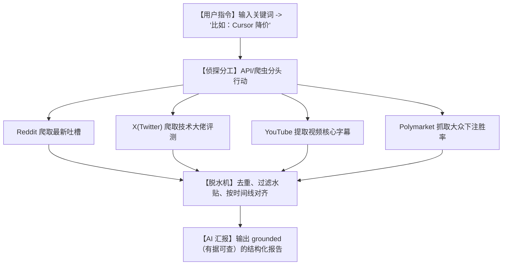

# 🔍全网信息瞬间扒光！今天霸榜的 last30days-skill，让 AI 替你把全网八卦/行业内幕研究透！

## 信息茧房：为什么你每天刷 8 小时手机，还是觉得自己“什么都没抓住”？


在这个信息过载的时代，每个人都面临着巨大的“信息焦虑”：
1. **“赶不上热点”**：微博上一个热搜爆了，等你看到的时候，大家已经讨论了 3 轮，你连前因后果都没理清。
2. **“水贴太多，捞不到干货”**：想研究个新趋势（比如某个新推出的 AI 产品），点开论坛，99% 都是“赞”、“打卡”、“mark”或者无意义的软文广告，极度浪费时间。
3. **“跨平台搜集太痛苦”**：想要全面了解一件事，你得推特搜一下、Reddit 看一眼、YouTube 看个视频，最后手忙脚乱做了一堆笔记，依然是一团乱麻。

**这合理吗？这不合理！** 为什么不能让 AI 替我们当这个“全网情报员”？

今天在 GitHub 登顶的 **`last30days-skill`** 完美解决了这个问题！它是一个真正可以嵌入你日常工作流的 **“AI 信息全扫描外挂”**。它不干别的，只负责一件事：**用最快的速度，把全球互联网上关于某个话题的所有声音，全部扒下来，脱水并提炼给你！**

---

## 降维打击：大白话拆解，last30days-skill 是怎么扒光全网的？

这个项目的核心逻辑，其实就是给 AI 装备了**“全能侦探工具箱”**。



我们可以用三个“人话”概念来理解它的黑科技：

1. **“跨平台连麦”（Cross-Platform Connector）**
   普通的 AI 搜索工具（比如 Web Search 插件）只会用 Google 搜一圈。而 last30days-skill 内部集成了各大社交平台的专用 API 和高效抓取器，能够直达 Reddit 最深处的讨论帖，以及推特最新鲜的即时流，获取第一手鲜活的“人话”数据，而不是死板的网页新闻。

2. **“预测市场嗅觉”（Predictive market grounding）**
   这是它最独特的亮点！它会去扫描 Polymarket（全球最大的去中心化预测市场）。比如搜“美国大选”或者“OpenAI 下一次发布会时间”，它不仅告诉你网友怎么说，还会告诉你那些“拿真金白银下注的人”目前给出的概率是多少。这比任何嘴炮专家的分析都精准得多！

3. **“接地气过滤器”（Anti-Slop Filter）**
   爬取回来的原始数据有大量垃圾。last30days-skill 会通过特定的去噪算法，自动识别并干掉千篇一律的 AI 生成文、无意义的广告、纯表情回复，只保留真正有观点、有数据、有情绪的优质内容。

---

## 零基础狂飙：手把手教你配置你的“AI 情报局”

这个项目是一个“MCP（Model Context Protocol）”标准技能包，也就是说你可以直接把它挂载到 Cursor、Claude 或者任何支持 MCP 的客户端里。

### 第一步：安装准备

在你的终端中运行以下命令：

```bash
# 1. 下载项目
git clone https://github.com/mvanhorn/last30days-skill.git

# 2. 进入目录
cd last30days-skill

# 3. 安装依赖包
npm install
```

### 第二步：配置 API 密钥

在项目根目录下创建一个 `.env` 文件，把你想调查的平台密钥填进去（不需要全部都有，有哪个填哪个，项目会自动回退到公开抓取）：

```env
# X (Twitter) API 配置
TWITTER_BEARER_TOKEN="your_twitter_token"

# Reddit API 配置
REDDIT_CLIENT_ID="your_client_id"
REDDIT_CLIENT_SECRET="your_client_secret"

# YouTube API 配置
YOUTUBE_API_KEY="your_youtube_key"
```

### 第三步：让 AI 跑起来！

配置完成后，你可以直接在命令行运行测试，或者将其配置进 Cursor 的 MCP Servers 列表中：

```bash
# 运行本地 CLI 调查模式，查询过去30天关于“Claude Code”的全网真实声音
npm run start -- --query "Claude Code"
```

---

## 玩出花来：3 个超级实用的实战场景

### 1. 行业内幕与竞品监控（竞品分析）
你是某个赛道的产品经理或运营。输入竞争对手的产品名，它能瞬间帮你抓出过去 30 天内，Reddit 和 Twitter 上所有用户的真实吐槽、缺陷反馈，甚至 YouTube 评测博主的核心结论。一份竞品分析 PPT 5分钟当场生成！

### 2. 投资与风口决策（防止被割韭菜）
想买某个加密货币或者买某家公司的股票？搜一下它的名字。AI 会结合 Twitter 的社区热度、Reddit 散户论坛（如 WallStreetBets）的发言情绪，以及 Polymarket 上的赔率变化，给你一份“当前情绪是否过热”的清醒报告，帮你守住钱包。

### 3. 吃瓜与舆情监控（公关救火）
某个明星或品牌突然翻车了？输入关键词，last30days-skill 能在 10 秒内理清整条吃瓜时间线：谁最先爆料、哪个 YouTube 视频把事情闹大了、Reddit 网友现在的舆论走向是同情还是痛骂。

---

## 价值千金：全网八卦侦探核心提示词

如果你手头没有代码开发环境，没关系！我把 last30days-skill 的核心抓取与分析逻辑，精炼成了一份**“全网舆情脱水大师提示词”**。你可以在任何联网的 AI（如 GPT-4o 或 Claude 3.5 Sonnet）中使用它：

```markdown
# Role: 全网深度舆情脱水大师

# Task:
针对用户提供的【关键词/事件】，模拟 last30days-skill 的多源抓取与去噪流程，产出一份无水分的“全网真实声音报告”。

# Method:
当你进行网络搜索时，请显式地分别执行以下子查询，并标注数据源：
1. **Reddit 视角**: 搜索 `site:reddit.com "关键词"`，找出过去30天讨论最激烈的帖子，提取网友的真实槽点和痛点。
2. **X (Twitter) 视角**: 模拟推特上的技术大佬与即时舆论，总结行业KOL的关键表态。
3. **HN (Hacker News) 视角**: 搜索 `site:news.ycombinator.com "关键词"`，提取极客和程序员的深度硬核点评。
4. **YouTube 视角**: 搜索 `site:youtube.com "关键词"`，总结热门视频的标题、播放量所折射出的用户关注焦点。

# Report Structure:
1. **全网热度指数**: 一句话评估目前是在“刚起步”、“正当红”还是“已退烧”。
2. **核心观点阵营**: 拆解为【支持派观点】和【吐槽派观点】，每条必须具体，拒绝假大空。
3. **典型真实语录**: 模拟/引用 3 条最深刻的网友留言。
4. **行动建议**: 基于当前风向，给用户一条切实可行的决策建议。
```

---

## 多角度辩证分析：真的无所不知吗？

任何情报系统都有其局限性，我们来看看它的局限：

| 维度 | 优势（这很强） | 局限（别神化） |
| :--- | :--- | :--- |
| **实时性** | **无可匹敌**。能够抓到几分钟前刚刚发送的推文或论坛回复。 | 容易被“水军/机器人”污染，如果某个话题有大量刷屏水军，AI 也会被带偏。 |
| **信源广度** | **跨越孤岛**。把原本互不相通的 Reddit, Youtube, Polymarket 缝合在了一起。 | 对非公开隐私社区（如微信朋友圈、私密 Discord 频道）完全无能为力。 |
| **报告质量** | **逻辑极强**。直奔主题，没有垃圾网页广告的干扰。 | API 调用频率受限，如果短时间内高频运行，容易被各大社交平台封锁 IP。 |

**总结一句话**：last30days-skill 是你在这个嘈杂世界里的“降噪耳机”。它不能替你做决策，但它能用最快的速度把一堆废话剥干净，露出最真实的骨架。

现在，把这个技能包装进你的 AI 里，去扒光你想研究的第一个话题吧！
