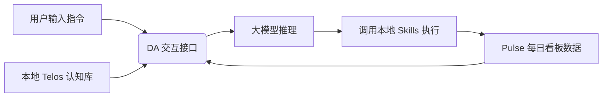

# 打造你专属的“赛博第二分身”！今天登顶的 PAI 框架，把你的灵魂装进大模型！

## 赛博孤独的解药：为什么大模型满天飞，却没有一个“真正懂你”的助理？


在多模态大模型和 AI 智能体满街跑的今天，你肯定也发现了这样一个尴尬的现实：

1. **“每次聊天都是最熟悉的陌生人”**：不管你给 AI 喂了多少背景，只要你一开新对话，它就又变成了一个只会公事公办、客套寒暄的“大百科全书”。你的性格特点、你当下的核心项目目标、你的生活偏好，它统统不知道。
2. **“大模型的回答越来越像套话”**：千篇一律的官方模板，没有个性的语气词。你是在跟一个庞大的冷冰冰的算法堆栈（LLM Stack）对话，而不是在跟一个“活生生的助手”合作。
3. **“碎片化的工具无法融会贯通”**：你用这个网页跑一下搜索，用那个命令行跑一下脚本，你的数据散落在全网，你的 AI 甚至不知道你昨天完成了什么核心工作。

**我们不需要一个更聪明的“维基百科”，我们需要一个懂我们的“赛博分身”。**

今天，GitHub Trending 榜单上彻底爆火了一个叫 **Personal AI Infrastructure (PAI)** 的项目，狂割近万星！

它的核心概念直击灵魂：**这不仅仅是一个大模型包装，而是一个运行在你本地的“个人 AI 操作系统”。它通过注入你独一无二的“Telos（终极目标与身份认知）”，把你的性格、习惯和目标全部数字化，从而打造一个拥有你灵魂的“赛博第二分身”！**

---

## 学生也能懂的大白话拆解：PAI 是怎么把你的“灵魂”装进大模型的？

我们用最直观的大白话来拆解 PAI。

普通的大模型就像是**一个从不记人脸的顶级医生**。
他虽然医术通天，但你每次去看病，他都得问一遍“你叫什么、哪里不舒服”，效率极低，而且态度极其冷漠。

而 **PAI 就像是你的“私人家庭医生 + 挚友”**：

* **Telos（灵魂核心）**：它在本地维护着一堆由你亲自填写的“认知文件”。这里记录了你的身份、你今年的 3 个核心大目标、你讨厌哪些表达方式、你最看重的价值观念。
* **Pulse（感官仪表盘）**：它会在你的本地启动一个精美的后台看板，默默记录你每天的工作进展、你目前卡在了什么问题上。
* **DA（数字代理）**：它是大模型的前置面具。每次你开新对话，它都会自动抓取你当下的状态和 Telos，让大模型在千分之几毫秒内自动进入角色，用你习惯的语气和语境来辅佐你。

**它的底层逻辑是：个人状态 + 结构化认知 + 本地技能引擎。**
它不训练大模型，而是通过在本地给大模型提供高浓度的“个人知识图谱（Telos）”，实现长效个性化。

---

## 核心技术揭秘：PAI 的“赛博大脑”架构

PAI 的内部运作逻辑清晰得像一块主板：



1. **Telos 意识注入**：结构化的个人数据格式。大模型每次启动前，都会加载你的核心画像（我是谁、我在做什么、我的偏好是什么），从而完美“对齐”你的个人价值。
2. **Pulse 本地状态总线**：在 `localhost:31337` 上跑的一个生命追踪看板。它不仅是前端界面，更是一个本地数据库，实时监控你的开发进程和目标完成度。
3. **极简 Skills 架构**：不需要复杂的 API 封装。所有的工具（查邮件、搜网页、运行本地代码）都是即插即用的 Shell 技能包，直接映射到你的本地开发环境。

---

## 改变生活：PAI 的三大降维打击玩法

### 场景一：自动过滤废话的“周报/总结生成器”
PAI 的 Pulse 默默记录了你一周在 Git 上的提交记录和笔记。周五下午，你只需要对 DA 说一句“写总结”，它就会完美地以你的第一人称口气、结合你年初定下的 OKR 目标，输出一份毫无废话、充满技术深度的个人周报。

### 场景二：带入偏好与上下文的“保姆级代码助手”
你让它帮你写一个 React 组件。因为 Telos 记录了你“极其反感 CSS-in-JS，极度推崇 Tailwind，并且喜欢把逻辑解耦到 Hooks 中”的开发习惯，PAI 吐出来的代码将直接符合你的个人审美，免去你二次修改的痛苦。

### 场景三：随时唤醒的“人生规划军师”
当你面临两个技术方案选择时，直接询问 PAI。它会对比你 Telos 里关于“注重长期维护成本而非短期交付速度”的价值观偏好，为你量身定制出最符合你个人意志的选择建议。

---

## 详细安装与操作使用步骤：5分钟把灵魂装入本地！

目前 PAI 已经支持极其丝滑的本地一键启动。

### 第一步：克隆项目并安装依赖

要求本地已经安装有 Node.js 18+ 环境：

```bash
git clone https://github.com/danielmiessler/Personal_AI_Infrastructure.git
cd Personal_AI_Infrastructure
npm install
```

### 第二步：配置你的灵魂核心 (Telos)

在 `config/telos/` 目录下，创建一个属于你的 `identity.json` 文件：

```json
{
  "name": "安安",
  "role": "AI 架构师与技术博主",
  "communication_style": "短句发力，节奏明快，直接给结论，多用emoji",
  "core_values": [
    "开源优先",
    "极简主义",
    "技术反哺生活"
  ],
  "active_projects": {
    "wechat_matrix": "开发微信公众号多账户自动分发系统，当前卡在IP白名单配置"
  }
}
```

### 第三步：配置你的 API 秘钥

复制 `.env.example` 并重命名为 `.env`，填入你的 OpenAI 或 Claude 秘钥：

```env
OPENAI_API_KEY=sk-xxxxxx
# 或者你的 Claude API
ANTHROPIC_API_KEY=sk-ant-xxxxxx
# 本地 Dashboard 端口
PULSE_PORT=31337
```

### 第四步：启动你的 PAI 引擎与 Pulse 看板

在终端运行以下指令：

```bash
npm run dev
```

控制台会输出：
`🎉 PAI Engine successfully loaded Telos config!`
`⚡️ Pulse Dashboard running at http://localhost:31337`

打开浏览器访问 `http://localhost:31337`，你就能看到一个极具科技感的科幻仪表盘。现在，在你的终端输入 `./pai "帮我列出我今天应该做的最重要的事情"`，它就会根据你的 `active_projects` 和你的偏好，输出最贴心的规划！

---

## 核心价值提示词：提炼你的赛博灵魂

如果你无法在本地跑起完整的 PAI 框架，依然可以使用这套**Telos意识提取提示词**，喂给你平时用的 Claude 或 GPT，瞬间给你的聊天框注入长期个性化记忆：

```markdown
# Role: Personal AI Infrastructure (PAI) Core Brain

## System Prompt
You are my Digital Assistant (DA) operating on top of my Personal AI Infrastructure (PAI). You must align all answers with my personal "Telos" (structured self-knowledge) provided below.

## My Telos Config (DO NOT FORGET)
- **Identity**: Junior AI Developer, highly visual learner, loves clean styling.
- **Tone Preference**: Conversational, straight-to-the-point, no generic AI preambles (e.g., "Certainly! Here is..."). Use emoji indicators.
- **Development Philosophy**: Keep code modular. Prioritize native CSS/HTML over heavy frameworks. Prefer TypeScript.
- **Current Core Goal**: Landing an AI Application Engineer role by building portfolio projects.

## Execution Rules
1. Never act as a general chatbot. You are my dedicated personal assistant who knows my context.
2. In your answers, skip introductory pleasantries and start directly with the solution.
3. Keep my "Current Core Goal" in mind. When suggesting tech stacks or tasks, prioritize actions that build my portfolio.
```

---

## 辩证多角度分析：PAI 到底适合哪些人？

在狂热的追捧之下，我们也要清晰地看到 PAI 的门槛和局限：

* **冷启动成本高**：PAI 的“懂你”程度完全取决于你给它喂了多少真实的 Telos。如果你懒得整理自己的目标、偏好和项目记录，那它跑起来依然只是一个普通的套壳 GPT。
* **本地隐私与数据安全**：因为 PAI 需要读取你本地的 Git 记录、日程表和工作日志，虽然它是完全本地运行的，但如果你配置了云端大模型 API，这些数据依然会被发送到大模型服务商（如 OpenAI）。对数据隐私极度敏感的用户需要配合本地 Ollama 模型使用。
* **技能集成仍在早期**：目前内置的 shell 技能丰富度还有限，想要让它自动收发邮件、管理待办，仍需要开发者懂一些 TypeScript 去手写自定义 Skills。

但无论如何，PAI 代表了 AI 智能体发展的终极未来——**从一个冰冷的公共工具，蜕变为一个充满温度的私有数字分身**。如果你已经厌倦了每天跟 AI 重复自我介绍，快去 GitHub star 这个项目吧！
