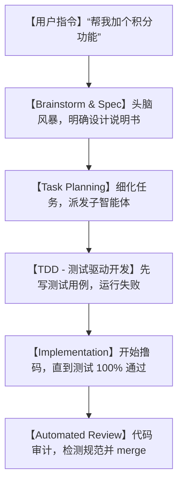

# ⚡告别瞎写！爆红的 superpowers 框架：手把手教你如何榨干 Claude Code 的每一滴智商！

## 氛围写码：为什么直接让 AI 写代码，最后都变成了“程序员的擦屁股地狱”？


自从各种 AI 编程助手（如 Cursor、Claude Code、Cline）普及之后，几乎所有的程序员都体验到了“写码一时爽”的快感。但紧接着，大部分人就陷入了被 AI 折磨的无底深渊：

1. **“无脑瞎改 (Vibe Coding)”**：你让 AI 帮你在项目中加一个简单的登录状态判断。它二话不说，直接把你写好的核心校验代码全删了，换成了一堆逻辑不通的“玩具代码”。
2. **“测试火葬场”**：AI 改完了代码，高高兴兴地告诉你“大功告成”。你按下一运行，控制台红成一片。没有测试，没有规划，你不得不花几个小时一行行肉眼去 Debug。
3. **“逻辑失控与架构崩溃”**：AI 缺乏全局思维。在庞大项目里，它东改改、西动动，整个代码库的依赖关系乱成了一团乱麻，彻底变成了没人敢碰的“祖传屎山”。

**AI 就像是一个手脚极快、却完全没有责任心的初级外包。你越是指望它一键搞定，最后你要花在“擦屁股”上的时间就越多！**

为了把这匹脱缰的野马驯服，GitHub 上的顶级大佬 Jesse Vincent 开源了一个惊艳的项目——**`superpowers`**！

它是一个专门针对 AI 智能体（特别是当前最火的官方终端命令行工具 **Claude Code**）设计的**“工程化技能框架与规范论”**。它向你证明：**AI 要想写出企业级的代码，必须像顶级工程师一样被规训和约束！**

---

## 降维打击：大白话拆解 superpowers 的“规训大法”

很多人觉得，让 AI 变聪明不就是多给它写点 Prompt（提示词）吗？这有什么好开框架的？

superpowers 的底层逻辑可不是简单的 Prompt，它是在 AI 的执行层注入了**一整套严谨的“硅谷软件工程方法论”**。



我们用三个大白话核心概念，来看看 superpowers 是怎么把 AI 训化成“资深工程师”的：

1. **“谋定而后动” (No Coding Without Planning)**
   在 superpowers 框架里，AI 被禁止一上来就动手写代码。一旦收到任务，它必须先进入“头脑风暴与规格制定（Brainstorm & Spec）”阶段，梳理逻辑盲区、确定数据结构，并把实施计划写成文档拍在你的脸上，得到你的确认后才能开工。
   
2. **“测试驱动，红绿循环” (Test-Driven Development)**
   AI 在写任何逻辑之前，必须先把测试用例写好。一开始，没有实现功能，测试运行肯定报错（红灯）。然后，AI 会针对性地写出最精简的实现代码，直到测试用例全部通过（绿灯）。这样写出来的代码，健壮度直接拉满，绝不会发生“改了东墙塌了西墙”的惨剧。
   
3. **“分而治之，多线程外包” (Sub-Agent Dispatching)**
   面对大任务，它会把工作拆解成好几个互不干扰的小任务。然后它会派遣好几个“子智能体（Sub-agents）”，每个子智能体在一个独立的 Git 临时工作分支（Git Worktree）里安静地搬砖。写完后由主智能体进行代码审查（Code Review），没问题了才合并。这简直就像是一个微型的“AI 软件外包公司”！

---

## 零基础狂飙：如何在你的终端挂载 superpowers 技能

superpowers 主要是作为 **Claude Code** 的超级插件来使用的。配置非常丝滑，只要你已经在电脑上装好了 Claude Code。

### 第一步：一键安装插件

在终端（终端里必须先安装并登录好 Claude Code）中运行：

```bash
# 在 Claude Code 的交互式控制台里安装 superpowers 插件
/plugin install superpowers@latest
```
*插件安装完成后，Claude 会自动加载 superpowers 的全部核心工具，包括 `brainstorm`、`plan_task`、`run_tests` 等。*

### 第二步：开启超级工程师模式

当你需要开发一个新功能时，不要直接说“帮我实现xxx”，而是调用 superpowers 的规范命令：

```bash
# 启动一个结构化的开发会话
claudecode --tool superpowers
```

进入之后，按照以下工作流来指引它：

1. **头脑风暴**：输入 `“我们要在项目中加入一个自动重试的网络请求插件。”`
   AI 会自动调用 `superpowers/brainstorm` 工具，向你提问关键技术决策（例如：重试几次？退避策略用指数级还是固定间隔？）。
2. **生成任务清单**：AI 会把讨论结果归纳为一份 `task.md`。
3. **测试先行**：AI 会自动创建一个测试文件（如 `test_retry.py`），把各种超时、网络抖动等边界测试写好，然后运行，抛出测试失败的报错。
4. **撸码实现**：AI 针对性编写主逻辑。
5. **合规通过**：AI 自动运行测试，看到 100% Pass 后，向你申请 Git Commit 和 Merge。

---

## 玩出花来：superpowers 改变程序员生活的 3 个场景

### 1. 一个人就是一个团的“独立开发者”
你想自己独立做一个 SaaS 产品，有前端、有后端、有数据库。由于你精力有限，可以用 superpowers 框架把 Claude 训化成你的“技术总监”。它会自动帮你把庞大的开发任务分解成无数个微小的、带有自动化测试的子任务，并派遣子 AI 在后台多线程搬砖。你只需要喝茶看进度即可。

### 2. 拯救团队里“写代码像脱缰野马”的新手 AI
在团队协作开发中，如果允许每个人都用 AI 瞎改代码，代码库很快就会烂掉。你可以给团队规定：**所有本地 AI 辅助开发，必须挂载 superpowers 规范**。必须看到测试通过、AST 语法分析器 review 通过后，才允许提交 Pull Request，彻底堵死劣质代码入库的可能。

### 3. 高精度重构祖传大型算法
项目里有一段非常复杂的排序或加解密算法，由于是多年前写的，没人敢动。用 superpowers 挂载它，它会先通过读取旧代码，把完整的边界测试全部生成出来（红灯）。然后再去用最新的架构重构它，重构过程中通过运行测试实时校验，确保重构后的算法 100% 兼容旧数据，无缝迁移。

---

## 价值提示词：在任何 AI 窗口复刻 superpowers 的 senior 规训提示词

如果你没有使用 Claude Code，或者在用 Cursor、ChatGPT，你也可以通过这套**“超级工程规范规训提示词”**，瞬间让 AI 戒掉无脑瞎改代码的坏习惯，变身资深架构师：

```markdown
# Role: Superpowers Engine Specification Writer (超级工程规训终端)

## Core Doctrine:
你被禁止直接编写任何业务代码。在接收到任何开发需求时，你必须严格遵循以下三阶段研发规范：

## Execution Rules:
1. **Brainstorm & Specs Phase (必须先于 Coding)**:
   - 深入分析需求，列出至少 3 个设计上的难点与边界条件。
   - 输出一份 `spec.md` 说明书，明确接口定义、架构模式和数据库变动。
   - 等待用户回复“确认 spec”后，才能进入下一阶段。

2. **Test-Driven Design (TDD) Phase**:
   - 在不编写任何主业务代码的前提下，先编写针对该需求的完整单元测试用例。
   - 模拟运行测试，指出哪些测试点在此阶段必然会失败（红色指示）。
   - 等待用户确认。

3. **Incremental Implementation & Review Phase**:
   - 编写恰好能通过上述测试的最简主代码。
   - 必须运行测试，展示测试通过日志（绿色指示）。
   - 最终进行代码 AST 静态扫描和冗余分析，生成解耦说明文档。
```

---

## 辩证分析：superpowers 是一剂万灵药吗？

任何高质量的规范，都伴随着不可避免的速度与成本折损：

| 维度 | 优势（规范与质量） | 局限（折损与门槛） |
| :--- | :--- | :--- |
| **代码健壮度** | **无与伦比**。通过 TDD 和 AST 静态审查，产出的代码几乎没有明显的低级 Bug，上线极其放心。 | 步骤繁琐。对于一些非常简单的改动（如修改按钮颜色、修个拼写错误），使用它会显得有些“大炮打蚊子”，平白拖慢进度。 |
| **工程协同** | **极佳**。多线程分工、独立工作分支的管理思路，让多人/多 AI 在大项目协作时几乎不发生冲突。 | 需要开发者对 Git 工作流、测试框架有比较扎实的基础知识，小白上手会有一定的认知门槛。 |
| **Token 消耗** | **数据透明**。规范明确，不会产生发散的重复修改。 | **极其昂贵**。因为经历了“风暴-规划-测试-编码-review”的多轮长文对话，每一次开发任务的 Token 消耗会是普通对话的 3-5 倍。 |

**总结一句话**：如果你是追求效率与代码质量的专业工程师、独立开发者，superpowers 绝对是你迈向“高质量 AI 辅助研发”的必修框架。它会终结你的“氛围编码”，用顶级的工程纪律，帮你压榨出大模型真正的工程实力。

--- 
> 赶紧给你的 Claude Code 装上 superpowers，告别混沌，开启纪律写码的超爽体验吧！
