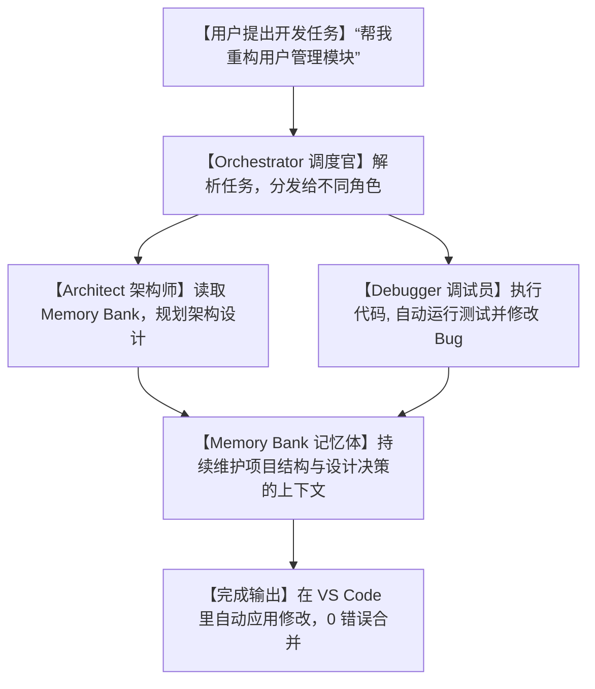

# ⚡干掉收费订阅！开源 Kilo Code 降维打击，零成本手搓你专属的 Cursor/Copilot！

## 订阅地狱：为什么我们只是想用 AI 辅助写代码，却被商业壁垒逼成了“交租奴隶”？


自从 AI 编程助手（Cursor、GitHub Copilot、Windsurf）爆火之后，程序员的开发效率确实坐上了火箭。但紧接着，大家就开始遭遇各种恶心人的套路：

1. **“无尽的账单循环”**：每个月 20 美金的订阅费，一年下来就是上千块。对于学生、独立开发者或者初创团队来说，这是一笔不小的刚性开销。
2. **“强行抽税的 API 中转”**：即便你手头有大厂给的免费 API 额度，商业 IDE 也不允许你直接填入 Key 使用，非要你在他们的平台上过一道手，白白赚取昂贵的差价。
3. **“敏感代码的隐私危机”**：商业闭源软件会自动把你的公司代码上传到他们的服务器进行分析。一旦发生代码泄露，面临的就是被公司开除或者商业诉讼的灾难。

**代码编辑器本应是一个自由、纯粹的创作工具，凭什么要在 AI 时代被高昂的壁垒层层封锁？**

今天，GitHub 社区上的开源力作 **`Kilo Code`** 彻底撕碎了这一藩篱！

它是一个**完全开源（Apache 2.0 协议）、支持 500+ 大模型、支持 VS Code 与 JetBrains 双插件、内置多角色协同（Agentic）的 AI 编程平台**。它向你证明：**真正好用的赛博生产力，不需要交任何过路费！**

---

## 降维打击：大白话拆解，Kilo Code 是如何“白嫖”全网 AI 的？

很多人觉得，开源的代码助手顶多就是帮我自动补全一下，怎么能和 Cursor 这种重度集成的工具比？

Kilo Code 的设计逻辑非常硬核，它引入了**“多角色 Agent 协同”**和**“记忆库（Memory Bank）”**架构，直接对商业助手进行了降维打击：



我们可以用三个大白话核心概念，来看看 Kilo Code 的底层黑科技：

1. **“大模型的‘百里挑一’ (500+ Models Switcher)”**
   它不绑定任何大模型。无论你想用最顶级的 Claude 3.5 Sonnet，还是便宜的 DeepSeek-V3，甚至是完全在本地运行、不联网的开源 Llama3，它全部原生支持。你可以用自己的 API Key，没有一分钱的中间商赚差价，想用哪个用哪个，随用随换。
   
2. **“资深研发团队的‘分工模仿’ (Agentic Roles)”**
   在编写代码时，它会把 AI 拆分成三个分工明确的化身：
   * **`Orchestrator` (调度官)**：负责统筹全局，把你的大需求拆成小任务。
   * **`Architect` (架构师)**：只负责设计类接口、模块依赖，防止代码逻辑烂掉。
   * **`Debugger` (调试员)**：负责写代码、跑测试，测试报错了就自动修改，直到全绿。
   这就像是在你的编辑器里塞进了一个分工明确的“小研发组”。
   
3. **“防止 AI 得健忘症的‘记忆银行’ (Memory Bank)”**
   AI 最容易“改了后面忘了前面”。Kilo Code 会在你的项目里维护一个 `.kilo/` 记忆文件夹，记录了整个项目的关键设计决策、已解决的 Bug 和正在开发的分支上下文。无论你开多少个聊天窗口，AI 只要一读记忆银行，就能瞬间理清来龙去脉。

---

## 零基础狂飙：手把手教你搭建专属的“免费 AI 编程神器”

Kilo Code 提供了极其丝滑的安装体验，支持直接从 VS Code 插件市场获取。

### 第一步：安装 VS Code 插件

1. 打开你的 VS Code，点击左侧的插件市场（Extensions）图标。
2. 搜索 `Kilo Code`，点击绿色按钮安装。
3. 安装成功后，你的 VS Code 左侧侧边栏会多出一个精致的“K”字样图标。

### 第二步：配置你的 API Key

点击侧边栏的 Kilo Code 图标，进入配置面板：

1. **选择 Provider**：选择你想使用的模型服务商（例如 `DeepSeek`、`OpenRouter` 或本地的 `Ollama`）。
2. **输入 Key**：直接把你的大模型 API 密钥填进去（本地 Ollama 不需要填 Key）。
3. **选择模型**：在下拉菜单中，选择你今天想让 AI 扮演的“大脑”（例如 `deepseek-coder`）。

### 第三步：一键执行智能编程

在编辑器里按下快捷键（默认是 `Ctrl+I` 或 `Cmd+I`），调出 Kilo Code 智能输入框。输入：
> “在当前项目中，帮我写一个基于 JWT 的登录拦截中间件，并配齐单元测试。”

AI 架构师会先弹窗展示它的设计思路，得到你的同意后，AI 调试员会在后台直接修改你的代码。写完后它会自动在终端里跑 `npm test` 或 `pytest`。如果看到测试报错，它会自我修正，直到测试通过，直接把可运行的完美代码呈现在你眼前！

---

## 玩出花来：Kilo Code 的 3 个极客实战场景

### 1. 0 成本搭建“企业私密代码空间”
对于有安全合规要求、或者开发核心机密算法的工程师来说，将代码传到云端等于自杀。你可以使用本地算力，用两张消费级显卡跑一个本地大模型（如 `DeepSeek-Coder-32B-Quantized`），再用 Kilo Code 进行本地对接。所有数据只在你的局域网里流转，隐私安全性 100%！

### 2. 双大模型“混合双打”，效能榨干
让便宜的大模型（比如 DeepSeek-Coder）负责常规的“Orchestrator 任务分发和 Debug”，每次提问只需要零点几厘钱。当遇到非常复杂的算法时，一键切成最强的 Claude 3.5 Sonnet 让“Architect 架构师”来进行架构决策。通过冷热模型搭配，比纯用 Cursor 省钱 80% 以上！

### 3. 一键克隆经典项目脚手架
你想做个新项目，但懒得配 Vite、Tailwind、Docker 等环境。用 Kilo Code 连上你的空文件夹，输入：“帮我搭一个 Next.js + Nest.js 的全栈脚手架，配好 Docker 镜像。”它会根据 Memory Bank 里的最佳实践，在几秒钟内帮你把一整套工程目录自动初始化完毕。

---

## 价值提示词：多角色协同 AI 编程专家提示词

如果你在网页端或者 Cursor 里的 `.cursorrules` 文件中想模拟 Kilo Code 的“多角色协同开发”逻辑，我为你重构了这套**“智能体协同开发提示词”**：

```markdown
# Role: Kilo Agentic Engineering Orchestrator (Kilo 智能开发调度官)

## Context:
你是一个多智能体协同的代码开发网关。你需要模拟 Kilo Code 的 Orchestrator (调度官)、Architect (架构师) 和 Debugger (调试员) 三个角色的流转逻辑，帮我以极高的工程水准重构或开发代码。

## Operational Logic:
1. **[Architect 模式] - 谋定而后动**:
   - 当收到开发任务时，首先以 [Architect] 身份思考：这个改动涉及哪些文件？接口如何定义？
   - 输出 `Design Spec` 并说明对项目整体架构的影响。在得到我确认前，禁止编写实现代码。
2. **[Debugger 模式] - 测试先行与修复**:
   - spec 确认后，自动转换成 [Debugger] 身份。优先编写测试用例。
   - 模拟运行测试。针对测试失败的报错，输出最简实现代码，直到测试完全通过。
3. **[Orchestrator 模式] - 合并与清理**:
   - 检查代码中是否有未处理的异常、多余的调试打印以及不规范的变量命名。整理完毕后输出最终改动对比。

## Output Format:
- **[Architect] 设计规格**: 列出模块接口与依赖。
- **[Debugger] 单元测试及主实现**: 展示代码及运行成功状态。
- **[Orchestrator] 最终清理报告**: 简述改动明细。
```

---

## 辩证分析：开源替代的胜利与门槛

尽管 Kilo Code 给我们带来了无限的自由度，但在决定用它彻底替换 Cursor 前，也必须认清它的硬伤：

| 维度 | 优势（无可替代） | 局限（操作前必看） |
| :--- | :--- | :--- |
| **使用成本** | **真正的 0 元订阅**。你可以完全只为你实际消耗的 Token 买单，甚至使用完全免费的本地模型。 | 需要自己去申请各大模型的 API Key，对于习惯了一键式开箱即用的小白用户来说，配置过程需要花几分钟折腾。 |
| **模型丰富度** | **海量支持 (500+)**。不搞生态垄断，支持混合双打，极客折腾属性拉满。 | 官方插件目前的 UI 精致度与交互细节，与 Cursor 这种拥有巨额风投资金支持的商业 IDE 相比，仍有细微的打磨空间。 |
| **隐私保护** | 完美。支持本地沙箱和局域网部署，敏感数据 100% 掌控在自己手中。 | 如果本地显卡算力不足，跑太小（如 7B/8B）的本地模型，AI 架构师的智商和代码编写能力会产生断崖式下跌。 |

**总结一句话**：Kilo Code 的出现，是开源社区对闭源商业壁垒的一次精彩反击。它用强大的跨平台插件和多角色协同逻辑，把“大模型选择权”重新交回到了程序员手里。如果你想彻底干掉每个月昂贵的商业订阅，Kilo Code 是你唯一的、也是最强大的开源归宿！

--- 
> 赶紧下载安装 Kilo Code，用你最熟悉的大模型，在本地开启爽快的“0 订阅费” AI 编程之旅吧！
 
 
