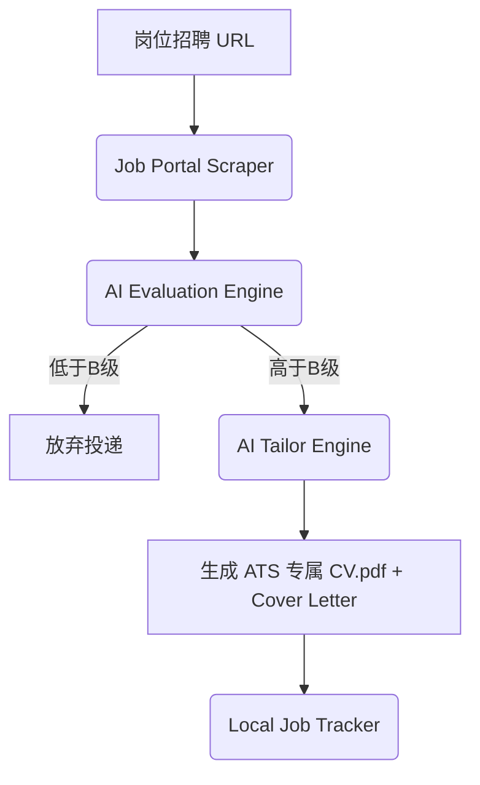

# 求职效率狂飙10倍！这个“AI自动求职绞肉机”，一键把高薪Role全部拿下！

## 简历已读不回？每天投简历投到吐血，却只换来HR的冷冰冰群发拒信？


不管你是刚出校门的学生，还是寻求转型跳槽的职场人，只要你最近在找工作，你一定会陷入这三个让人崩溃的“求职黑洞”：

1. **“海投策略彻底失效”**：现在大厂和初创公司全在用 ATS（申请者追踪系统）进行第一轮简历筛选。你精心写好的通用简历，直接因为关键词不匹配，被冰冷的系统瞬间秒杀，连 HR 的面都见不到。
2. **“手动精修累到怀疑人生”**：为了提高面试通过率，你得根据每一个岗位的 Job Description（工作职责），把简历里的项目经历、技术栈、甚至个人陈述一条条修改。每天改 5 份简历，你就已经头脑发昏，看什么单词都像天书。
3. **“盲目投递全是坑”**：很多 JD 写得天花乱坠，进去才发现架构混乱、加班加点、技术落后。你花了几天准备面试，最后只是去踩了个天坑。

**在 AI 时代，你还在用最原始的手工劳作对抗企业的“AI 简历筛选机”，这简直是降维打击式的降智行为！**

今天，GitHub 上爆火了一个叫 **Career-Ops** 的开源项目，彻底掀翻了传统的求职流水线。

它的本质就是一台**“AI 自动求职绞肉机”**：**它能自动帮你去扫各大招聘门户，用大模型给每个岗位进行 A-F 级匹配打分，然后针对通过筛选的岗位，一键生成和 JD 完美契合的 ATS 优化版简历 PDF。让你的求职效率狂飙 10 倍以上！**

---

## 大白话拆解：Career-Ops 到底是怎么帮你“薅”高薪 offer 的？

我们用最直观的大白话来拆解它的运作逻辑。

普通的求职就像是**用渔网在大海里瞎捞鱼**。
你花了一天时间，捞上来一堆塑料垃圾和几条小臭鱼，不仅累个半死，还把渔网刮烂了。

而 **Career-Ops 就像是给你配备了一个“智能激光捕鱼雷达”**：

* **第一步：无情打分（Laser Evaluator）**：你把招聘网站上的职位 URL 丢给它。AI 会根据你的背景和心仪程度，在 10 个维度（如薪资、技术栈匹配度、通勤时间、WFB等）进行 1-10 分的量化打分。低于 B 级的岗位，直接无情过滤，绝不浪费你的时间。
* **第二步：简历变形金刚（Resume Tailor）**：AI 会把你的“基础简历（Raw CV）”和该职位的“工作职责（JD）”放在一起比对。自动微调你的措辞，把那些不相关的经历隐藏，把能打中 ATS 系统筛选的关键词加粗高亮，最后直接导出 PDF。
* **第三步：求职追踪仪表盘（App Tracker）**：自动帮你把投递时间、面试轮次、薪酬谈判的话术和故事库（Story Bank）整理在本地 Markdown 中，让你像管理代码库一样管理你的职业生涯。

**它的核心本质是：基于大模型的求职 Pipeline（Pipeline as a Service）。**

---

## 核心底层逻辑：AI 是如何把简历改得天衣无缝的？

Career-Ops 的底层工作流非常严密：



1. **精准定位评分（Evaluator）**：
   它使用多维加权打分模型。它不会简单地回答“适合”或“不适合”，而是基于你的个人配置表（Preferences），计算出一个综合匹配度，帮你从源头上过滤掉“垃圾岗位”。
2. **基于大模型的语义对齐（Semantic Alignment）**：
   它采用的不是简单的“关键词替换”，而是“语义重构”。它会把你在上家公司的项目经历，用新岗位 JD 里的术语进行翻译。比如，新岗位看重“高并发”，它就会着重提炼你之前做过的 Redis 缓存优化细节。
3. **本地 Markdown/Typst 渲染**：
   不依赖任何收费的简历生成网站。它在本地直接使用极速的 Markdown 转换或 Typst 渲染器，瞬间生成排版严丝合缝、完全没有多余空白行的专业 PDF。

---

## 降维打击：Career-Ops 的三大爽点场景

### 场景一：一键分析 20 个 Greenhouse/Ashby 岗位
你把今天在 LinkedIn 上看到的 20 个远程 AI 岗位的链接复制出来，一次性塞给 Career-Ops。两分钟后，控制台会输出一个精美的表格，清晰标明有 3 个 A 级岗位最值得投递，剩下的 17 个由于技术栈不符或薪资过低，已被自动建议放弃。

### 场景二：瞬间量身定制 3 份不同侧重点的简历
你同时投递了“AI 前端开发”和“全栈开发”两个岗位。Career-Ops 会读取同一个基础 JSON 简历，为前端岗位生成侧重 React/TypeScript 的版本；为全栈岗位生成侧重 Python/FastAPI 的版本，排版完美，耗时仅需 3 秒。

### 场景三：生成匹配度极高的自荐信（Cover Letter）
很多外企要求附带 Cover Letter。Career-Ops 会抓取岗位招聘方的痛点，写出一份极其专业的自荐信，第一句就直奔主题，点出你为什么是解决他们目前业务痛点（例如：高并发、海外用户增长）的唯一完美人选。

---

## 详细安装与操作步骤：5分钟搭建你的求职控制台！

### 第一步：克隆项目并安装依赖

需要本地安装 Node.js 和 Python 3.10+ 环境：

```bash
git clone https://github.com/santifer/career-ops.git
cd career-ops
pip install -r requirements.txt
npm install
```

### 第二步：编写你的“个人求职偏好表” `profile.json`

在项目的 `config/` 目录下创建 `profile.json`，用来作为 AI 打分和修改简历的基准线：

```json
{
  "personal_info": {
    "name": "Alex",
    "desired_roles": ["AI Frontend Engineer", "React Developer"],
    "skills": ["React", "TypeScript", "Tailwind CSS", "Next.js", "Python"]
  },
  "preferences": {
    "min_salary": "25k",
    "remote_friendly": true,
    "tech_stack_must_have": ["TypeScript", "React"]
  }
}
```

### 第三步：填入你的大模型 API Key

在 `.env` 文件中配置秘钥：

```env
OPENAI_API_KEY=sk-xxxxxx
# 或者使用 Claude Code 的 API 秘钥
ANTHROPIC_API_KEY=sk-ant-xxxxxx
```

### 第四步：运行职位打分指令

把你相中的招聘岗位 URL 喂给系统：

```bash
python3 main.py evaluate --url "https://greenhouse.io/jobs/example-company-ai-frontend"
```

控制台会返回评分报告：
`📊 Score: A (92/100)`
`✅ Pros: Stack fully matches (React/TS), Salary is within preference.`
`❌ Cons: Hybrid model, requires 2 days in office.`

### 第五步：一键生成量身定制的 PDF 简历

如果评估满意，直接运行简历 Tailor 指令：

```bash
python3 main.py tailor --url "https://greenhouse.io/jobs/example-company-ai-frontend" --output "./cv_alex_frontend.pdf"
```

系统会自动抓取页面上的 JD，自动微调你的简历，并使用 Typst/Weasyprint 编译成一份设计感十足、完全适配 ATS 的 PDF 简历！

---

## 核心价值提示词：让 AI 成为你的专业简历顾问

如果你不想折腾复杂的命令行脚本，也可以把这套**ATS 简历智能对齐提示词**收藏起来，直接在网页版 Claude 或 GPT 中使用：

```markdown
# Role: ATS-Optimized Resume Architect

## Mission
Your goal is to tailor the user's `Raw_Resume` to match the given `Job_Description` (JD) for maximum ATS (Applicant Tracking System) compatibility and human HR appeal.

## Strict Rules
1. **Never Invent Facts**: Do not add skills, companies, degrees, or certifications that are not present in the `Raw_Resume`.
2. **Translate to JD Keywords**: Identify key terms and phrasing used in the `Job_Description`. Rewrite the wording of the user's project descriptions to use these terms, provided they reflect the same technical tasks.
3. **Use the STAR Method**: Ensure all edited bullet points are formatted as: [Action taken using specific tech/skill] -> [Metric/Impact achieved].
4. **Formatting**: Output the modified resume in clean Markdown format. Highlighting modified phrases by wrapping them in asterisks.

## Inputs
- **Job_Description**: [Insert JD here]
- **Raw_Resume**: [Insert CV here]
```

---

## 辩证客观分析：使用 AI 求职的边界在哪里？

虽然 Career-Ops 威力巨大，但你在使用中必须注意这几个局限：

* **垃圾输入等于垃圾输出**：如果你的 `profile.json` 和原始简历里本身就没有多少实在的项目经历，AI 怎么改也改不出花来。切记：AI 只是润色和对齐，它不能无中生有。
* **面试依然看真功夫**：简历虽然帮你过了第一关，但随后的面试和手写算法，依然需要你用脑子里的真实实力去应对。别让你的简历表现得像个 P9 架构师，面试表现得像个刚毕业的学生。
* **国内平台适配性**：Career-Ops 对 Greenhouse、Lever、Ashby 等国外主流平台支持极佳。但如果你投递的是国内的 Boss 直聘或智联招聘，由于这些网站的数据格式没有标准化，无法一键自动抓取，你可能需要手动把 JD 文本复制到本地再进行处理。

总结来说，**Career-Ops 是一个帮你缩短垃圾操作时间、把精力集中在真正高价值面试准备上的神器**。如果你正在疯狂投简历却收效甚微，赶紧试试这个项目，用 AI 的速度打败 ATS 的冰冷！
