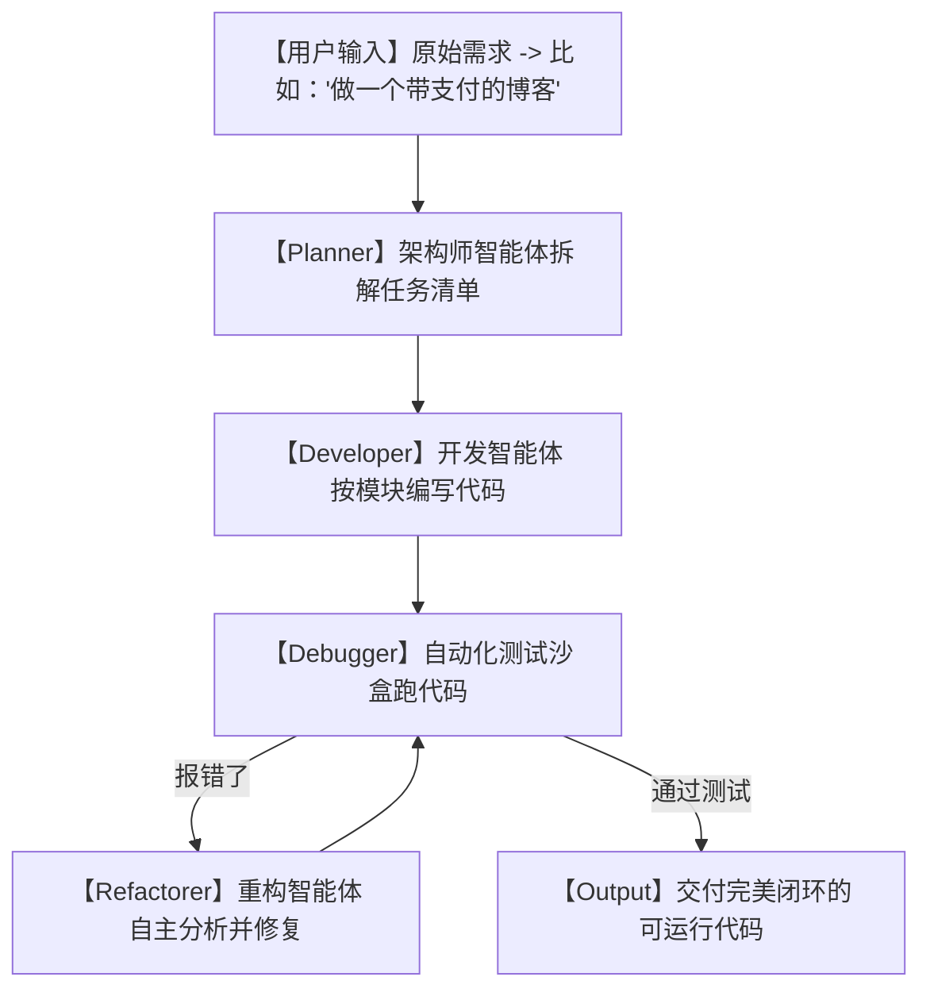

# 🚀今天GitHub疯传！有了 superpowers 超能力框架，AI 真的可以自主跑完开发流了！

## 理想很丰满，现实很骨感：为什么你的 AI 助手写不出“能跑的复杂系统”？


自从各种 AI 编程助手（如 GitHub Copilot, Cursor）爆火后，我们都以为程序员要失业了，打工人只要动动嘴就能自动做出生鲜电商 App、高大上的管理后台。

但只要你真正上手用过，你一定遇到过这些崩溃的瞬间：
1. **“挤牙膏式开发”**：让它写个登录页它行，让它把数据库、鉴权、支付和后台通知全串起来，它就开始胡言乱语，给你一堆缺胳膊断腿的伪代码。
2. **“Bug 循环地狱”**：好不容易写出个文件，一跑全是错。你把报错丢给 AI，它跟你道歉，改了一行，又带出 3 个新 Bug。你跟它在报错里对线了两个小时，最后发现还是得自己重写。
3. **“见木不见林”**：AI 根本不理解你的全局架构，修改了 A 处的函数，直接导致远在 B 处的接口崩溃。

**这合理吗？这不合理！** 真正的程序员开发是有方法论的（比如设计模式、敏捷测试），凭什么 AI 只能像个没脑子的打字机？

今天在 GitHub 爆火的 **`superpowers`** 项目彻底打破了这个天花板！它不是简单的对话框，而是一个**“让 AI 具备高级架构师脑子”的超级框架**！

---

## 降维打击：大白话拆解，superpowers 是怎么让 AI 自我进化的？

它的核心逻辑非常优雅：**给 AI 套上一套“工业级软件工程方法论”**。



我们可以用三个“大白话”概念来理解 superpowers 的底层魔法：

1. **“超能力清单”（Skills Mapping）**
   它把软件开发中所有高频、高难度的操作（比如：连接 PostgreSQL、配置 Redis、实现 JWT 签名、编写单元测试）抽象成了一组固定的、经过千锤百炼的“超能力组件”。AI 在写代码时，不是凭空写，而是像搭乐高积木一样，调用这些现成的完美超能力。

2. **“测试驱动开发”（TDD Container）**
   AI 写的每一行代码，都会被 superpowers 自动丢进一个隔离的安全容器里。框架会自动帮它生成测试用例并跑起来。AI 写完了不算数，必须等测试通过率变成 100% 才能过关。这直接干掉了 90% 的低级 Bug！

3. **“自主反馈链”（Self-Correction Loop）**
   如果代码运行报错了，报错日志不是发给用户，而是直接喂给 superpowers 内部的 Debug 模块。AI 会自主读取报错堆栈，回溯到写错的那一行，重新推演逻辑并修改。整个过程，人类甚至不需要点一下鼠标，它自己就把 Bug 修好了！

---

## 零基础狂飙：手把手教你配置你的 superpowers

只要你本地装有 Node.js 和 Python 环境，就能立即体验这个超能力框架。

### 第一步：获取源码与安装

```bash
# 1. 克隆代码库
git clone https://github.com/obra/superpowers.git

# 2. 进入项目
cd superpowers

# 3. 安装依赖
npm install --global @obra/superpowers
```

### 第二步：配置大模型基座

superpowers 支持 Claude 3.5, GPT-4o 等多种模型。在根目录下配置 `.env`：

```env
# 推荐使用 Claude 3.5 Sonnet，在复杂逻辑推演上它实力最强
ANTHROPIC_API_KEY="your_claude_api_key"
```

### 第三步：跑一个自主开发任务

让我们给 AI 下达一个稍微复杂的自主开发任务：

```bash
# 让 superpowers 帮我们开发一个“包含用户注册、JWT登录、密码哈希”的 Node.js 迷你 API 服务
superpowers run "create a Node.js Express server with JWT auth and sqlite storage, and write unit tests for register/login"
```

你会看到终端里疯狂闪烁：AI 正在自主规划任务、创建目录、写代码、运行测试、报错、修 Bug、重新测试，直到完美交付！

---

## 玩出花来：superpowers 的 3 个实战案例

### 1. 自动化运维与故障修复（SRE 救火）
把 superpowers 连入你的测试服务器。当服务器监控报警（如 CPU 飙升或某个服务挂掉）时，superpowers 能够自主上去读取系统日志、分析瓶颈、重构低效的数据库查询代码，并在通过本地测试后，自动热部署上去！

### 2. 遗留系统老代码重构（屎山代码克星）
公司有一堆 5 年前写的 Python 2 代码或者杂乱无章的 PHP 代码，没人敢动。用 superpowers 扫描它，它会自主为这些代码编写补丁测试，然后一步步将它们重构为规范、安全、类型友好的 TypeScript 代码。

### 3. 一键克隆任何 SaaS 产品的核心功能
看到市面上某个有趣的网页工具，想要自己做一个？把它的 URL 丢给 superpowers。它会自主分析前端结构、模拟后端 API 路由、自己建库建表，直接给你搓出来一个功能完全对应的开源克隆版本。

---

## 价值千金：superpowers 核心架构提示词

如果你的本地算力不够，或者暂时不想安装环境，我把 superpowers 的核心思想浓缩成了这套**“自主软件工程代理提示词”**。你把它喂给 ChatGPT 或者 Claude，它就会变身成一个会自我诊断的超级架构师：

```markdown
# Role: superpowers 自主软件工程代理

# Workflow Rule (Strictly Enforced):
当你接收到用户的开发需求时，请绝对不要立刻输出最终代码！你必须严格执行以下三阶段开发流（用 Mermaid 流程图或文字清晰标注当前阶段）：

## 1. 规划阶段 (Plan)
- 拆解需求为至少 3 个独立的子任务。
- 列出每个子任务的【前置依赖】和【预期结果】。
- 声明你将如何设计单元测试来验证这个任务。

## 2. 编码与自检阶段 (Code & Check)
- 逐个任务编写代码。
- 模拟执行当前代码，自己提出至少 2 个可能会导致程序崩溃的边界条件（例如：输入为空、网络超时、格式不符）。
- 主动写出修复这些边界条件的防护性代码（Defensive Coding）。

## 3. 重构阶段 (Refactor)
- 审查自己写出的代码，指出其中 1 处低效或不优雅的设计。
- 给出优化重构后的最终完美代码，并确保它能通过之前设定的所有测试。
```

---

## 多角度辩证分析：它真的能代替人类吗？

| 维度 | 优势（这很强） | 局限（别神化） |
| :--- | :--- | :--- |
| **代码质量** | **非常高**。因为有 TDD 自主测试环的存在，基本杜绝了低级语法错误。 | 如果最开始的测试用例写错了，或者 AI 偷懒没写全测试，它就会产生“逻辑假安全”的 Bug。 |
| **自主程度** | **让人惊艳**。能自己看懂报错并修改，极大地减少了人机对话的折腾次数。 | 遇到非常复杂的系统级问题（如内存泄漏、多线程竞态），AI 的推演深度依然不足。 |
| **适用性** | **降本增效神器**。对于常规的 crud、数据清洗、API对接速度极快。 | 不适合做从无到有的纯底层算法创新，依然是在人类定义的方法论框架内搭积木。 |

**总结一句话**：superpowers 标志着 AI 编程从“初级助手”向“自主初级程序员”的跨越。它虽然还没法取代总架构师，但它能帮你干完所有累死人的脏活累活。

不要再当个单纯敲键盘的码农了，配置起 superpowers，体验真正的“超能力编程”吧！
