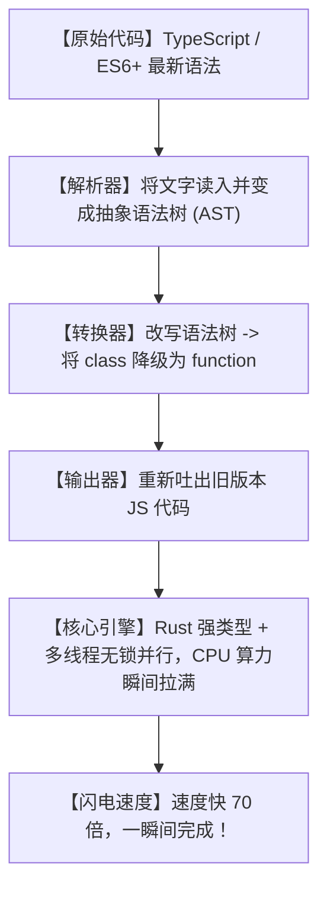

# ⚡效率狂飙70倍！今天在 GitHub 爆红的 SWC，彻底干掉开发编译的“摸鱼等待时间”！

## 摸鱼地狱：为什么我们每天最黄金的时间，全被“等待构建”给白白浪费了？


在互联网做前端、全栈开发或者做产品的打工人，每天一定会经历这样滑稽而痛苦的循环：
1. **“保存代码卡十秒”**：你改了一个错别字，按下了 `Cmd + S`。然后，你的电脑屏幕开始转圈，你的热重载（Hot Reload）要花 10 秒钟甚至更久才能在浏览器里生效。你的创作灵感，就这么一次次被打断。
2. **“部署编译二十分钟”**：代码写完了，你想提交到测试环境。结果，CI/CD 构建流水线光是运行 Webpack 和 Babel 打包，就跑了整整 20 分钟。在这期间你只能尴尬地干等，或者以“在编译呢”为借口疯狂摸鱼。
3. **“风扇起飞的电脑”**：每次跑本地测试，电脑的 CPU 占用率直接拉满到 100%，电脑热得像个暖风机，电量光速往下掉。

**这合理吗？这不合理！** 为什么把现代的 JS/TS 代码翻译成老旧浏览器认识的旧格式，需要花这么长时间？

今天在 GitHub 爆火的 **`SWC`** 项目直接粉碎了这一切！它用冰冷的 Rust 代码向大家证明：**以前我们习以为常的慢编译，全是因为工具太简陋！**

---

## 降维打击：大白话拆解，SWC 是怎么比传统 Babel 快 70 倍的？

SWC 的速度狂飙，本质上是**“把木头马车换成了磁悬浮列车”**。



我们可以用三个“大白话”概念来理解 SWC 的降维打击：

1. **“降维打击：用 Rust 代替 JavaScript”（Rust vs Node.js）**
   以前的编译器（比如 Babel）是用 JavaScript 写的，跑在 Node.js 环境下。这就像是“用塑料铲子去挖山”。而 SWC 是用 Rust 语言编写的，它是直接编译成底层机器码的强类型硬核语言，相当于“开着一辆纯钢造的挖掘机”，速度根本不在一个量级！

2. **“多核心多线程起飞”（True Multi-threading）**
   JavaScript 是单线程的，不管你的电脑有 8 核还是 16 核，传统的编译器同时只能用其中一个核心默默计算。而 SWC 利用了 Rust 的多线程并行处理能力。你保存文件的一瞬间，SWC 会把任务切碎，分给你的所有 CPU 核心一起并发计算，瞬间吃满电脑性能！

3. **“无损零垃圾回收”（Zero-GC Overhead）**
   Babel 在编译代码时，会在内存里创建数百万个临时小对象，导致 Node.js 频繁启动垃圾回收（Garbage Collection）去清理内存，期间程序会多次卡顿。而 Rust 是手动管理内存的，完全没有垃圾回收机制，内存开销极低，一路畅通无阻！

---

## 零基础狂飙：5 分钟在你的项目里换装 SWC 引擎

换装 SWC 非常简单，它完美兼容了传统的打包工具，你可以直接在现有项目里一键替换。

### 第一步：在项目中安装 SWC

打开你的终端，进入你的 Web 项目目录：

```bash
# 安装 SWC 核心包和命令行工具
npm install --save-dev @swc/core @swc/cli
```

### 第二步：创建极简配置文件

在项目根目录下创建一个名为 `.swcrc` 的文件（相当于 `.babelrc`）：

```json
{
  "jsc": {
    "parser": {
      "syntax": "typescript",
      "tsx": true,
      "decorators": true
    },
    "target": "es2015"
  }
}
```

### 第三步：跑一下，体验极速狂飙！

现在，用 SWC 编译你的 TS/JS 项目文件：

```bash
# 以前用 babel-cli 编译需要 10 秒，现在用 npx swc，回车按下的瞬间就已经完成了！
npx swc src -d dist
```

---

## 玩出花来：SWC 的 3 个高频效率场景

### 1. 拯救老项目的“热重载”卡顿
你们公司的遗留前端项目，每次保存代码热更新要等 15 秒。把打包工具的 `babel-loader` 替换为 `swc-loader`。只要这一项小改动，热更新耗时瞬间降到 0.5 秒以内。你再也不用因为保存代码而被迫打断思路了。

### 2. CI/CD 流水线提速（省下公司几十万云服务器费）
公司的代码仓库很大，CI 流水线跑一次打包要 15 分钟，每月按时间给云平台付费。在流水线中全面启用 SWC 编译，将打包时间缩短至 2 分钟。不仅开发部署爽快，更直接帮老板砍掉了流水线服务器的大量账单！

### 3. 本地全自动化大面积代码库扫描与测试
在写自动化测试（比如 Jest）时，每次跑测试都要花几分钟编译代码。SWC 提供了一个神级库 `@swc/jest`。用它替换传统的 `ts-jest`，测试冷启动耗时瞬间缩短 80%，让测试驱动开发（TDD）变得无比流畅。

---

## 价值千金：项目极速编译调优专家提示词

我把 SWC 的编译优化、Babel 迁移以及 Webpack/Vite 加速方案，整理成了一套**“前端工程化极速调优提示词”**。你把它复制给 AI，它能为你产出完整的极速配置：

```markdown
# Role: 前端工程化性能调优大师

# Task:
我有一个因为庞大而编译极其缓慢的 JavaScript/TypeScript 项目。请帮我编写一份完整的、用于替换原有 Babel 编译流的 SWC 优化实施方案。

# Requirements:
1. **Config File**: 给出最规范的 `.swcrc` 配置，要求支持 TypeScript、React (JSX)、装饰器(decorators)，并能兼容旧版浏览器 (ES5)。
2. **Loader Integration**: 提供在 `webpack.config.js` 中使用 `swc-loader` 替换 `babel-loader` 的具体配置代码。
3. **Vite/Rollup Alternative**: 如果项目是 Vite 结构，给出如何使用 `@vitejs/plugin-react-swc` 替换默认 react 插件的具体步骤。
4. **CI/CD Optimization**: 给出一条如何在 Jenkins 或 GitHub Actions 中结合 SWC 进行冷启动构建缓存的 Shell 优化命令。
5. **Code Style**: 所有配置文件中的关键参数（如 `minify`, `sourceMaps`, `target`）旁必须用中文注释解释其性能影响。
```

---

## 多角度辩证分析：真的完美无缺吗？

没有任何工具是十全十美的，我们来看看 SWC 的短板：

| 维度 | 优势（这很强） | 局限（别神化） |
| :--- | :--- | :--- |
| **编译速度** | **强到犯规**。70 倍的速度提升，直接把“重载等待”变成历史。 | Rust 编写的底层代码报错时，其报错堆栈（Stack Trace）有时比纯 JS 更难读懂。 |
| **生态兼容** | **极高**。完美兼容 Babel 配置，并提供了一键迁移插件。 | 极个别非常冷门、自定义程度极高的 Babel 插件在 SWC 生态中没有对应的 Rust 实现。 |
| **资源消耗** | **非常低**。极低的内存占用，不会像 Node.js 一样频繁撑爆内存。 | 不支持在编译阶段直接进行 TS 类型检查（Type Checking），必须配合 `tsc --noEmit` 使用。 |

**总结一句话**：SWC 是你写代码时的“法拉利引擎”。它彻底干掉了那些无聊的等待编译时间，把你的开发心流牢牢锁在效率最高峰。

别再去忍受蜗牛一般的编译速度了，赶紧配置起 SWC，体验属于你的极速开发人生吧！
