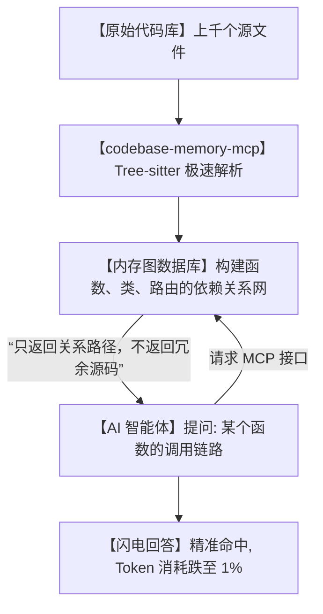

# 🔥Token省下99%！爆火的 codebase-memory-mcp 彻底解决 AI 读大型代码库的“破产危机”！

## 破产危机：为什么只是让 AI 读个代码，却要交几千块的“Token税”？


任何把 AI 智能体（比如 Claude Code、Cursor 或 Cline）引入到日常开发工作流的程序员，都会在第一周遭遇以下让人当场破防的瞬间：

1. **“账单火葬场”**：你只是问了 AI 一句：“这个项目里所有的 API 路由是怎么和数据库模型绑定的？”。AI 默默开始在后台疯狂 `grep` 和读取几十个源文件。一分钟后，你的 API 额度直接扣掉了几美元，几万个 Tokens 瞬间灰飞烟灭。
2. **“等待地狱”**：在大型项目（比如有上千个文件）中，AI 想理清一个跨文件的调用链，得一个文件一个文件地读取、解析。你只能坐在座位上看着进度条转圈，等得花儿都谢了。
3. **“AI 记忆力衰退（上下文爆炸）”**：由于吞下了太多无用的源码，AI 很快就达到了上下文极限。开始变得丢三落四、前言不搭后语，甚至连你五分钟前跟它说的话都记不住。

**这合理吗？这不合理！** 很多时候，AI 并不需要把每个文件的具体实现都读一遍，它只需要知道**“谁调用了谁，哪里定义了什么”**。但现有的 AI 助手太蠢了，只会用最原始的全文读取方式去“暴力破解”！

今天在 GitHub 爆火的 **`codebase-memory-mcp`** 彻底掀翻了这一现状！它是一个**用 C 语言手搓的、单文件静态编译、超高性能的代码上下文图谱 MCP 服务**。它用硬核的技术向你证明：**省钱和高效，在 AI 时代完全可以兼得！**

---

## 降维打击：大白话拆解，它是怎么实现“Token狂省99%”的？

为了让你明白它是怎么把 AI 变聪明的，我们先来做个好玩的对比：

*   **传统 AI 查代码**：就像一个**“睁眼瞎的搬砖工”**。你想找一本书里的某个段落，他二话不说把整栋图书馆的书全搬到你面前，让你一页页翻，白白浪费了无数的“搬运费（Token）”。
*   **codebase-memory-mcp**：给图书馆做了一个**“超级雷达三维地图”**。AI 只需要用毫秒级的速度查一下这个雷达图，就能知道在哪本书的第几页有你要的答案，直接精准定位！



它是如何做到这一切的？底层有三个大白话核心逻辑：

1. **“Tree-sitter 语义提炼” (Abstract Syntax Tree Parsing)**
   它并不把代码当成冷冰冰的“文本”来读。它内置了 Tree-sitter（一种高级语法解析引擎），支持 158 种语言。它能像人类编译器一样读懂代码，直接提炼出“这是一个类”、“那是一个函数”、“这里发生了跨文件调用”，把所有无关的注水文本全部扔掉！
   
2. **“关系图谱常驻内存” (Persistent Knowledge Graph)**
   它会把解析出来的代码结构存入一个本地的超高性能图数据库（Graph Database）中。因为是用 C 语言写的，它可以在几毫秒内检索完复杂的调用链。AI 问一句“这个函数在整个项目里被谁调用过？”，图数据库在一瞬间就能返回一条由“节点和线”组成的极简路径，不需要 AI 自己去全文检索！
   
3. **“MCP 协议标准” (Model Context Protocol)**
   它完美支持 Anthropic 推出的 MCP 协议。它是独立运行的本地二进制程序，但任何支持 MCP 协议的客户端（如 Claude Desktop, Cursor 等）都能一键把它挂载为自己的“大脑插件”，零门槛调用它的图谱检索能力。

---

## 零基础狂飙：手把手配置你的“超省钱 AI 助手”

只要你的系统支持运行可执行文件，几分钟内就能完成 codebase-memory-mcp 的安装与挂载。

### 第一步：下载并初始化 codebase-memory-mcp

你可以直接从 GitHub Releases 下载对应系统的免安装静态二进制包：

```bash
# 1. 下载并赋予执行权限 (以 Mac/Linux 为例)
chmod +x codebase-memory-mcp

# 2. 在你的项目根目录下运行索引初始化命令
# 这会在当前项目下生成一个 .codebase-memory 关系数据库
./codebase-memory-mcp index ./
```
*提示：由于它是用 C 语言手搓的，哪怕面对拥有几十万行代码的超级大项目，整个索引建立过程也只需要短短几秒钟！*

### 第二步：在 Claude Desktop 中挂载

打开你的 Claude Desktop 配置文件（Mac 路径为 `~/Library/Application Support/Claude/claude_desktop_config.json`），在 `mcpServers` 节点中添加以下配置：

```json
{
  "mcpServers": {
    "codebase-memory": {
      "command": "/Users/YOUR_NAME/path/to/codebase-memory-mcp",
      "args": ["server", "/Users/YOUR_NAME/path/to/your/project"]
    }
  }
}
```

保存并重启 Claude Desktop，你会发现聊天窗口右下角多了一个小铲子图标，说明 AI 已经成功连上了你的“代码图谱库”。

### 第三步：见证奇迹的时刻

在对话框里直接问 AI：
> “在这个项目里，跟 `AuthService` 相关的调用逻辑是怎样的？请列出最深的三层调用链。”

此时，AI 不会再去读取任何文件，而是直接通过 MCP 服务端向图数据库发送一个 sub-ms（亚毫秒）查询，只获取结构路径。你原本需要消耗 **30,000 Tokens** 的问题，现在只消耗了 **300 Tokens** 就完美解答了！

---

## 玩出花来：codebase-memory-mcp 的 3 个硬核实战场景

### 1. 瞬间理清“祖传屎山代码”的脉络
你刚刚接手了一个前人留下的、完全没有任何文档的庞大遗留系统。以前你得硬着头皮啃好几天。现在直接用它生成代码图谱挂给 AI，你可以问它：“这套系统里，支付成功后到底触发了哪些微服务调用？”AI 会瞬间用拓扑图的形式把整个业务调用链路画给你看！

### 2. 自动追踪微服务与多语言跨项目调用
你的项目里前端用 TypeScript，后端用 Go，脚本用 Python。由于它支持多达 158 种语言，它能在一个统一的图谱里把 TS 发送 HTTP 请求、Go 接收路由、Python 跑后台任务的完整路径关联起来。AI 能第一次拥有跨越语言藩篱的全局“上帝视角”。

### 3. CI/CD 打包时自动生成精确架构文档
你可以在 CI/CD 流程中加入它的索引构建步骤，自动提取出每次提交（Commit）对系统核心调用链产生的影响，并自动把架构图推送到开发团队的 Wiki 或 Slack 频道中，彻底终结“文档与代码不同步”的程序员世纪难题。

---

## 价值千金：大型代码库依赖分析与重构规划提示词

如果你在用支持 MCP 的 AI 工具，或者想让 AI 配合 codebase-memory-mcp 的底层思路来帮你规划重构，你可以将这套**“代码结构学家提示词”**塞给 AI：

```markdown
# Role: 代码库拓扑结构专家 (Codebase Topologist)

## Context:
我当前挂载了基于 AST 解析的 codebase-memory-mcp 关系图谱。我需要你基于图谱提取出的节点（类/函数/接口）与连线（调用关系），进行无源码侵入式的依赖分析与重构规划。

## Operation Rules:
1. **拓扑缺陷检测**:
   - 寻找图谱中的“循环依赖”（A -> B -> C -> A）路径。
   - 识别“超级节点”（Incoming 边数极高但 Outgoing 极低的核心类），指出这些类是否承担了过多不相干的职责。
2. **重构影响评估 (Blast Radius)**:
   - 当我要修改某个核心函数 `foo` 时，自动在图谱中向上追溯所有的依赖父节点，输出一张“改动波及范围”列表。
3. **架构合规审计**:
   - 设定架构边界（例如：表现层 React 组件绝对不能直接依赖数据库映射 DAO 节点）。在图谱中扫描是否存在越权的越界依赖。

## Output Format:
- **高危架构缺陷**: 标明文件名与具体节点。
- **改动波及分析**: 列出改动某节点时受影响的模块及概率。
- **推荐解耦方案**: 提供具体的接口隔离或依赖注入方案。
```

---

## 多角度辩证分析：硬币的另外一面

codebase-memory-mcp 虽然极度优秀，但在决定引入团队前，也必须了解它的局限性：

| 维度 | 优势（无可比拟） | 局限（部署前须知） |
| :--- | :--- | :--- |
| **经济效益** | **降维打击**。对于大项目，AI 查代码的 API 消耗直接砍掉 95% 以上，彻底杜绝账单爆炸。 | 图数据库存储的是“结构元数据”，如果 AI 需要对某行具体的业务细节进行深层逻辑推理，仍然需要去读取该文件的源码。 |
| **性能响应** | **闪电般迅速**。C 语言手搓的单执行文件，没有 node_modules，几乎不占内存，查询在毫秒内完成。 | 需要将二进制包挂在本地，部分公司内网对于运行未签名的二进制文件有严格的安全审计限制。 |
| **多语言生态** | **海量支持**。依靠 Tree-sitter，对绝大多数主流及小众语言（158种）开箱即用。 | 如果你有一些非常冷门、甚至是公司自研的 DSL（领域特定语言），需要自己去编写 Tree-sitter 的解析规则。 |

**总结一句话**：codebase-memory-mcp 是大模型时代下“程序员降本增效”的里程碑式工具。它用极简的 AST 提取方案，把大模型从漫无目的的“文字搬运工”，变成了手握结构图的“架构分析师”。

--- 
> 赶紧把这个 MCP 服务端挂到你的 AI 助手上，开启爽快、省钱又极速的代码探索之旅吧！
