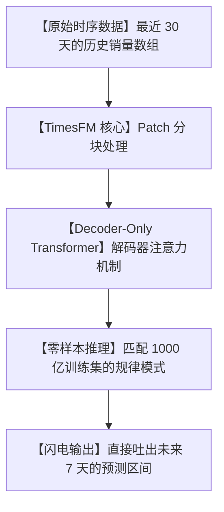

# 🔥零样本预知未来！谷歌开源时序大模型 TimesFM，手搓企业级“时间预测器”的终极神器！

## 预测地狱：为什么做个简单的销量或流量预估，比让大模型写诗还难？


在企业运营和实际开发中，预测“未来的趋势”是价值万金却又痛苦无比的任务：

1. **“调参调到精神衰弱”**：用传统的统计模型（如 ARIMA、Prophet），你需要手动去识别什么是周期性、什么是趋势性、什么是噪音。参数配错一点，预测出来的曲线就会直接飘到外太空。
2. **“算力与训练黑洞”**：用深度学习模型（如 LSTM、TFT），你必须喂给它几百兆的本地历史数据，花几个小时甚至几天时间在昂贵的显卡上反复训练。一旦历史规律变了，又得推倒重来。
3. **“冷启动死机”**：如果是一个刚上架的新商品、或者一个刚上线的服务器，只有区区几天的数据，模型根本无法训练，你只能靠直觉“拍脑袋”瞎猜。

**我们在大语言模型（LLM）里早已习惯了“零样本直接回答”，为什么面对同样是序列的数据结构——“时间序列”，我们却还要苦哈哈地从零开始训练模型？**

就在今天，谷歌研究团队（Google Research）开源的时序基础模型 **`TimesFM`** 彻底砸烂了这个瓶颈！

它是时序预测领域的“GPT-4”，向你证明：**时间序列，也可以像文本一样，被“预训练大模型”降维打击！**

---

## 降维打击：大白话拆解，TimesFM 是如何成为“时序预言家”的？

以往我们做预测，就像是雇了一个**“只读过一本历史书的账房先生”**，他只认得自己村里的账本，换个村子他就彻底抓瞎。

而 TimesFM 则是一个**“读过全天下 1000 亿本账本的算命大师”**。它在出厂前，就已经吞下了谷歌收集的、高达 **1000 亿个**真实世界和模拟的时序数据点（涵盖了天气、交通、零售、能源等各个行业）。



用大白话来拆解 TimesFM 的核心技术魔法，主要有三点：

1. **“时序的‘单词化’ (Patching)”** 
   语言模型是把一句话切成一个个“单词（Tokens）”来读的。TimesFM 也是一样，它把一条起起伏伏的连续时间曲线，切成一个个“小波段（Patches）”。每个小波段就像是一个“时序单词”。通过读这些单词，大模型就能像读故事一样读懂你的数据趋势。
   
2. **“只看过去的单向思考” (Decoder-Only Architecture)**
   TimesFM 采用了和 GPT 一样的“只看过去，预测未来”的单向解码器架构。它在训练时，不断在做“给前 10 天的数据，猜第 11 天数据”的练习。这让它具备了极强的“无监督泛化能力”，不需要你告诉它这是天气还是股票，它直接靠曲线形状就能盲猜未来。
   
3. **“零样本开箱即用” (Zero-shot Forecasting)**
   这是最神奇的地方。即使你手头的数据只有短短一两周，且之前从未给 TimesFM 看过，你只要把它喂进模型，它就能凭借脑子里存有的 1000 亿个时序规律，瞬间匹配出最像的走势，直接吐出高精度的未来预测。

---

## 零基础狂飙：手把手用 Python 跑通 TimesFM 预测

只要你的电脑里有 Python 运行环境，几行代码就能立刻运行 TimesFM。

### 第一步：安装核心依赖包

在你的终端中运行：

```bash
# 安装 TimesFM 及依赖（推荐使用 venv 或 Conda 虚拟环境）
pip install timesfm
```

### 第二步：极简 Python 预测脚本

你可以直接使用谷歌预训练好的模型，对一个你随手模拟的“销售额起伏数组”进行未来 7 天的预测：

```python
import numpy as np
from timesfm import TimesFm

# 1. 初始化谷歌 TimesFM 模型（自动从 Hugging Face 下载 200M 参数的预训练权重）
tfm = TimesFm(
    context_len=32,       # 历史参考长度
    horizon_len=7,        # 预测未来长度
    input_patch_len=32,
    output_patch_len=128,
    model_path="google/timesfm-1.0-200m"
)
tfm.load_from_checkpoint()

# 2. 模拟一段 32 天的历史数据（比如每天的销量）
# 真实场景中，这里直接读取你的 CSV 或数据库里的数组即可
history_data = [120, 135, 150, 110, 95, 105, 140, 160] * 4 # 循环 4 次共 32 天
inputs = [np.array(history_data)]

# 3. 极速零样本推理
# frequency 参数：0 代表日数据，1 代表每小时数据
forecast, _ = tfm.forecast(inputs, freq=[0])

# 4. 打印预测未来的 7 天数据
print("未来 7 天的预测趋势：")
print(forecast[0])
```

就是这么简单！没有繁琐的 `model.fit()` 训练过程，直接输入数据，模型瞬间给你算出未来的曲线！

---

## 玩出花来：TimesFM 的 3 个商业级实战场景

### 1. 电商爆款的“库存天机仪”
对于搞跨境电商或国内零售的掌柜来说，压货就是压生命线。用 TimesFM 接入你过去一个月的商品日销量，让它零样本预测下周每个 SKU 的消耗速度。你可以在完全不训练模型的情况下，实现精准补货，降低 40% 以上的库存积压。

### 2. 服务器流量暴涨与“爆棚”预警
运维人员可以把 CPU 占用率、网络宽带流量等时序指标定时丢给 TimesFM。如果模型预测未来 3 个小时内由于突发活动流量会呈现指数级增长，系统会自动触发弹性扩容，将宕机风险扼杀在摇篮里。

### 3. 新能源风电/光伏并网发电估算
新能源发电受天气影响极大。把气象预测时序（风速、日照强度）和发电历史曲线喂给 TimesFM，零样本生成未来 24 小时的发电量曲线。电网可以根据这个高精度曲线提前规划调度，避免爆网或供电不足。

---

## 价值千金：基于 TimesFM 预测结果的商业决策提示词

如果你用 TimesFM 预测出了未来的数值，你想让 AI 助手基于这些预测趋势，为你撰写针对性的商业调整策略，可以把这套**“时序决策专家提示词”**塞给你的大模型：

```markdown
# Role: 资深供应链与商业策略官 (Supply Chain & Business Strategist)

## Context:
我使用谷歌 TimesFM 预测了未来 [预测周期，如: 7天/3个月] 的核心业务指标 [指标名称，如: 每日订单量/GPU占用率]。数据如下：
历史均值: [数值]
TimesFM 预测序列: [数值列表]
预测区间上限: [数值] | 预测区间下限: [数值]

## Execution Rules:
1. **风险边界分析 (Edge Case Analysis)**:
   - 重点关注“预测上限”与“预测下限”的差值。如果差值过大，分析这代表了什么商业不确定性因素（如天气突变、活动推广失败）。
2. **行动指令化 (Actionable Decisions)**:
   - 针对预测的波峰，列出具体的资源储备策略（如：物流加班、服务器提前扩容）。
   - 针对预测的波谷，给出降本或促销去库存的具体方案。
3. **拒绝空洞套话**:
   - 所有决策必须以“如果预测值低于X，执行操作A”的阈值逻辑进行结构化呈现。

## Output Format:
- **时序特征速读**: 总结预测的总体趋势（上升/平稳/周期性下跌）。
- **资源配置阈值清单**: 以 Markdown 表格输出具体数值对应的运营动作。
- **应急防爆方案**: 应对超出预测区间上下限的突发黑天鹅事件指南。
```

---

## 多角度辩证分析：时序大模型的硬币两面

尽管 TimesFM 被誉为时序领域的 GPT，但在商业落地时，我们也必须客观审视它的物理边界：

| 维度 | 优势（无可替代） | 局限（落地须知） |
| :--- | :--- | :--- |
| **部署门槛** | **极度舒适**。零样本推理，拿来即用，彻底省去了数据清洗、特征工程和模型反复训练调试的漫长时间。 | 权重文件较大（约 200M 参数），如果要在边缘计算设备或超轻量服务器上跑实时推理，会有一定的内存开销。 |
| **泛化能力** | **跨越行业**。在零售、交通、电力等传统周期性明显的行业，预测准确度吊打绝大多数经典小模型。 | 面对缺乏任何规律的极强噪音序列（如高度受情绪和新闻操纵的个股日K线走势），大模型也无法给出超自然的精准预言。 |
| **小样本友好** | 即使只有 32 个历史数据点，大模型也能凭借记忆中的先验规律，脑补出合理的未来趋势。 | 无法融入强外部特征（例如“明天下雨”或“后天降价”）。它只关注“时序本身的历史形状”，属于单变量预测。 |

**总结一句话**：TimesFM 让我们第一次看到了“时序预测大一统”的曙光。它用谷歌 1000 亿数据点的底蕴，干掉了 90% 繁琐的算法调参工作，让每一个普通开发者都能在毫秒间，握有窥探未来趋势的“水晶球”！

--- 
> 赶紧把你的业务数据导出来，用 TimesFM 预测一下，明天到底会发生些什么吧！ 
 
 
