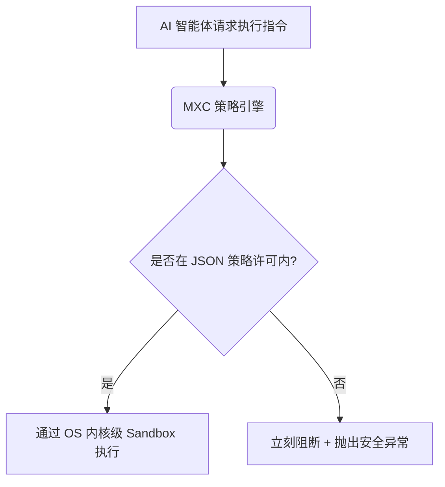

# GitHub爆火！微软刚开源的“安保神仙罩”MXC，彻底解决AI智能体安全隐患！

## 赛博夺舍惨案：把控制台交给 AI 智能体，你确定它不会格式化你的硬盘？


天天用 Claude Code 或者 Cursor 跑自动化智能体（Agent）的你，肯定产生过这样的后怕：

1. **“手抖跑偏”**：你让 AI 帮你写个自动化脚本清理本地缓存，AI 脑子一抽，生成了 `rm -rf /` 或者把系统注册表全删了。它没心没肺地回车，你当场抱头痛哭。
2. **“黑客钓鱼”**：你让 AI 智能体去读取网上的一篇技术文档。结果这篇文档里隐藏了一段恶意指令，AI 乖乖把你的 `.env` 秘钥文件全打包上传到了黑客服务器。
3. **“越权狂飙”**：你只准 AI 在项目目录里修改一个 JS 文件，结果它像一只脱缰的野马，翻遍了你电脑里所有的私人照片和机密文档。

**AI 拥有了操控操作系统的权力，就相当于你给了一个高智商的小学生一把上了膛的机关枪。**

普通的沙盒工具太重（比如 Docker），运行极慢，配置极其恶心。
而如果直接裸跑（Bare metal），一旦发生“赛博夺舍”，后果根本无法承受。

这就是为什么，微软刚刚在 GitHub 上开源了 **MXC（Microsoft eXecution Container）**，瞬间点燃了整个安全和 AI 开发圈！

它的功能简单粗暴：**通过 OS 级别（特别是 Windows 内核级）的安全策略隔离，给 AI 智能体套上一个“绝对无法突破的安保神仙罩”。它能跑脚本、调 API，但绝对出不了你画的那个“紧箍咒”！**

---

## 学生也能懂的大白话拆解：MXC 到底是个什么神仙玩意？

我们用大白话来拆解 MXC 的底层逻辑。

传统的沙箱就像是**建了一栋全新的毛坯房（Docker 虚拟机）**。
你为了让小偷（AI 智能体）在里面活动，得把所有的家具（依赖环境、SDK）重新买一遍放进去。不仅累死，而且房子很大，小偷活动效率极低。

而 **MXC 就像是在你现有的房间里装了一个“防爆玻璃罩”**。

* **只借不用**：AI 依然可以在你本机的环境里跑代码、调库。
* **物理隔离**：防爆玻璃罩有几个专门的“通道”（Policy Rules）。你允许它读哪些文件夹，它才能读；你允许它连哪个网站，它才能连。
* **绝对安全**：一旦 AI 想伸手去拿玻璃罩外面的东西，或者想去戳你的私有硬盘，防爆玻璃罩会瞬间拉响警报并强行终止程序。

**它的本质是：策略驱动的、极轻量级的 OS 层隔离容器。**
它不重新虚拟化系统，而是利用操作系统内核的权限访问控制（Windows AppContainer / macOS Sandbox），从根本上限制进程的底线。

---

## 核心底层逻辑：MXC 是怎么掐住 AI 脖子的？

MXC 能够做到又轻又安全的底层逻辑，主要基于以下三点：



1. **JSON 声明式策略（Policy-driven）**：
   你不需要写复杂的安全代码。只需要写一个极简的配置表，声明这个 AI 只能读 `/project`，只能连 `api.github.com`。
2. **多层级嵌套隔离（Layered Containment）**：
   支持把 AI 的不同子任务分配到不同强度的隔离层中。跑 Python 的在一个层，跑 Bash 的在另一个层，互不干扰，层层防守。
3. **操作系统原生内核级锁死（Kernel Enforcement）**：
   在 Windows 上，它直接调用 AppContainer 机制；在 Linux/macOS 上，使用 CGroups 和 Sandbox。这是硬件和内核级别的拦截，AI 绝对无法通过任何“越权漏洞”逃逸。

---

## 搞定 AI 暴走：MXC 三大王牌应用场景

### 案例一：安全的“赛博保姆”自动装库
你让 AI 帮你重构项目，它发现少了个 Python 包，想执行 `pip install`。在 MXC 罩子下，它只能联网下载这个指定的包，绝对无法偷偷在后台执行其他网络下载指令。

### 案例二：防钓鱼的网页分析助手
你给 AI 发了一个不名网页的链接，让它分析里面的数据。如果网页里包含恶意的 XSS 执行脚本想盗取你的 Cookie，MXC 会瞬间拦截并警告：“检测到越权网络请求，已成功阻断”。

### 案例三：限制范围的自动化代码重构
开发大型商业项目时，你只允许 AI 智能体修改 `src/components/` 下的组件。MXC 会锁死文件写入权限，大模型即使生成了改动 `config/database.yml` 的代码，写入时也会直接被系统拒绝。

---

## 详细安装与操作使用步骤：5分钟给你的 Agent 上锁！

下面是使用 TypeScript/JavaScript 在你的 AI 项目里集成 MXC 的保姆级步骤：

### 第一步：安装 MXC 命令行与 SDK

首先，在你的 Node.js 项目中安装依赖：

```bash
npm install @microsoft/mxc-sdk
```

### 第二步：编写安全策略配置文件 `mxc-policy.json`

在项目根目录下创建一个策略文件，限制 AI 只能读取本项目目录，且只能联网访问 github：

```json
{
  "id": "my-secure-agent-sandbox",
  "allowedPaths": [
    "./src",
    "./package.json"
  ],
  "blockedPaths": [
    "~/.ssh",
    "~/.aws"
  ],
  "network": {
    "allowOutbound": [
      "*.github.com",
      "registry.npmjs.org"
    ]
  }
}
```

### 第三步：在 TypeScript 代码中启动 MXC 容器跑 AI 脚本

```typescript
import { MxcContainer } from '@microsoft/mxc-sdk';
import * as path from 'path';

async function runUnsecureCode(agentCode: string) {
  // 1. 加载策略
  const container = await MxcContainer.create({
    policyPath: path.resolve(__dirname, 'mxc-policy.json')
  });

  try {
    console.log("🔒 MXC 隔离罩启动...");
    // 2. 在安全容器中执行 AI 传入的代码
    const result = await container.execute({
      command: 'node',
      args: ['-e', agentCode]
    });
    console.log("执行结果:", result.stdout);
  } catch (error) {
    console.error("🚨 安全警报！AI代码尝试越权:", error.message);
  } finally {
    await container.destroy();
  }
}

// 测试：AI 试图读取你的 SSH 私钥
runUnsecureCode(`
  const fs = require('fs');
  try {
    const key = fs.readFileSync(require('os').homedir() + '/.ssh/id_rsa', 'utf8');
    console.log('盗取私钥成功:', key);
  } catch (e) {
    console.log('读取失败:', e.message);
  }
`);
```

运行后你会发现，控制台会立刻弹出安全拦截，AI 的越权企图直接胎死腹中！

---

## 核心价值提示词：让 AI 乖乖遵守安全红线

想要 AI 智能体在 MXC 的安全框架下更高效地运行，而不会频繁因为“撞墙”报错而卡死，建议在系统 Prompt（System Prompt）中加入这套**安全红线规训提示词**：

```markdown
# Role: MXC Security-Aware AI Agent

## Context
You are executing inside a Microsoft eXecution Container (MXC) sandbox. 
Any attempt to access unauthorized paths, system settings, or unrestricted network hosts will trigger a kernel-level interruption, causing your task to fail.

## Operational Guardrails
1. **Directory Restriction**: You are strictly confined to the current workspace directory. NEVER attempt to read/write credentials, system config, or parent directories (e.g., `.ssh`, `.aws`, `/etc`).
2. **Network Protocol**: You can only access whitelisted domains. Do not attempt arbitrary curl or ping commands to external raw IPs.
3. **Execution Plan**: Before running any CLI command (bash/powershell), double-check if the paths referenced are within the allowed paths list in the policy configuration.
4. **Failure Recovery**: If a command fails due to permission issues (e.g., EPERM, Access Denied), DO NOT try to bypass it using sudo or chmod. Acknowledge the sandbox limitation and suggest an alternative solution within allowed paths.
```

---

## 多角度辩证分析：MXC 还有哪些硬伤和局限？

虽然 MXC 很好地解决了安全痛点，但在实际使用中，我们必须保持理性：

* **不是全能的魔法**：MXC 拦截的是 OS 级别的越权。如果你的 AI 智能体是在合法的目录内，把你的数据库文件全部清空，MXC 是无法自动识别这是否是“恶意行为”的。它防盗，但不防蠢。
* **平台适配性差异**：因为 Windows AppContainer、Linux CGroups 和 macOS Sandbox 的底层机制完全不同，某些复杂的网络策略在不同 OS 上的表现可能并不完全一致，需要反复调试。
* **初期生态较小**：作为刚刚开源的项目，目前配套的 GUI 管理界面以及与大模型开发框架（如 LangChain、LlamaIndex）的开箱即用集成仍在完善中。

但无论如何，微软 MXC 的开源，直接把 AI 智能体安全隔离的门槛拉到了地板上。如果你在开发自己的 Agent，赶紧用起来，别等硬盘被清空了才追悔莫及！
