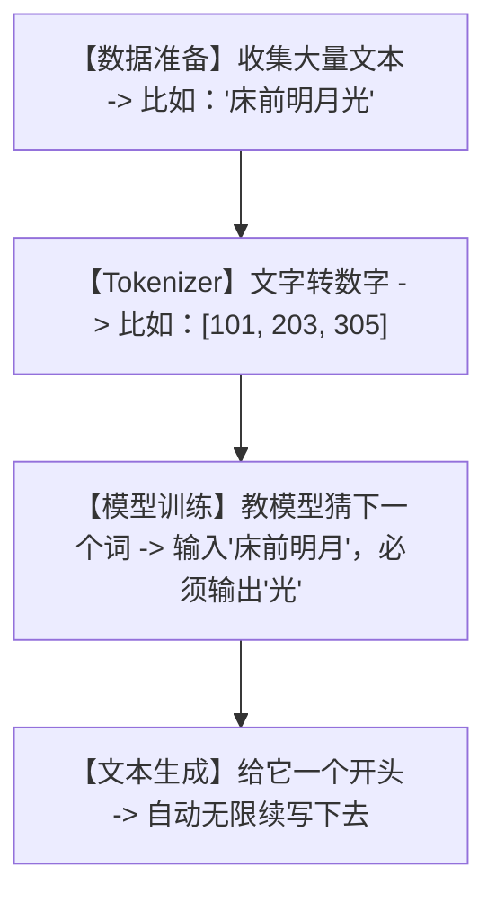

# 🔥今天全网刷屏！这才是真正的“手把手教你从零训练大模型”！5分钟手搓出你的人生首个LLM！

## 脑壳疼：大模型天天吹，为什么我们还是觉得它“神秘得像个玄学”？


 
不管你是刚入门的计算机系学生，还是对 AI 满怀好奇的科技爱好者，最近一定被各种大模型（LLM）狂轰滥炸。

但每次你兴冲冲地想去学习“如何训练一个自己的模型”时，点开教程，迎面扑来的都是：
1. **满屏幕的数学公式**：什么反向传播、自注意力机制、损失函数……微积分和线性代数瞬间把你劝退。
2. **动辄几百G的庞大数据集**：下载要三天三夜，解压就爆硬盘。
3. **天文数字的算力要求**：没个几张 A100 显卡？对不起，你连跑起来的资格都没有。

**这合理吗？这不合理！** 凭什么大模型只能是巨头们的专属玩具？

今天在 GitHub 爆火的 **`train-llm-from-scratch`** 直接掀翻了桌子！它用极简的步骤，告诉你：**训练一个大模型，本质上就是把大象装进冰箱，只需要三步！**

---

## 降维打击：大白话拆解，训练LLM的底层逻辑到底是什么？

大模型听起来神乎其神，实际上它的底层逻辑简单得像个**“成语接龙游戏”**。



我们可以把训练大模型的过程，拆解为三个极度通俗的概念：

1. **分词器（Tokenizer）——“翻译官”**
   大模型根本不认识汉字或英文，它只认识数字。翻译官的任务，就是把我们输入的“我爱AI”，切成一粒粒的词，然后给每个词发一张身份证（数字ID）。比如：“我”是 1，“爱”是 2，“AI”是 3。

2. **模型结构（Model Structure）——“连线本”**
   大模型的内部就是无数个“连线题”。输入一个词，它会通过复杂的电路（神经网络参数），指向下一个最可能出现的词。训练的过程，就是不断调整这些连线的粗细（权重参数），直到它连对为止。

3. **自监督学习（Self-Supervised Learning）——“自己出题自己做”**
   大模型最神奇的地方在于，它不需要人工标注答案。只要给他一亿字的小说，它自己会把后面的词捂住，让前面的词去猜。猜错了，就自己打手板（更新梯度参数）；猜对了，就继续。

---

## 零基础狂飙：手把手教你手搓第一个大模型

这个项目最牛的地方，就是把所有复杂的步骤都压缩进了几个极简的 Jupyter Notebook 脚本中。只要你有 Python 环境，用你那台破电脑的 CPU 也能当场跑起来！

### 第一步：准备工作（拉取代码与安装）

打开你的终端，输入以下命令：

```bash
# 1. 克隆项目到本地
git clone https://github.com/FareedKhan-dev/train-llm-from-scratch.git

# 2. 进入项目目录
cd train-llm-from-scratch

# 3. 安装核心依赖
pip install torch transformers datasets tiktoken matplotlib
```

### 第二步：运行极简训练

项目内包含多个独立步骤的 Python 脚本。我们直接运行最简版模型训练：

```bash
# 运行极简训练脚本，你将亲眼目睹损失函数（Loss）一路下降！
python train_simple_model.py
```

如果你想一步步深入，可以依次打开并运行项目中的 Notebooks：
- `1_extract_data.ipynb`：如何获取并清理大模型要吃的“精神食粮”（数据）。
- `2_tokenization.ipynb`：看文字是如何被切碎并贴上数字标签的。
- `3_training_llm.ipynb`：大模型的核心代码，看它是如何进行参数训练的。

---

## 玩出花来：大模型训练的 3 个实战案例

学会这个项目的核心逻辑后，你可以在以下 3 个场景中横着走：

### 1. 打造“赛博分身”（专属聊天机器人）
把你微信 3 年来的聊天记录全部导出，喂给这个微型 LLM。经过几个小时的训练，你就能获得一个说话语气、常用表情包、口头禅和你一模一样的“赛博分身”，帮你自动回复那些无聊的消息！

### 2. 垂直领域“专业百科”
把你们公司的全部产品文档、FAQ 问答、客服手册丢进这个模型里进行局部训练。它不联网也绝不瞎编，成为你们公司内部最懂产品细节的“免维护”智能客服。

### 3. 古诗词/科幻小说续写器
把全唐诗或者《三体》小说输入进去，让模型去学习其特定的语言风格。训练完成后，你给它一句话：“在宇宙的边缘”，它能自动给你写出一篇充满科幻味、逻辑闭环的小说段落。

---

## 价值千金：大模型底层架构核心价值提示词

如果你现在无法在本地搭建代码环境，没关系！我把这个项目的底层架构与训练逻辑，提炼成了一份**“LLM 架构设计专家提示词”**。你把它复制进 ChatGPT 或者 Claude，就能让它帮你用纯 Python 从零写出大模型的每个模块！

```markdown
# Role: 极简 LLM 架构设计专家

# Task:
请以最简短、无第三方重度依赖（仅限 PyTorch 和 Python 原生库）的方式，用纯 Python 代码实现一个大模型（LLM）的最小可行性演示（MINI-LLM-MVP）。

# Requirements:
1. **Tokenizer**: 编写一个极简字符级 Tokenizer，能将输入文本编码为数字 ID 列表，并能解码回来。
2. **Dataset & Dataloader**: 实现一个能生成 (X, Y) 输入输出对的数据加载器，模拟“成语接龙”的预测过程。
3. **Model**: 搭建一个微型 Transformer 架构（必须包含 Multi-Head Attention, Feed-Forward Network 和 Embedding 层）。参数量控制在 100K 左右，确保 CPU 可以在 10 秒内完成一次前向传播。
4. **Training Loop**: 写出包含 Loss 计算、优化器更新（Adam）的完整训练循环，打印 5 个 Epoch 的 Loss 变化。
5. **Generation**: 编写一个 autoregressive 生成函数，输入一个起始 Token，模型能自动预测并输出接下来的 20 个字符。
6. **Code Style**: 每行关键代码必须包含中文注释，解释为什么要这么设计，其底层逻辑是什么。
```

---

## 多角度辩证分析：它真的很完美吗？

没有任何技术是包治百病的，我们用冷酷的视角来看看它的边界：

| 维度 | 优势（这很强） | 局限（别神化） |
| :--- | :--- | :--- |
| **学习门槛** | **极低**。用最少的 PyTorch 代码还原了 GPT 的核心组件，没有之一。 | 它为了教学极度简化，忽略了现代 LLM 的分布式训练、混合精度等工程难题。 |
| **运行资源** | **极其亲民**。普通的家用轻薄本，甚至手机终端都可以跑完微型模型的训练。 | 无法训练真正具有“涌现能力”的千亿参数模型，仅适合玩具或垂直演示。 |
| **可定制性** | **百分之百掌握**。你能看懂、修改每一行代码，拥有绝对的控制权。 | 缺乏工业级的容错机制，一旦数据有噪点，模型极其容易崩溃（Loss 报 NaN）。 |

**总结一句话**：如果你想成为顶尖的 AI 研究员，这个项目是你迈出“从调包侠到手搓帝”的第一步；但如果你指望用它去打败 OpenAI，建议洗洗睡吧。

现在，项目就在这里，代码全部开源。别再只当个观众了，赶紧点开链接，手搓你人生中第一个大模型吧！
