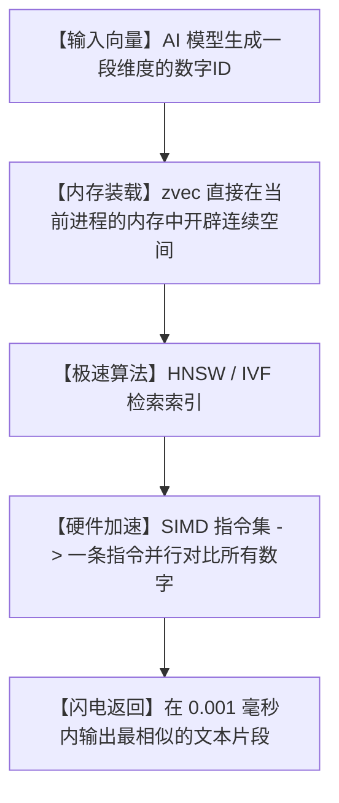

# 🔥检索狂飙100倍！阿里开源单文件向量库 zvec，手搓超高速 RAG 的终极神器！

## 臃肿地狱：为什么我们只是想做一个简单的本地知识库，却要装一个“几十G”的数据库？


每个想自己做个人知识库、RAG（检索增强生成）系统或者智能助手的开发者，在第一步都会遭遇迎头痛击：
1. **“Docker 全家桶折磨”**：为了存几个向量，你得去拉取 Milvus、Qdrant 或者 Pinecone 的镜像。几G的内存瞬间被占满，轻薄本的电扇吹得像直升机起飞。
2. **“繁琐的网络请求”**：每次查询一个向量，你的代码都要经历漫长的 TCP 连接、序列化、发送网络请求、等待数据库返回、反序列化。本地运行慢得像幻灯片。
3. **“运维灾难”**：项目想打包部署给客户？对不起，你得顺便给客户部署一整套云原生数据库集群。客户一看这臃肿的架构，当场把你拉黑。

**这合理吗？这不合理！** 很多时候，我们只是想要一个能快速做“相似度匹配”的高效内存库，凭什么要把事情搞得这么复杂？

今天在 GitHub 爆火的 **`zvec`** 直接把所有臃肿踩在脚下！它是阿里开源的一个**“单文件、嵌入式、无服务”极速向量检索库**。它向你证明：**真正牛逼的架构，往往长得极度简单！**

---

## 降维打击：大白话拆解，zvec 是怎么实现“单文件闪电检索”的？

zvec 的底层核心，其实就是把复杂的向量检索，变成了**“超高效的本地数组连线”**。



我们可以用三个“大白话”概念来理解 zvec 的底层魔法：

1. **“进程内寄生” (In-Process Execution)**
   它不需要你单独运行一个数据库进程，也没有网络监听端口。它是“寄生”在你的 Python 或 C++ 程序内部的。数据直接读写在内存里，查询数据就像是访问一个普通的局部变量，彻底干掉了网络传输的耗时！

2. **“SIMD 硬件加速” (Vectorized CPU Instructions)**
   向量比对需要计算大量的“余弦相似度”，这涉及到成千上万次数字的乘法和加法。zvec 利用了现代 CPU 的 SIMD（单指令多数据流）技术。简单来说，以前 CPU 是一只手算一道题，现在它有 16 只手，能在一瞬间把所有数字对比完毕！

3. **“单文件依赖” (Single-Header Simplicity)**
   没有复杂的安装包，没有满屏幕的依赖警告。它把所有的核心检索逻辑、索引算法全部精简压缩进了一个文件里。你只需要把这个文件复制进你的项目，就能瞬间拥有工业级的向量检索能力。

---

## 零基础狂飙：手把手带你手搓超高速 RAG

只要你有基础的编译环境，几分钟内就能在本地把 zvec 跑起来。

### 第一步：获取源码与编译

```bash
# 1. 克隆阿里 zvec 仓库
git clone https://github.com/alibaba/zvec.git

# 2. 进入目录
cd zvec

# 3. 运行极简编译（zvec 支持 C++ 编译，并提供超方便的 Python 绑定）
mkdir build && cd build
cmake ..
make
```

### 第二步：极简 Python 接口调用

zvec 提供了极其丝滑的 Python 绑定，你可以直接在你的 AI 项目里像使用 List 一样使用它：

```python
import zvec

# 1. 初始化一个维度为 768 的向量索引（支持余弦距离）
index = zvec.Index(dim=768, metric="cosine")

# 2. 添加你的知识向量（模拟文本 embedding）
# doc_id 是知识的唯一ID，vector 是 768 维的浮点数数组
index.add(doc_id=1, vector=[0.1, 0.2, ...])
index.add(doc_id=2, vector=[0.3, 0.4, ...])

# 3. 极速检索最相似的 3 个结果
results = index.search(query_vector=[0.11, 0.19, ...], top_k=3)
print("检索结果：", results)
```

---

## 玩出花来：zvec 的 3 个惊人实战场景

### 1. 纯本地离线“第二大脑”（完美保护隐私）
你想做一个把自己的日记、私人聊天记录变成随时可检索的“第二大脑”。你绝对不希望把这些隐私数据传到云端向量库。用 zvec + 本地大模型（如 Ollama + Llama3），所有数据只存在你的电脑内存和本地磁盘里，断网也能飞速检索，隐私指数 100%！

### 2. 边缘设备与车载芯片 AI 检索
在无人机、智能音箱、甚至是新能源汽车的本地芯片上。这些设备的内存和算力极其有限，根本跑不动复杂的数据库服务。zvec 的单文件极轻量设计，能完美嵌入到这些嵌入式设备里，实现本地语音命令的毫秒级向量匹配。

### 3. 超大规模文本去重与快速推荐系统
你有 1000 万条新闻数据，想要快速找出哪些内容是高度重复的。把它们转为向量后丢进 zvec 内存索引里。利用它强悍的 SIMD 加速，原本需要跑几天的对比任务，在你的电脑上几分钟内就能全部比对清洗完毕。

---

## 价值千金：本地内存向量检索器专家提示词

如果你想让 AI 帮你用纯 Python 实现一个类似 zvec 底层逻辑的、包含 SIMD 并行思想的内存向量检索器，我为你准备了这套**“极简内存向量库设计提示词”**：

```markdown
# Role: 嵌入式向量数据库架构师

# Task:
请使用纯 Python (仅限 NumPy 和 Math 库) 编写一个极简的、单文件的内存向量检索器（MiniVectorDB）。

# Core Requirements:
1. **Distance Metrics**: 支持计算余弦相似度（Cosine Similarity）和欧氏距离（L2 Distance）。
2. **Index Structure**: 
   - 实现一个 `FlatIndex`，直接在内存中维护一个连续的 numpy 矩阵，用于线性检索。
   - 使用 NumPy 的矩阵广播（Broadcasting）特性，模拟 SIMD 并行计算，一句话完成 query 和库中所有向量的距离比对。
3. **Save/Load**: 实现将内存中的向量和对应的 ID 字典序列化保存到本地文件，并能一键加载回来。
4. **Clean API**: 暴露 `add(id, vector)`, `search(query_vector, top_k)`, `save(path)` 和 `load(path)` 四个极简 API。
5. **Code Style**: 每一行复杂的矩阵运算（如求模长、矩阵乘法）必须写明详细的中文注释。
```

---

## 多角度辩证分析：它真的很完美吗？

任何优秀的产品都有其特定的适用场景，我们来看看 zvec 的局限性：

| 维度 | 优势（这很强） | 局限（别神化） |
| :--- | :--- | :--- |
| **检索速度** | **突破天际**。进程内内存直达，SIMD 硬件加速，彻底省去了网络延迟。 | 因为数据全在当前进程的内存里，如果数据量极其庞大（如几亿条），会导致程序内存爆掉。 |
| **集成门槛** | **极度简单**。单文件复制即用，不需要 Docker，没有外部配置痛苦。 | 缺乏分布式扩展能力，不支持多节点分片（Sharding）和高可用自动灾备。 |
| **运行资源** | **极其省电**。超轻量的开销，适合单机、边缘设备及轻量云主机。 | 不支持复杂的 SQL 混合查询，只能做单纯的向量距离搜索。 |

**总结一句话**：zvec 是独立开发者、个人知识库和边缘端 AI 应用的绝对福音。它用最纯粹的极简主义，干掉了 99% 没必要的数据库配置时间，让你把精力真正聚焦在 AI 应用的创新上。

别再去折腾臃肿的云端向量库了，赶紧下载 zvec，感受单机检索的狂飙速度吧！
