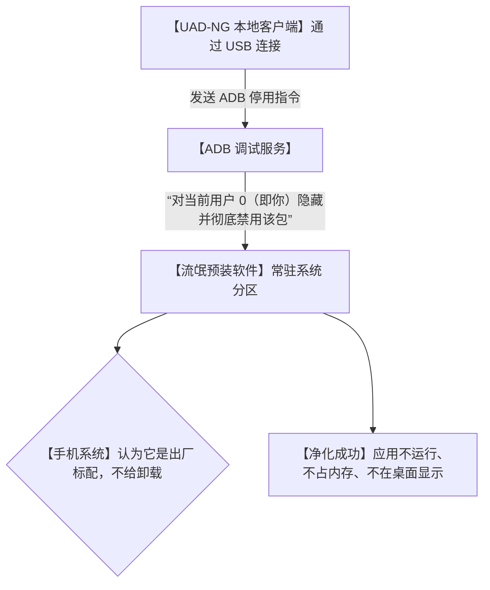

# 📱旧机丝滑复活！全新一代 Android 净化神器，免 root 彻底干掉那些赖着不走的预装软件！

## 流氓预装：为什么我们买来的手机，连“卸载自己不要的软件”都是奢望？


每一个用安卓手机的用户，在日常生活里都一定被以下三个“手机肿瘤”折磨过：

1. **“请神容易送神难”**：手机出厂就自带了各种乱七八糟的视频、阅读、钱包、甚至是不知名的应用商店。你根本用不上，但在桌面上长按它们，却发现根本没有“删除”或“卸载”选项，只能任由它们占着你的昂贵内存。
2. **“后台吸血鬼”**：这些预装软件会在后台悄悄启动、推送垃圾通知、偷偷同步数据。即使你在系统设置里关闭了它们，一旦重启手机，它们又会像狗皮膏药一样死灰复燃，让你的电量半天就掉光。
3. **“父母的老年机噩梦”**：给爸妈买的千元老年机，没用半年就卡得动弹不得。打开一看，全是预装软件诱导下载的各种“清理大师”、“WiFi 钥匙”。老人不会清理，手机越用越热，随时有隐私泄露的风险。

**难道我们就必须去冒着手机变砖、失去保修的风险，去给手机搞什么 Root（获取最高权限）吗？**

今天在 GitHub 狂暴飙升的 **`UAD-NG`**（通用安卓去载器 - 下一代）直接拯救了所有受害者！

它是一个**免 Root、安全度极高、带精美中文界面的开源安卓系统净化器**。它向你证明：**你的手机，你才是它唯一的主人！**

---

## 降维打击：大白话拆解，UAD-NG 是怎么实现“免 root 强行卸载”的？

你可能觉得奇怪，既然手机厂商锁死了“卸载”按钮，UAD-NG 凭什么能把它们给干掉？难道它是黑客软件？

其实不然，UAD-NG 利用的是安卓系统底层的 **ADB（Android Debug Bridge，安卓调试桥）** 通信协议，跟手机厂商玩了一个非常聪明的“障眼法”：



我们可以用三个“大白话”概念来理解 UAD-NG 的底层智慧：

1. **“用户空间停用” (Uninstall for User-0)**
   安卓系统是一个多用户系统（哪怕你只用一个账号，你的账号在底层也叫 User 0）。UAD-NG 并没有冒着变砖的风险去物理删除系统分区（System Partition）里的文件，而是通过调试协议对当前用户发送了指令：**“在本用户下，将这个软件彻底注销”**。效果等同于卸载，系统安全无痛！
   
2. **“海量社区白名单” (Crowdsourced Recommendation Engine)**
   很多人不敢乱删应用，是怕删错了导致手机开不了机。UAD-NG 最牛的地方在于，它背靠庞大的全球开源社区，维护了一张庞大的“预装包白名单”。它会自动识别你的手机型号（小米、华为、OPPO、三星等），并用三种颜色标记包的安全性：
   * **绿色（Recommended）**：可以闭着眼睛放心删的垃圾软件。
   * **黄色（Advanced）**：建议保留，删除可能会影响某些不常用功能。
   * **红色（Expert）**：系统核心组件，千万别删，删了手机会变砖！
   
3. **“一键反悔药” (Instant Recovery)**
   如果不小心手抖删错了一个应用（比如把内置相机删了），不用慌！UAD-NG 会在列表里专门保留一个“已卸载（Uninstalled）”清单。你只需要轻轻点击一下右侧的 `Restore`（恢复），软件就会瞬间完好无损地重新出现在你的手机里，容错率 100%！

---

## 零基础狂飙：手把手带你给手机“洗个热水澡”

使用 UAD-NG 不需要你会写任何代码，只需要准备一台电脑和一根 USB 数据线。

### 第一步：开启手机的“隐藏通道”

1. 打开手机的 **【设置】 -> 【关于手机】**。
2. 连续快速点击 **【版本号】（或 MIUI版本/ColorOS版本）** 7 次以上，直到屏幕下方提示“您已处于开发者模式”。
3. 回到设置菜单，找到 **【系统/辅助设置】 -> 【开发者选项】**。
4. 找到 **【USB 调试】**（有些手机还需要同时开启【USB 调试 - 安全设置】），将它们全部打开。

### 第二步：电脑端启动 UAD-NG

1. 从官方 GitHub 页面（`https://github.com/Universal-Debloater-Alliance/universal-android-debloater-next-generation`）下载对应你电脑系统（Windows / Mac / Linux）的最新版本包。
2. 用 USB 数据线将手机连接到电脑，手机上如果弹窗询问“是否允许这台电脑进行 USB 调试”，点击 **“始终允许”**。
3. 直接双击运行你下载好的 UAD-NG 软件。

### 第三步：开始爽快净化！

1. 软件界面打开后，会自动读取并显示你的手机型号，并在列表里列出所有预装软件。
2. 在右上角的筛选菜单中，选择 **`Recommended`（推荐卸载）**。
3. 勾选所有你想干掉的垃圾 App（比如各种厂商钱包、浏览器、资讯推荐等）。
4. 点击右下角的 **`Uninstall`（卸载）**。
5. 伴随着清脆的提示音，你的手机桌面瞬间变得干净清爽，后台干干净净，省电爽飞！

---

## 玩出花来：UAD-NG 必看的 3 个实战场景

### 1. 彻底解救卡顿的老年机
每次回家过年，父母的旧手机总是卡得发热。花半小时帮他们连上电脑，用 UAD-NG 剔除掉所有自带的低俗阅读、理财、广告推送插件。父母的手机瞬间多出 1-2GB 运行内存，不仅使用流畅，续航还能直接多出一天！

### 2. 封杀手机后台隐私窃听与定位追踪
某些出厂预装的应用，即使你没打开，它也会在后台读取你的通讯录和 GPS。用 UAD-NG 筛选出那些无法在系统里手动停用的“数据同步”、“用户体验改进计划”进程，直接发送注销指令。在物理层面切断其后台运行，隐私保护指数 MAX！

### 3. 外贸出海“纯净环境”搭建
对于做外贸、TikTok 运营的同学，需要一个极其干净的设备环境。用一台二手安卓机，通过 UAD-NG 把所有国内厂商的内置服务、本土推送推送服务彻底打扫干净，还原成一张白纸，防关联效果极佳。

---

## 价值提示词：安卓优化与软件依赖分析提示词

如果你在面对一堆奇奇怪怪的安卓进程包名（比如 `com.miui.analytics`、`com.samsung.android.messaging`）拿不准要不要删时，你可以把这套**“安卓包依赖分析提示词”**塞给 AI 帮你决策：

```markdown
# Role: 安卓系统包名分析专家 (Android Package Specialist)

## Context:
我正在使用 UAD-NG 清理我的安卓手机预装软件。我有一组不确定的系统进程包名。我需要你分析它们的作用，判断删除它们是否会导致手机变砖或系统报错。

## Analyze Framework:
1. **进程定性 (Definition)**:
   - 翻译这个包名的真实所属（例如：`com.android.providers.calendar` 代表系统日历数据中心）。
2. **连锁影响评估 (Dependency analysis)**:
   - 如果我删除了这个包，会有哪些关联的应用无法正常工作？（例如：删除厂商云服务会导致本地便签无法同步）。
3. **安全操作定级 (Safety Grading)**:
   - 给出判定：`Recommended`（放心删）、`Advanced`（谨慎删，需要替代软件）、`Expert`（严禁删，会导致开不了机）。

## Output Format:
- **包名**: [包名]
- **功能描述**: [中文人话解释它的实际用途]
- **删除后果**: [如果删了，哪些手机功能会挂掉]
- **安全定级**: [Recommended / Advanced / Expert]
```

---

## 辩证分析：硬币的另一面

虽然 UAD-NG 强悍且免 Root，但在使用时仍然有需要注意的物理边界：

| 维度 | 优势（无可替代） | 局限（操作须知） |
| :--- | :--- | :--- |
| **保修安全性** | **满分**。不需要解开手机 Bootloader 锁，不需要 Root，随时可以一键恢复，不影响任何保修。 | 如果失手删除了类似 `system_server` 等超核心组件，虽然不会硬件损坏，但会导致手机死机，需要手动重启或拔掉数据线进行恢复。 |
| **清理效果** | **极佳**。应用完全停止后台驻留，后台内存占用瞬间降低，续航得到物理层面的提升。 | 因为没有 root 写入系统分区的权限，它实际上只是为当前用户“注销了该包”。所以手机的物理闪存空间并没有多出来（安装包仍在 ROM 中）。 |
| **设备兼容度** | 依靠庞大的开源白名单数据库，几乎对全球所有主流安卓厂商的机型都支持得极其完美。 | 少数深度定制的非主流机型可能无法自动匹配白名单，需要开发者具备手动查阅包名的能力。 |

**总结一句话**：UAD-NG 是每一个安卓折腾党、极客和孝顺子女的必备装机工具。它把复杂的 ADB 命令行调试变成了一个赏心悦目的图形面板，让你不费吹灰之力，就能帮手机找回提车第一天时的纯净与丝滑！

--- 
> 赶紧找出你压箱底的旧安卓手机，连上数据线，感受一下“旧机变新机”的狂飙快感吧！
