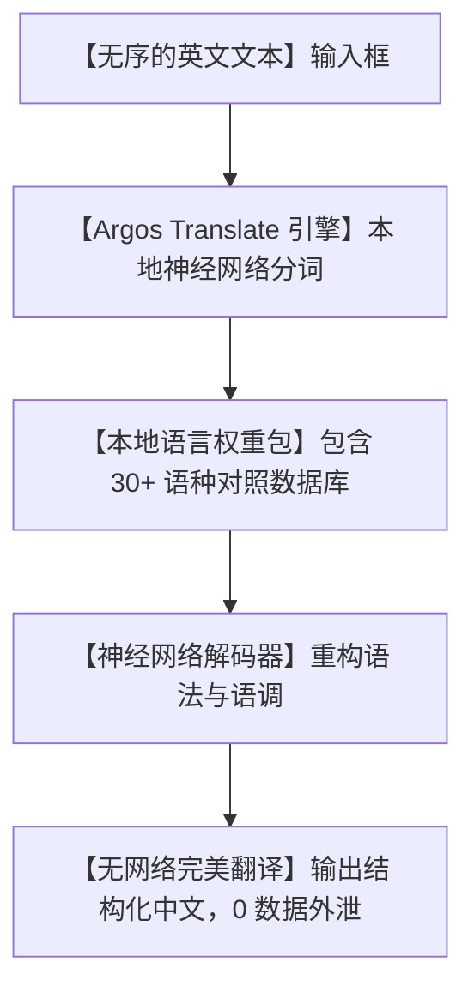

# 🌐断网也能用！开源自建翻译神器 LibreTranslate，彻底终结谷歌/DeepL 账单！

## 翻译黑洞：为什么只是翻个文档，我们要把隐私和钱包双手奉上？


在日常学习、外贸工作或写代码时，我们几乎随时随地都在使用翻译工具。然而，传统的云端翻译（如 Google 翻译、DeepL、有道翻译）正悄悄给你埋下三个难以忍受的坑：

1. **“隐私裸奔危机”**：你手头有一份涉及商业机密、公司财务报表、甚至是个人隐私的情书。当你把它们复制进翻译框的那一瞬间，这些文本就已经被上传到了云端服务器。许多厂商甚至在服务条款里写明“有权使用您上传的文本进行大模型训练”。
2. **“按字符收费的抢钱账单”**：如果你是独立开发者，要在自己的 App 里加个“多语言翻译”功能。云端 API 是按字符收费的，用户量稍微一多，月底的信用卡账单就会让你直接破产。
3. **“无网寸步难行”**：去偏远地区旅游、坐飞机、或者在网络极其糟糕的地下室办公。当你断开网络，所有的云端翻译立刻变成哑巴，连一个最简单的单词都翻不出来。

**为什么我们只是想在本地翻译几个单词，却非要通过海底光缆把数据发到大洋彼岸的云端？**

今天，在 GitHub 爆红的开源硬核项目 **`LibreTranslate`** 站了出来！

它是一个**完全免费、100% 离线可用、不依赖任何云端服务的自托管翻译引擎**。它向你证明：**真正安全、自由的语言翻译，就应该完全掌控在你自己手中！**

---

## 降维打击：大白话拆解，LibreTranslate 是如何“闭门造车”搞翻译的？

很多人会有疑问：没有了谷歌和 DeepL 的超级算力，在我的普通电脑上，它是怎么做到高精度离线翻译的？

其实，LibreTranslate 的底层核心非常纯粹，它使用了一种叫 **OpenNMT（开源神经网络机器翻译）** 的引擎，配合开源的 **Argos Translate** 模型，在本地把翻译过程压缩成了三步：



我们可以用三个“大白话”概念，来理解它的底层运转魔法：

1. **“本地神经网络包 (Local Language Models)”**
   传统的翻译软件是把你的文字发给云端的超算。而 LibreTranslate 则是把经过高度压缩的神经网络模型（每个语种大约只有 100M-200M）下载到你的本地硬盘里。翻译时，你的电脑 CPU 就是它的计算大脑，不需要消耗一字节的网络流量！
   
2. **“开箱即用的 RESTful API” (API First)**
   它不仅是一个网页翻译窗口。它启动后会直接在本地暴露出一个标准的 API 接口。任何其他的软件、命令行工具或你的自建 App，都可以用最简单的 HTTP 请求去调用它，彻底平替了谷歌翻译的商业 API。
   
3. **“零依赖一键自毁 (Zero Tracking)”**
   它不记录任何日志，不需要你注册账号，也没有什么 Token 鉴权。一旦翻译完成，数据在内存中处理完即刻销毁，真正做到了“雁过无痕”，隐私保护指数直接拉满！

---

## 零基础狂飙：5 分钟在本地跑起你的“翻译服务器”

LibreTranslate 官方提供了开箱即用的 Docker 镜像，只需一行命令，你就能在电脑上搭建起私有的翻译中心。

### 第一步：一键运行 Docker 镜像

请确保你的电脑上已经安装好了 Docker。打开你的终端，直接复制并运行以下命令：

```bash
# 启动 LibreTranslate 容器，将端口映射到本地的 5000 端口
# 默认会自动下载常用语言模型（包括中文、英文等）
docker run -dp 5000:5000 libretranslate/libretranslate
```
*提示：第一次启动时，容器会在后台自动去公共下载源拉取对应的语言模型包（大约需要几分钟）。一旦下载完成，你就可以彻底拔掉电脑的网线，进入完全的物理隔离模式！*

### 第二步：在浏览器中使用它

1. 打开浏览器，输入 `http://localhost:5000`。
2. 你会看到一个极其干净、没有任何广告的极简翻译面板。
3. 输入英文：“This is a totally free and private translation engine.”。
4. 侧边栏瞬间会输出完美的中文：“这是一个完全免费和私人的翻译引擎。”

### 第三步：让你的程序直接调用它

如果你是程序员，你可以直接在代码里调用你刚刚自建的接口，完全不花一分钱：

```bash
# 使用 curl 发送一段翻译请求，要求将中文翻成英文
curl -X POST "http://localhost:5000/translate" \
     -H "Content-Type: application/json" \
     -d '{
       "q": "祝你今天过得愉快，平凡日子记！",
       "source": "zh",
       "target": "en",
       "format": "text"
     }'
```

接口会瞬间返回：`{"translatedText": "Have a great day, ordinary diary!"}`。响应时间在毫秒级别，快到飞起！

---

## 玩出花来：LibreTranslate 的 3 个经典实战场景

### 1. 独立 App 的“0 成本国际化”多语言翻译
你开发了一款面向海外的软件，想在 App 内部加一个“用户聊天自动翻译”功能。如果用谷歌 API，你每个月可能会收到几百美金的账单。现在，你只需要在自己的服务器后台运行一个 LibreTranslate 容器，App 所有的翻译请求全部内网调用，成本直接降为 0！

### 2. 商务机密 PDF 离线“无痕翻译”
公司要翻译一份高保密的财务审计合同或者技术专利。员工害怕泄密，不敢使用网上的翻译网站。让员工连上局域网内的 LibreTranslate。大段文本直接粘贴翻译，或者上传整个文档，由于数据完全不经过公网，彻底封死了任何数据泄露的通道。

### 3. 出国旅行的“单机翻译求生本”
准备一架老旧的树莓派或小主机，装上 Linux 和 LibreTranslate，配合一块太阳能板。把它丢在你的旅行背包里。在没有任何基站信号的荒野、或异国他乡的深山中，它就是你与当地人沟通、查阅本地路牌和药品说明书的“离线求生神器”。

---

## 价值提示词：跨语言本地数据重构与清洗提示词

如果你在用自建的 LibreTranslate，配合 AI 助手进行大量跨国文献的提炼和重排，你可以把这套**“跨语言结构清洗专家提示词”**丢给 AI：

```markdown
# Role: 本地翻译网关优化官 (Local Translation Post-Processor)

## Context:
我使用本地自建的 LibreTranslate 引擎，将一批外文文献/代码注释翻译成了中文。由于本地神经网络模型有时对行业黑话（Jargon）翻译不够地道，我需要你基于翻译后的初稿进行“润色与信达雅重构”。

## Refinement Rules:
1. **术语表修正 (Glossary Correction)**:
   - 自动识别并纠正翻译初稿中的生硬翻译（例如：把“调试桥”润色为“ADB调试模式”，“大语言模式”修正为“大语言模型”）。
2. **语序本地化 (Natural Phrasing)**:
   - 调整倒装句和被动句，使其符合中文“短句子、动词主导”的日常口语习惯。
3. **输出对照对照**:
   - 给出修正后的“信达雅”版本，并在括号中标注出你修改的 3 个最核心术语及其原因。

## Output Format:
- **优化后中文文本**: [流利、地道的中文]
- **术语微调记录**:
  - `[原翻译]` -> `[修正后术语]` : [原因说明]
```

---

## 辩证分析：硬币的另外一面

没有哪一款自托管工具是十全十美的，LibreTranslate 也有它的短板：

| 维度 | 优势（无可替代） | 局限（操作前必看） |
| :--- | :--- | :--- |
| **隐私安全性** | **满分**。100% 离线自建，没有 API key 锁死风险，数据永不上云。 | 翻译精度对于一般的日常沟通、技术文档绝对够用，但在文学翻译或极高要求的商业谈判合同上，其语境细腻度相比 DeepL 仍有微小差距。 |
| **使用成本** | **终身免费**。不用按字符数交钱，不限流量，适合高频、大规模的自动化脚本。 | 第一次启动时需要联网下载对应的语言模型包，如果服务器内网无法连接外网，需要手动提前下载模型文件并进行拷贝。 |
| **集成便捷度** | 原生暴露标准的 RESTful 接口，对开发者极度友好，支持 30 多种主流语种。 | 在翻译非常庞大的文件（如几百页的 PDF）时，会消耗大量的本地 CPU 算力，导致老旧服务器响应变慢。 |

**总结一句话**：LibreTranslate 是给所有极客、隐私保护者以及小微开发者的一份大礼。它用极简的 Docker 容器，捍卫了我们对语言数据的“主权”，让我们真正能够零门槛、零账单地与世界沟通！

--- 
> 赶紧在你的 Docker 库里拉取 LibreTranslate，搭建起你私密且免费的个人翻译中心吧！
 
 
