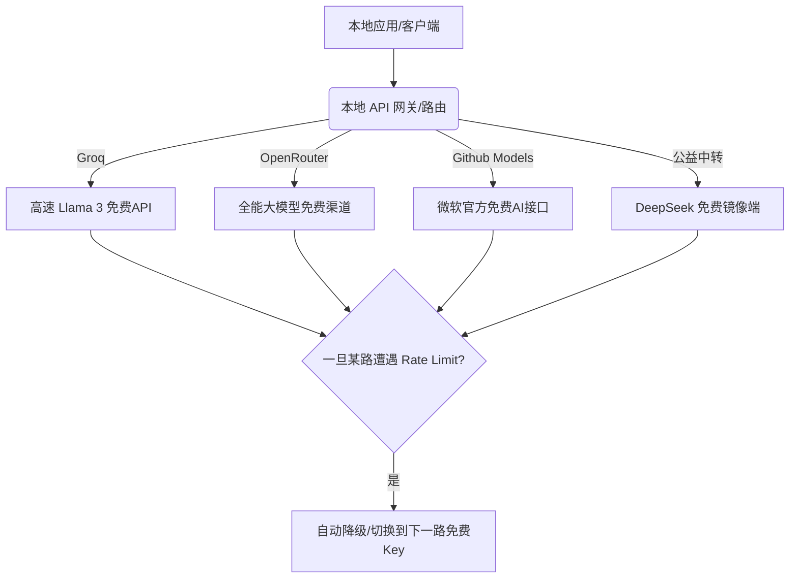

# 白嫖全世界免费大模型API！今天爆火的“开源薅羊毛指南”，教你一分钱不花用爽顶级AI！

## 钱包在滴血：为什么大模型越来越便宜，你的 API 账单却还在“指数级狂飙”？


天天在本地折磨 AI 助手或者搭建个人博客的你，肯定被以下这三个尴尬现状折磨过：

1. **“用不起的 Claude 3.5 / GPT-4o”**：写代码是爽，但一到月底，看着后台那几十美刀甚至上百美刀的 API 账单，你的钱包绝对在颤抖。写两行代码，就得扣好几毛钱，简直是“会呼吸的痛”。
2. **“繁琐的绑卡防线”**：为了免费领个官方赠送的 5 美刀额度，你得去搞海外信用卡、弄手机号验证、折腾复杂的海外代理。结果没折腾两下，账号直接被官方风控封禁。
3. **“高昂的探索成本”**：你只是想写个玩具脚本测试一下大模型的提取能力，却得先去充值 5 美元起步的余额，充进去的钱花不完又退不出来，直接打水漂。

**在开源社区百花齐放的今天，其实全网散落着无数完全免费、零门槛的大模型 API 资源，你却还在傻乎乎地去给商业大厂氪金！**

就在今天，GitHub 上一个叫 **free-llm-api-resources** 的开源项目引爆了极客社区，疯狂吸星！

它的存在就是为了帮你**彻底打消付费焦虑**：**它系统性、每天动态更新整理了全网所有“完全免费、免绑卡、甚至不需要注册就可以直接调用的顶级大模型 API”渠道，直接带你白嫖全世界大模型的算力！**

---

## 零门槛大白话拆解：这帮人为什么能让你“白嫖”大模型 API？

我们用最直观的大白话来拆解这背后的商业逻辑和开源机制。

普通人会觉得纳闷：“运行大模型成本那么高，凭什么让我白嫖？是不是有病毒或者钓鱼？”
其实，全网的免费 API 渠道主要来源于以下三个“正规军”：

* **免费白嫖党（Free Tier Promoters）**：很多初创的 AI 平台为了推广自己的大模型或吸引开发者入驻，会提供永久免费的额度（比如 Groq、OpenRouter、Github Models、Cloudflare Workers AI 等）。他们不仅不收费，运行速度还快到飞起。
* **慈善中转站（Community Proxies）**：有一大批开源极客，用自己的赞助资金或服务器资源，搭建了公益的中转接口（API Hubs），向全社会公开免费调用权限。
* **本地与开源算力联盟**：很多学术机构或开源社区提供的公共算力节点，允许开发者直接通过统一的接口规范（如 OpenAI 协议）免费调用公共的开源模型（如 DeepSeek-R1, Llama 3）。

**它的底层本质就是：全网公益算力节点与大厂开发者免费额度的大汇总。**
你不需要一个一个去翻帖子找链接。跟着这个项目，一键就能配置好你的“永久免费大模型后台”！

---

## 核心架构设计：如何搭建你的“零成本”大模型调用网络？

要完美利用这些免费资源，你需要一个**多路容灾与自动分发**的架构：



1. **统一 OpenAI 协议兼容**：
   所有的免费通道都通过统一的 `v1/chat/completions` 格式输出。这意味着不管是 Cherry Studio、Lobe Chat 还是 NextChat 客户端，都可以无缝直接接入，不需要改动一行代码。
2. **多源多 Key 负载均衡（Load Balancing）**：
   免费接口通常有频次限制（Rate Limit，比如每分钟限 30 次）。通过在本地配置 2-3 个不同的免费 Key，进行自动切换轮询，就可以实现全天候无阻碍的免费高速高频使用。
3. **零卡本地转发**：
   不需要你在本机配置几千块的显卡，直接通过 API 远程向免费云端节点发起 HTTPS 请求，本地只需要一个非常轻量的客户端软件即可。

---

## 薅羊毛的终极体验：三大日常白嫖场景

### 场景一：零成本搭建你的“私人翻译助手”
用沉浸式翻译插件看英文论文时，翻译字符量极大，收费 API 几天就能刷掉你几十块钱。接入 OpenRouter 的免费 Claude/Llama 接口，无论看多少页论文，后台账单永远显示：`$0.00`。

### 场景二：开发者的免费测试沙盒
当你需要写一段 Python 脚本，测试一个批量清洗数据的 prompt 时，直接调用 Groq 的极速 API。每秒吐出上百个 Token，而且完全免费，测试几万次也一分钱不花。

### 场景三：大模型多渠道自动容灾
当 OpenAI 官网或者 DeepSeek 官方接口因为拥堵而宕机时，你的本地客户端会自动无缝调用备用的 GitHub 免费模型接口，保证你的 AI 生产力永远不会因为大厂宕机而中断。

---

## 详细配置与白嫖步骤：5分钟拥有你的免费 API 矩阵！

这里教大家如何用目前最主流的开源免费 API 中转站 **OpenRouter** 和本地客户端 **Cherry Studio** 搭建你的白嫖环境：

### 第一步：注册并获取免费 API Key

1. 打开 [OpenRouter 官网](https://openrouter.ai/)。
2. 点击右上角注册（支持用 Github 账号直接登录，无需绑卡）。
3. 注册成功后，点击 **Keys** -> **Create Key**。
4. 给 Key 起个名字，点击生成。复制保存这个 Key（格式类似于 `sk-or-v1-xxxxxx`）。

### 第二步：查找当前完全免费的大模型

OpenRouter 上长期维护了一大批定价为 `$0.00` 的大模型，例如：
* `meta-llama/llama-3-8b-instruct:free` (极速大模型)
* `google/gemma-2-9b-it:free` (谷歌优秀模型)
* `mistralai/mistral-7b-instruct:free` (小钢炮模型)

### 第三步：配置本地客户端（以 Cherry Studio 为例）

1. 下载并打开 [Cherry Studio](https://cherry-ai.com/) 客户端。
2. 进入 **设置** -> **模型服务商**。
3. 选择 **OpenRouter**（或者添加自定义 OpenAI 兼容服务商）。
4. 在 API Key 栏贴入刚才复制的 `sk-or-v1-xxxxxx` 密钥。
5. 在 API 地址栏保持默认的 `https://openrouter.ai/api/v1`。
6. 点击 **添加模型**，输入你想用的免费模型标识符（如 `meta-llama/llama-3-8b-instruct:free`）。
7. 点击测试连接，看到绿色对勾，大功告成！

现在，你可以在客户端里随便输入问题，你所消耗的全部算力，全部由平台和公益联盟免费买单！

---

## 核心价值提示词：多平台故障智能容灾路由器

当你拥有了多个平台的免费 API 时，可以将这套**API容灾路由器配置规则提示词**发给大模型，帮你快速生成自动切换和容灾的代理脚本：

```markdown
# Role: API Gateway Router Developer

## Task
Write a highly robust Node.js/TypeScript middleware for routing LLM API calls across multiple free API providers (e.g., OpenRouter, Groq, Cloudflare AI) in an OpenAI-compatible format.

## Requirements
1. **API List Configuration**: Support configuring an array of provider endpoints, API keys, and model names.
2. **Auto-Failover**: If a call to Provider A returns a 429 (Rate Limit Exceeded) or 5xx (Server Error), catch the exception, log the failure, and automatically retry the call with Provider B immediately.
3. **No Downtime**: Continue down the provider queue until a successful 200 response is returned. Only throw an error if all configured providers fail.
4. **Token Logging**: Log the prompt and completion tokens used for each successful request for optimization tracking.
```

---

## 辩证冷静看待：白嫖 API 需要避开哪些坑？

虽然白嫖大模型极度舒适，但天下没有完美免费的午餐，在实际使用中务必防范以下痛点：

* **Rate Limit（高频拦截）**：免费 API 通常有极其严格的速率限制。比如一分钟内只准问 20 次，或者一天限额多少万 token。因此，绝对不要把免费 Key 用在大型商业项目或高并发的线上生产环境中。
* **数据隐私与版权安全**：很多公益中转站虽然免费，但你发出去的请求会经过其服务器中转。**绝对不要**把公司的机密代码、私人身份证号、密码秘钥等敏感数据发给免费或公益的 API！防人之心不可无。
* **连接稳定性**：免费通道因为调用的人极多，偶尔会出现短暂的高延迟或报错。如果你需要极致稳定的体验，依然建议配置一个备用的付费官方 API 账户。

但无论如何，**free-llm-api-resources** 的出现为个人开发者和 AI 爱好者提供了一个极佳的零成本试验田。如果你想一分钱不花地快速体验各种大模型，赶紧去克隆配置起来吧！
