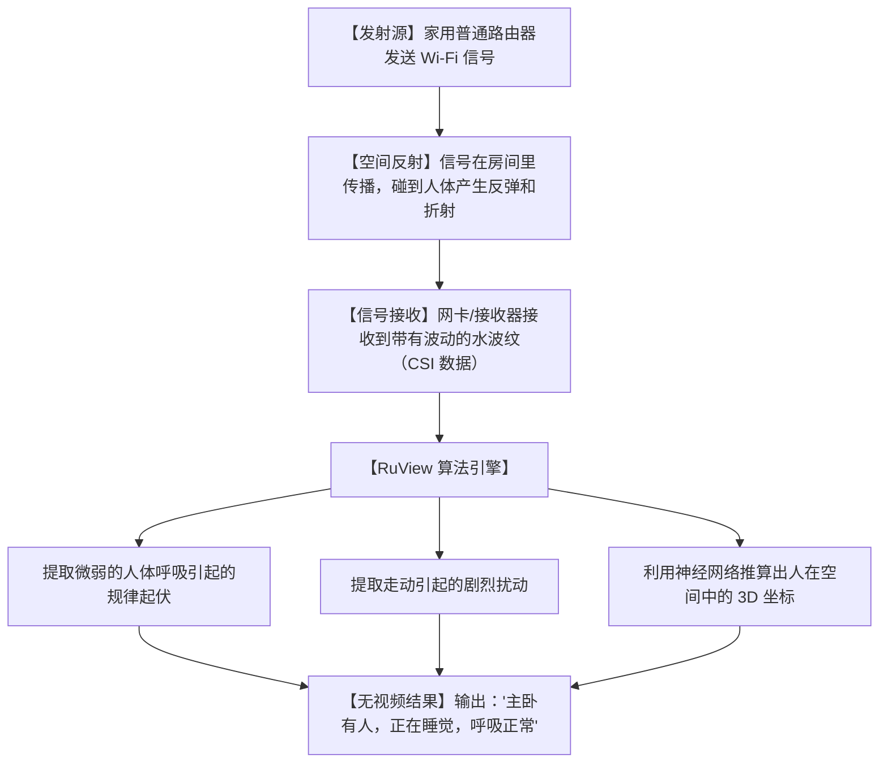

# 👁️无摄像头也能“看透”房间！今天被疯抢的 RuView，用 Wi-Fi 信号实现神级穿墙监控！

## 隐私噩梦：为什么我们既想要“智能安防”，又害怕“摄像头正对着床”？ 


现在的智能家居很方便，但也有着让人如鲱在喉的隐私痛点：
1. **“摄像头焦虑”**：在客厅、卧室装网络摄像头，总担心哪天服务器被黑客攻破，自己的私密生活画面变成网上的免费资源。
2. **“盲区尴尬”**：红外感应器（PIR）只能检测“人在动”。如果你坐在沙发上静静看书或睡觉，感应器就以为屋里没人，啪的一声把灯给你关了，极其弱智。
3. **“高昂的雷达硬件费”**：想要精准毫米波雷达？一个传感器动辄几百块，每个房间装一个，预算直接爆表，而且安装布线麻烦得要死。

**这合理吗？这不合理！** 我们明明已经被漫天飞舞的无线电信号包围了，为什么不能物尽其用？

今天在 GitHub 爆火的 **`RuView`** 项目彻底解决了这个千古难题！它用一行 Rust 代码告诉你：**只要你家里有 Wi-Fi，你其实就已经拥有了一套遍布全屋的超敏感“穿墙雷达”！**

---

## 降维打击：大白话拆解，普通 Wi-Fi 是怎么变成“千里眼”的？

RuView 的底层原理，其实就像是**“池塘里的水波纹”**。



让我们用大白话来拆解 RuView 的 3 个底层硬核技术：

1. **通道状态信息（CSI，Channel State Information）——“水波纹的褶皱”**
   普通的 Wi-Fi 芯片不仅负责传输网速，每次发送信号时，它还会记录这个信号在空气中传播时受到的“阻力”和“折射”。当有人在房间里走动、甚至只是胸腔在起伏呼吸，Wi-Fi 信号这碗水就会产生涟漪。CSI 就是对这些细微涟漪的超高精度记录。

2. **多径干扰消除（Multipath Mitigation）——“过滤杂音”**
   房间里的桌椅墙壁也会反射 Wi-Fi，产生一堆乱七八糟的回声。RuView 内部的算法就像是一个聪明的声纳员，它能把静止的桌椅反射波自动扣除，只把关注点放在“会动的那一缕水波”上。

3. **微弱呼吸检测（Micro-movement sensing）——“听懂胸腔起伏”**
   人的呼吸起伏只有几毫米，但它会对 Wi-Fi 载波的相位产生极其规律的微小扰动。RuView 用快速傅里叶变换（FFT），可以把这种规律的极低频扰动从背景噪声中剥离出来，甚至能隔着一堵水泥墙，精准测出你一分钟呼吸了多少次！

---

## 零基础狂飙：手把手教你把旧网卡变成“雷达”

RuView 目前使用 Rust 语言开发，效率极高，甚至能在几块钱的树莓派或 ESP32 上跑起来。

### 第一步：准备硬件

这个项目不需要你买昂贵的雷达，你只需要：
1. **一个普通的 Linux 主机（或树莓派、闲置的老旧电脑）**
2. **一张支持 CSI 提取的普通 Wi-Fi 网卡**（比如最便宜的 Intel 5300 或者是大名鼎鼎的 ESP32 芯片）。

### 第二步：安装 RuView 引擎

在你的 Linux 系统中打开终端，运行：

```bash
# 1. 下载 RuView 源码
git clone https://github.com/ruvnet/RuView.git

# 2. 进入项目
cd RuView

# 3. 编译 Rust 项目
cargo build --release
```

### 第三步：运行空间监测服务

将网卡切换至监听模式，并启动 RuView 开始解析空气中的 CSI 涟漪：

```bash
# 启动实时解析服务，它会自动输出房间内的人体活动与呼吸数据
sudo ./target/release/ruview --interface wlan0mon --mode spatial-intelligence
```

如果连接了 Home Assistant，你还可以在配置文件中开启 MQTT 自动发现，直接将数据推送到你的智能家居控制中心！

---

## 玩出花来：RuView 的 3 个黑科技实战场景

### 1. 独居老人的“隐形防摔倒监控”
在洗手间、浴室这种最容易发生滑倒、但绝对不能装摄像头的极度私密区域。装上一个带有 ESP32 芯片的智能插座，运行 RuView。当老人洗澡时，系统持续监测“有人存在”；一旦检测到突然发生剧烈位移且人体高度骤降（跌倒），且随后伴随着微弱的异常呼吸，系统会立刻向子女手机发送红色警报！

### 2. 真正“懂你”的无盲区智能空调与灯光
普通的传感器以为你坐着不动就是“走了”，RuView 不管你动不动，只要你还在喘气，它就能隔墙死死锁住你的存在。你坐在沙发上看书、睡觉，空调会温柔地把风避开你，灯光绝不会熄灭；等你真正离开房间，它才会彻底关掉电器，省电又省心。

### 3. “超音速”穿墙无感防盗门铃
把一个微型网卡贴在防盗门内侧。当门外有小偷鬼鬼祟祟撬锁或停留超过 30 秒，即使没有摄像头，Wi-Fi 信号穿过防盗门也能感知到门外人体的存在和呼吸，在小偷还没碰到锁芯之前，家里的音响就发出警告声，吓退小偷。

---

## 价值千金：Wi-Fi 空间感知算法提示词

我把 RuView 将 Wi-Fi 信号（CSI 数据）过滤并转化为空间智能的底层数学逻辑和过滤步骤，写成了一份**“Wi-Fi 穿墙感应算法架构师提示词”**。你把它复制给 AI，它能为你用 Python 还原核心的数据过滤与图表可视化代码：

```markdown
# Role: Wi-Fi CSI 空间智能感知架构师

# Task:
使用 Python (依赖 numpy, scipy, matplotlib) 编写一段 CSI（通道状态信息）数据流的解析和呼吸/运动分类核心处理逻辑代码。

# Core Algorithm Steps to Implement:
1. **Data Load**: 模拟接收包含 30 个子载波（subcarriers）的 CSI 复数矩阵数据（形状为 [Time_Frames, Subcarriers]）。
2. **Phase Sanitization**: 实现相位去噪算法（Phase Sanitization），消除网卡由于采样频率偏置（SFO）和载波频率偏置（CFO）带来的相位随机漂移。
3. **Amplitude PCA**: 对去噪后的振幅数据进行主成分分析（PCA），提取出代表人体运动的第一主成分（First Principal Component）。
4. **Bandpass Filtering**: 编写一个 Butterworth 带通滤波器，限制频率在 [0.15Hz, 0.4Hz] 之间（这是典型的人类呼吸频率区间：每分钟 9-24 次）。
5. **Peak Detection**: 提取滤波后的正弦波峰值，计算呼吸频率（Respiration Rate, BPM）并在控制台打印。
6. **Code Quality**: 每一行数据矩阵的维度变换和数学公式（如 FFT、PCA）处，必须写明中文注释解释其物理意义。
```

---

## 多角度辩证分析：它真的很完美吗？

| 维度 | 优势（这很强） | 局限（别神化） |
| :--- | :--- | :--- |
| **隐私防范** | **100分**。完全没有图像或声音输入，即使数据泄露，黑客也只看到一堆正弦波。 | 无法识别“来者是谁”。它只能知道“主卧有人在动”，但分不清是男主人、女主人还是宠物狗。 |
| **设备成本** | **接近零成本**。利用现有的路由器和老旧闲置电脑，完全不需要买新传感器。 | 需要对网卡进行底层的黑客固件刷写，对小白用户的折腾动手能力要求较高。 |
| **抗干扰性** | **穿墙感知**。没有红外线盲区的限制，被窝里、柜子里都能穿透。 | 容易受“大风吹动窗帘”或者“扫地机器人”等机械运动的干扰，产生误报，需要算法调优。 |

**总结一句话**：RuView 是智能家居安防的未来。它把冷冰冰的电磁波变成了懂人性的隐形雷达，让你在享受智能的同时，守住最安全的隐私底线。

现在，把你的老旧路由器擦擦灰，用 RuView 开启你的隐形智能生活吧！
