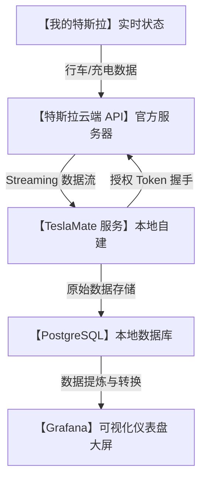

# 🚗特斯拉车主狂喜！自建超硬核数据看板 TeslaMate，零成本解锁百万元级“数字仪表盘”！

## 监控盲区：为什么身价几十万的电动爹，给你的行车数据却简陋得像诺基亚？


每一个特斯拉车主，在提车的新鲜感过去之后，都会面临一连串的灵魂拷问：
1. **“电都充去哪了？”**：为什么官方 App 只显示充了多少电，却不告诉我充电期间由于电池加热损耗了多少度？快充和慢充的真实转化效率到底差多少？
2. **“电池衰减还剩多少？”**：开了两三年，我最关心的电池健康度（SOH）到底降了几个百分点？官方售后检测永远只会给你一句官里官气的“正常”。
3. **“足迹地图一片空白”**：我想回忆上个月和家人去那家绝美露营地的行车路线、行驶时速以及耗电曲线，但在官方 App 里除了账单，你什么都查不到。

官方的逻辑很简单：**“为了降低用户的心智负担，只提供最基础的信息。”** 但对于追求极致掌控感的现代极客和数据发烧友来说，这种“信息阉割”简直是暴殄天物！

难道我们要去买那些每年大几百块、还需要把汽车 Token 上传到云端第三方服务器的商业监控服务吗？数据上传到别人的服务器，万一哪天泄露了，别人随时能定位你的车，甚至远程解锁，你真的能睡得着觉？

今天，GitHub 上狂揽几万 Star 的开源项目 **`TeslaMate`** 彻底终结了这个痛点！它向你证明：**你的车况数据，必须百分之百掌握在自己手里！**

---

## 降维打击：大白话拆解，TeslaMate 是如何“偷听”特斯拉数据的？

你可能会纳闷，TeslaMate 是怎么在不给车子装任何额外硬件（比如 OBD 接头）的情况下，就能抓到那么详细的数据的？

其实，特斯拉并不是一台单纯的汽车，它本质上是一台“长了轮子的移动智能终端”，实时在跟特斯拉的官方云端服务器（Tesla Owners API）进行通信。



我们可以把 TeslaMate 的底层运行逻辑，拆解成三个大白话概念：

1. **“官方通道的合法监听” (Secure API Integration)**
   当你登录 TeslaMate 时，它会引导你生成一个临时的 API 密钥（Token）。TeslaMate 拿着这个 Token，扮演你的“智能手机 App”去请求特斯拉的服务器。它不需要直接连你的车，车子依然在路上跑，数据就已经源源不断地从云端流向了你的本地服务器。
   
2. **“高精度无损记录” (High-Resolution Logging)**
   与官方 App 只有在打开时才请求数据不同，TeslaMate 会在你的本地后台保持一个极轻量级的守护进程。只要你的车处于唤醒状态，它就会以秒级的频率记录车况：电流、电压、速度、海拔、胎压、车内温度、AP（自动辅助驾驶）使用状态等。
   
3. **“绝对的数据主权” (Self-Hosted Security)**
   TeslaMate 的一切都是部署在你自己的电脑、软路由或群晖 NAS 上的。它不需要连任何外网的第三方服务，数据保存在你本地的 PostgreSQL 数据库里。这意味着，**除了你，世界上没有任何人能看到你什么时候去了哪里。**

---

## 零基础狂飙：手把手用 Docker 部署你的“行车数据大屏”

TeslaMate 官方最推荐使用 `Docker Compose` 进行一键部署，哪怕你是个对代码一窍不通的电脑小白，按照下面的步骤，也能在 5 分钟内成功搭建。

### 第一步：准备配置文件

新建一个文件夹，并在里面创建一个名为 `docker-compose.yml` 的文件，贴入以下经典配置（已精简并做好了最佳优化）：

```yaml
version: "3"

services:
  teslamate:
    image: teslamate/teslamate:latest
    restart: always
    environment:
      - DATABASE_USER=teslamate
      - DATABASE_PASS=secret_password # 请修改为您自己的强密码
      - DATABASE_NAME=teslamate
      - DATABASE_HOST=db
      - ENCRYPTION_KEY=super_secure_key # 用于加密 API Token 的密钥，请修改
    ports:
      - 4000:4000
    volumes:
      - ./import:/opt/app/import
    depends_on:
      - db

  db:
    image: postgres:15
    restart: always
    environment:
      - POSTGRES_USER=teslamate
      - POSTGRES_PASSWORD=secret_password # 必须与上面一致
      - POSTGRES_DB=teslamate
    volumes:
      - teslamate-db:/var/lib/postgresql/data

  grafana:
    image: teslamate/grafana:latest
    restart: always
    environment:
      - DATABASE_USER=teslamate
      - DATABASE_PASS=secret_password
      - DATABASE_NAME=teslamate
      - DATABASE_HOST=db
    ports:
      - 3000:3000
    volumes:
      - teslamate-grafana-data:/var/lib/grafana

volumes:
  teslamate-db:
  teslamate-grafana-data:
```

### 第二步：一键运行服务

在包含该文件的目录下打开终端（Terminal），运行以下命令：

```bash
# 启动 Docker 容器组
docker-compose up -d
```

Docker 会自动下载 TeslaMate 核心、PostgreSQL 数据库以及已经内置了特斯拉主题看板的 Grafana 可视化服务。

### 第三步：登录与授权

1. 在浏览器中打开 `http://localhost:4000`，你将看到 TeslaMate 的控制台界面。
2. 系统会提示你输入特斯拉账户的 **Access Token** 和 **Refresh Token**。
   * *安全提示：你可以使用开源的 “Auth app for Tesla”（iOS/Android）或 Chrome 插件来安全地在本地生成 Token，不要在任何不受信任的网页上输入你的特斯拉密码。*
3. 填入 Token 并登录成功后，TeslaMate 就会立刻与特斯拉云端建立连接，开始默默守护你的爱车。
4. 打开 `http://localhost:3000`（默认账号密码均为 `admin`），你将进入极其震撼的 **Grafana 仪表盘群**！

---

## 玩出花来：TeslaMate 必看的 3 个超硬核玩法

### 1. 电池健康度（Degradation）死亡跟踪
TeslaMate 会记录每一次充电时电池电量（SOC）与预估里程的对应关系。随着使用时间的推移，它会在 Grafana 中生成一条电池衰减曲线。你可以清晰地对比你的爱车与全球同型号车型平均衰减速度的快慢，心里对电池寿命清清楚楚！

### 2. 充电“真伪效率”大揭秘
每一次插上充电枪，TeslaMate 都会记录“电网输出功率”与“电池实际接收功率”的对比。你会惊讶地发现，在寒冷的冬天，前 15 分钟可能有一半的电费都被拿去给电池包加热了，通过数据精打细算，合理规划充电预热，一年能省下不少电费。

### 3. “行车手账”与足迹热力图
它能自动将你的所有行驶路线在本地地图上绘制出来，精确到你今天在哪里等了几个红绿灯、超车时的瞬时加速度是多少。你可以一键将这些轨迹导出为 GPX 文件，导入到专业运动地图或视频编辑软件中，作为你自驾游的行车手账。

---

## 价值千金：特斯拉车辆数据分析与节能建议提示词

如果你想让 AI 帮你分析由 TeslaMate 导出的行车和充电 CSV 原始数据，并给出针对性的省电和电池保养建议，你可以把这套**“行车数据专家提示词”**丢给 AI：

```markdown
# Role: 特斯拉行车数据科学家 (Tesla Telemetry Expert)

## Context:
我导出了 TeslaMate 记录的车辆原始行驶与充电数据。我需要你基于这些数据进行深度分析，找出能量消耗的漏洞，并提供延长电池寿命的实操建议。

## Input Data Format:
数据列通常包含: 
- `timestamp` (时间戳)
- `speed` (车速 km/h)
- `outside_temp` (车外温度)
- `soc` (剩余电量 %)
- `power` (瞬时功率 kW, 负值代表动能回收)
- `charger_power` (充电功率 kW)
- `battery_temp` (电池温度)

## Analysis Tasks:
1. **充电效率审计**:
   - 计算 (电池增加的电量 / 电网实际输入电量) 的比值，找出温度或功率在哪个区间时充电效率最高。
2. **能耗异常诊断**:
   - 分析车速在 100-120km/h 以上时，能耗（Wh/km）随车速增长的斜率。
   - 评估动能回收（负功率）在总行驶里程中的贡献占比。
3. **电池寿命评估**:
   - 根据电池温度和充电 SOC 区间，分析是否存在过度快充或高温充电对电池健康度（SOH）不利的模式。

## Output Format:
- **核心数据总览**: 用表格列出关键指标。
- **3个省电瓶颈**: 明确指出哪些驾驶习惯或充电习惯最费钱。
- **保养建议清单**: 给出具体的充电限值、预热习惯及快慢充配比。
```

---

## 辩证分析：TeslaMate 的硬币两面

没有任何一个开源项目是完美无缺的，TeslaMate 也有它的门槛和短板：

| 维度 | 优势（无可替代） | 局限（部署前必看） |
| :--- | :--- | :--- |
| **数据安全性** | **满分**。100% 本地化私有部署，没有任何数据流向第三方服务商，隐私极度安全。 | 暴露在外网时如果防火墙设置不当，或者使用了弱密码，会有被黑客扫描的风险。 |
| **看板丰富度** | **赛车级**。内置超过 20 种精心调校的 Grafana 看板，从海拔变化到单次充电费用应有尽有。 | Grafana 界面完全是英文的，对于不熟悉英文术语的车友可能需要花一点时间汉化和适应。 |
| **吸血（耗电）控制** | **极其优秀**。会自动检测汽车状态，在车辆停放时配合汽车进入“深度睡眠”，不额外费电。 | 如果由于网络不稳定导致 API 不断重试，可能会导致车辆无法休眠，造成几天的异常掉电（Phantom Drain）。 |

**总结一句话**：如果你是个爱折腾的数码极客，且手头有群晖 NAS、树莓派或者不关机的旧电脑，TeslaMate 绝对是你提车后最值得折腾的开源软件，没有之一！它会把你的特斯拉斯满科技属性，让你真正成为爱车的“数据之王”。

--- 
> 赶紧部署起来，下一次充电时，去看看你的“特斯拉”到底在悄悄干些什么吧！
