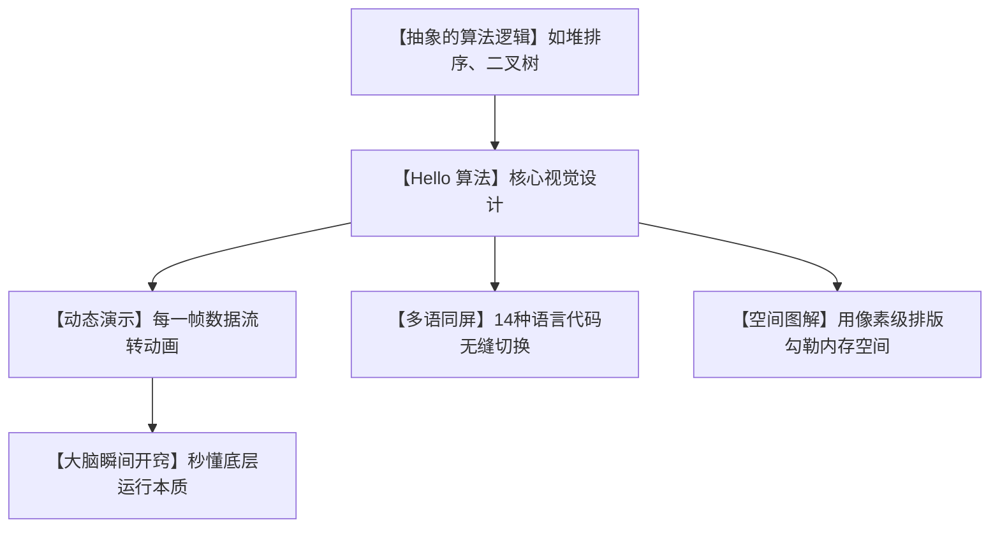

# 🎨美到窒息！爆红的《Hello 算法》动画图解数据结构，小白彻底告别算法恐惧！

## 算法噩梦：为什么我们只是想学个基础知识，却要被天书般的公式折磨退网？


任何想要转行程序员、考研、或者正在备战秋招面试的同学，在打开传统算法教材的第一天，都会遭遇以下三项精神摧残：

1. **“乱码般的伪代码”**：书上的代码要么是几十年前过时的语法，要么根本跑不通。你必须在脑子里手动把伪代码翻译成 Python 或 Java，还没开始学就脑门冒烟。
2. **“催眠用的数学公式”**：二叉树明明是个很形象的结构，书里却偏要用几十行带希腊字母的抽象公式来推导。看着看着眼睛就失焦了，大脑当场决定进入睡眠模式。
3. **“毫无生气的静态图”**：讲解快速排序（Quick Sort）或图的遍历时，书上画了几个冷冰冰的数字和箭头。数据在内存里是怎么飘的，指针是怎么指的，全凭你那并不强大的“脑补算力”去想象。

**我们本可以像欣赏艺术品一样去理解代码的结构美，却偏要被学术性的八股文磨灭掉所有的学习热情！**

就在今天，GitHub 社区上一个备受赞誉的开源大作再次刷屏——**`Hello 算法`**（作者：krahets）！

这不仅是一本算法书，更是一个**“殿堂级的互动视觉艺术品”**。

它把枯燥的代码逻辑，全部拆解成了**丝滑的动画、极致考究的版式设计、以及 14 种主流语言一键运行的代码示例**。

它用惊艳的视觉美感向你证明：**真正顶级的知识传播，往往长得极度好看！**

---

## 降维打击：大白话拆解，它凭什么能治好你的“算法恐惧症”？

如果你觉得这只是另外一个普通的开源电子书，那你就太低估它的含金量了。它主要在三个设计维度上，对传统算法教材进行了降维打击：



我们用三个大白话设计细节，来感受《Hello 算法》的独特魅力：

1. **“把指针运动变成连环画” (Continuous Step-by-Step Animation)**
   在讲解“链表删除节点”或者“双指针遍历”时，它没有用大段文字描述。而是设计了像连环画一样的分解步骤图，把红色的“前驱指针”和蓝色的“后继指针”像积木连线一样动态画给你看。你的眼睛甚至能跟着指针的漂移，瞬间在脑海里还原出真实的内存操作。
   
2. **“消灭‘语言偏见’” (14 Languages Side-by-Side)**
   你学的是 Python，而算法书上用的是 Java；或者你写的是 Rust，而教材上是 C++。这种“跨语种隔阂”极其劝退。Hello 算法提供了极其贴心的“多语同屏”，支持 Python, Java, C++, Go, JS, Rust 等 14 种主流开发语言。轻轻一点，右侧代码框立刻切换成你最熟悉的那门语言，真正的无缝丝滑！
   
3. **“消灭学术黑话” (Simplified Conceptualization)**
   它摒弃了冗长生涩的学术推理。比如在介绍“堆（Heap）”时，它不谈什么抽象的满二叉树定义，而是从“最爱出风头的数字站排头”这个好玩的生活概念切入。配上精心调校的莫兰迪配色插图，让你觉得是在看一本极富设计感的潮流杂志，而不是一本考试教材。

---

## 零基础狂飙：手把手带你玩转《Hello 算法》交互平台

Hello 算法提供了极其良心且完全免费的线上平台和多种离线格式。

### 第一步：选择最爽的阅读姿势

你不需要装任何软件，直接打开浏览器：

*   **网页交互版**：访问 `https://www.hello-algo.com/`，这是最推荐的阅读方式。左侧看动画和文字，右侧直接对着代码运行，支持暗黑模式，颜值拉满！
*   **PDF/ePub 离线包**：在 GitHub 首页（`https://github.com/krahets/hello-algo`）可以直接点击下载已经排版完美的 PDF 和手机端看最舒服的 ePub 电子书。

### 第二步：本地一键运行算法代码

如果你想自己在电脑上修改并运行这些漂亮的算法代码，你只需要：

```bash
# 1. 克隆官方的算法代码仓库
git clone https://github.com/krahets/hello-algo.git

# 2. 进入目录并找到你擅长的语言文件夹（例如 Python）
cd hello-algo/codes/python

# 3. 运行对应的算法文件（例如一键跑二叉树查找）
python chapter_tree/binary_tree.py
```
运行后，终端甚至会用纯字符在屏幕上给你“画”出一棵立体的二叉树！你可以在源码里修改某个节点，再次运行，瞬间观察二叉树结构的变化。

---

## 玩出花来：《Hello 算法》的三大实用场景

### 1. LeetCode 刷题前的“新手避风港”
很多人跟着网上的教程一上来就直接去 LeetCode 刷题，结果被那些困难（Hard）级别的题虐得怀疑人生，从此退网。正确的路线是：在刷题前，先跟着 Hello 算法的动画图解，把“哈希表”、“红黑树”和“快速排序”的底层视觉逻辑走一遍。脑子里有了画面，再去刷题就像是开挂一样轻松。

### 2. 软件设计中的“空间优化指南”
在实际开发中，当你面临几千万条用户数据的排序和排重任务时，不知道是该用数组、链表还是二叉树。打开 Hello 算法的“时间与空间复杂度”章节，它有一张极致精美的数据结构性能对比图表。按图索骥，三秒钟就能帮你选出最省内存、查得最快的底层结构。

### 3. 给团队或学生做“超酷的技术内训”
如果你是团队的技术 Leader，或者高校计算机老师。想给新人讲解什么是“递归”或“动态规划”，直接把书里配套的高清矢量动画插图截下来做成 PPT。新人一看图就懂，瞬间拉满你的专业度与技术品味！

---

## 价值提示词：让 AI 成为 Hello-algo 风格的“图解教学大师”

如果你在备战面试，遇到不懂的复杂算法题（比如动态规划背包问题），可以把这套**“Hello-algo 视觉图解导师提示词”**丢给 AI，让它以同样高颜值、大白话的风格教你：

```markdown
# Role: Hello-Algo 风格视觉图解导师 (Visual Algorithm Coach)

## Doctrine:
你是一个顶级的计算机科学视觉传达专家，以 krahets 的《Hello 算法》风格见长。你需要将复杂的算法题拆解成最易懂的“动画连环画”风格。

## Execution Rules:
1. **彻底拒绝学术黑话 (Jargon-Free)**:
   - 禁止使用任何带大写希腊字母（如 O, Θ, Ω）的复杂数学推导。
   - 用“大白话比喻”（如：把双指针比作两个在操场跑步的人，一个跑得快一个跑得慢）来解释底层核心。
2. **字符版连环画演示 (ASCII Animation Frame)**:
   - 必须使用简单的 ASCII 字符，在输出中“画”出算法在每一步执行时的内存状态（例如：[指针A -> 元素3 -> 指针B]）。
3. **多语言同屏核心**:
   - 每次讲解只给出最核心的 Python 和 Go 的对照代码，并在代码中用注释标明指针移动的“第几帧”。

## Output Structure:
- **大白话直觉认知**: 用生活中的故事解释。
- **逐帧内存图解 (ASCII)**: 至少画出 3 个核心执行帧。
- **极简双语代码**: Python/Go 对照。
```

---

## 多角度辩证分析：《Hello 算法》的优势与局限

虽然 Hello 算法在颜值和通俗度上做到了天花板级别，但对于不同水平的读者，仍然有不同的注意事项：

| 维度 | 优势（这很强） | 局限（别神化） |
| :--- | :--- | :--- |
| **颜值与体验** | **降维打击**。动画生动，排版极其舒适，能彻底激发小白的学习欲望，无压力读完。 | 因为定位是“科普上手”，所以没有包含特别高深、复杂的算法（如红黑树的完整旋转实现细节、高级图论等）。 |
| **代码实用性** | **极其良心**。14 种主流语言全部经过实测，100% 跑通，告别传统书的“错漏地狱”。 | 书中所有代码都追求“极简和教学化”，在面临海量并发或极速响应的工业级场景时，仍需要进行性能优化。 |
| **理论深度** | 概念清晰。通过几何直觉引导，能快速建立算法的时空复杂度感官。 | 缺乏大量的数学严谨推导。如果是应付以证明题为主的高级学术考试，仍然需要配合经典《算法导论》进行备考。 |

**总结一句话**：对 90% 的普通开发者和算法初学者来说，这绝对是他们生命中能遇到的**最美、最温柔的算法启蒙书**。它干掉了所有傲慢的公式，用设计的温度，带你真正看清代码运转的几何之美。

--- 
> 别再去啃那些像天书一样的旧教材了，打开 Hello 算法，感受一下爽快且高颜值的算法学习体验吧！
