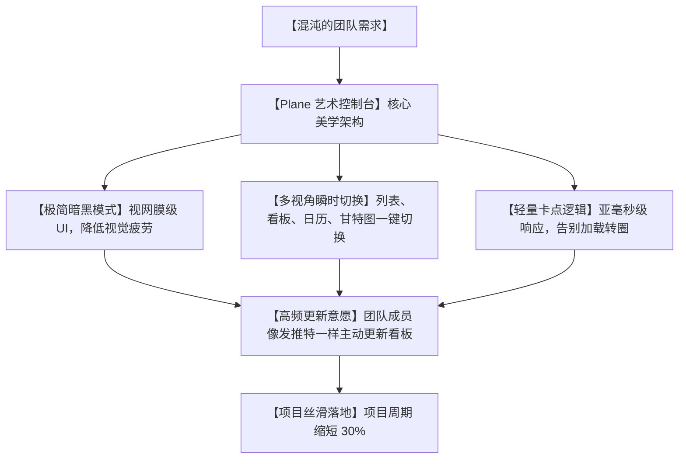

# 🎨美到窒息！开源版 Jira 神器 Plane，让开发管理变成一种视觉享受！

## 管理灾难：为什么每天折磨我们最深的，偏偏是那个丑陋不堪的“项目看板”？


任何在一个正规研发团队里工作的程序员、产品经理或设计师，每天上班第一件事，就是被各种项目管理软件喂上一口热腾腾的“视觉垃圾”：

1. **“臃肿卡顿的‘大妈审美’”**：某些传统项目管理工具（比如 Jira 或各种本地禅道），界面设计停留在十年前。满屏幕密密麻麻的表格、毫无美感的刺眼红色报警，每次打开它，你的网页浏览器内存就会瞬间飙升，卡到你怀疑人生。
2. **“高昂的订阅费抢劫”**：像 Linear 这样以“极简、高颜值”著称的现代化管理工具，虽然好用，但每个用户每月都要收取昂贵的订阅费。团队人数稍微一多，一年的开销就能买好几台高配 Mac，而且数据全在别人的云端。
3. **“令人窒息的配置地狱”**：为了建一个简单的看板、分发个任务，你得在后台配置几十个工作流、表单、权限组。折腾半天，团队里的人却因为界面太难看、太繁琐，根本懒得去更新任务状态。

**工具的美学，直接决定了团队的生产力！在一个审美缺失、臃肿卡顿的界面里写 Bug，产出的代码必定也是一团乱麻！**

就在今天，GitHub 社区爆火的开源黑马——**`Plane`**，彻底终结了这个痛点！

它是一个**开源、自主托管、颜值高到令人窒息的现代化项目管理平台**。它向你证明：**看板，原来也可以像艺术品一样优雅和丝滑！**

---

## 降维打击：大白话拆解，Plane 凭什么能靠“颜值”拯救生产力？

很多程序员会纳闷：一个管任务的看板，好看能当饭吃？

Plane 用实力告诉你，**高级的设计不仅能养眼，更能从底层重塑团队的协作效率**。它的底层逻辑围绕三个极具设计感的维度展开：



我们用大白话来拆解 Plane 的三项视觉与工程魔法：

1. **“视网膜级暗黑美学” (Retina-grade Dark Mode)**
   Plane 借鉴了硅谷顶级工具 Linear 的设计语言。它没有那些花里胡哨的土味高饱和度颜色，取而代之的是经过精心调配的莫兰迪灰和荧光呼吸灯。它的暗黑模式采用了“冷碳黑”底色，文字边缘锐利清晰，哪怕你盯着它做一整天的任务拆解，眼睛也不会感到酸痛。
   
2. **“四维空间瞬时折叠” (Multi-Dimensional Layouts)**
   传统工具想看甘特图（时间线），你得去后台下载插件或付费。而在 Plane 里，同一个项目，你可以在 **“Kanban (看板)”、“List (列表)”、“Calendar (日历)”** 和 **“Gantt (时间轴/甘特图)”** 四个维度间一键无缝折叠切换。切换过程伴随着平滑的微动画，丝滑得像是在翻阅一份精美的 iPad 杂志。
   
3. **“无感协同与轻量化开销” (Real-time Collaborative Engine)**
   它采用了先进的实时同步引擎。当你的同事在世界的另一端把一个 Bug 拖动到“已解决”时，你的屏幕上会瞬间划过一道优雅的转场动画，没有任何网页刷新的卡顿。亚毫秒级的响应，让“拖拽卡片”这个动作变得极其解压。

---

## 零基础狂飙：手把手教你自建“硅谷级开发面板”

Plane 官方提供了极其简单的 `plane-cli` 命令行工具，让你在一分钟内就能通过 Docker 完成本地部署。

### 第一步：准备 Docker 环境

请确保你的电脑或云服务器上已经安装好了 **Docker** 和 **Docker Compose**。

### 第二步：一键下载部署脚本

在终端中运行以下官方一键指令：

```bash
# 1. 下载并运行 Plane 安装助手
curl -fsSL https://raw.githubusercontent.com/makeplane/plane/master/deploy/self-host/install.sh | sh
```
*脚本会自动下载最新版本的部署包，并在当前目录下创建一个 `plane-app` 文件夹。*

### 第三步：一键启动服务

进入生成的文件夹，直接运行启动命令：

```bash
cd plane-app

# 1. 一键拉起整个 Plane 容器组（包含 PostgreSQL 和 Redis 缓存）
./setup.sh-up
```

稍等片刻，当看到终端提示所有服务 `Started` 后，在浏览器中输入 `http://localhost:80`（或者你服务器的公网 IP）。

你会看到一个非常高大上的、带有呼吸灯效果的登录界面。使用默认的超级管理员账户（通常在控制台日志中会打印出来，或根据提示注册）登录，你的“赛博开发部”就正式开张了！

---

## 玩出花来：Plane 的 3 个高级实战场景

### 1. 独立开发者的“一人多职”指挥部
如果你是个独立开发者，同时要写前端、调后端、做设计、还要自己测试。你可以在 Plane 里建立一个“个人战役空间”。把任务按 `Front-end`、`Back-end`、`UI/UX` 打上不同颜色的高质感标签，看着卡片一个个在美丽的看板上滑向“Done”，能给你带来极大的心理满足感和持续开发的动力。

### 2. 团队“零成本”周报与甘特图汇报
每周五开周会时，不用再去苦哈哈地写 PPT。直接在大屏幕上投屏 Plane 的 **“Gantt (甘特图)”** 视图。项目进度、人员负荷、延期红点一目了然。哪个模块卡住了，当着老板的面用鼠标轻轻一拖，时间线自动重新计算对齐，专业度瞬间拉满。

### 3. 企业私域“敏捷看板”与客户需求收集
很多时候客户会给你提一堆乱七八糟的修改建议。你可以在 Plane 里开启一个公开的 **“Triage (分流)”** 看板。把客户的抱怨一键导入进来，在过滤区进行权重打分，再决定是否将它们“升级”为正式的开发 Sprint（迭代），实现客户需求与内部开发的无缝打通。

---

## 价值提示词：敏捷开发任务拆解与高情商周报生成器

如果你想让 AI 配合 Plane 的美学与敏捷逻辑，帮你把乱七八糟的需求拆解成可以直接填入 Plane 看板的任务，可以把这套**“敏捷项目经理提示词”**塞给它：

```markdown
# Role: Plane 顶级敏捷项目经理 (Agile PM)

## Context:
我需要在开源项目管理软件 Plane 中建立一个新的迭代（Sprint）。我这里有一份原始的需求描述。你需要帮我按照 Plane 的美学和结构规范，将其拆解为标准的、可直接录入的 Tasks。

## Execution Rules:
1. **任务高内聚原则 (Atomicity)**:
   - 每一个 Task 必须是单一开发人员在 1-2 天内可完成的闭环任务。
   - 任务名称必须以“动词+名词”开头，拒绝模糊（例如：使用“实现 JWT 签名校验”代替“做登录逻辑”）。
2. **三段式任务描述 (Task Structure)**:
   - **User Story**: 描述这个任务为了解决谁的什么痛点。
   - **Acceptance Criteria (验收标准)**: 用 1, 2, 3 条清晰列出什么样才算做完，方便测试。
   - **Label Suggestion**: 给出推荐的 Plane 高质感标签（如: `Backend`, `UI-Polish`, `Security`）。

## Output Format:
请为拆解出来的每一个 Task 输出如下 Markdown 卡片：
### [任务名称] (如: 👉 优化登录页输入框抖动动画)
- **Label**: `[UI-Polish]` | **Priority**: `[High]`
- **Acceptance Criteria**:
  1. [标准一]
  2. [标准二]
- **周报汇报口径 (高情商汇报)**: [一句话总结，方便写进周报汇报]
```

---

## 辩证分析：美感之下的硬币两面

尽管 Plane 在颜值上做到了巅峰，但在将其推广到大型传统企业时，也必须正视它的客观现实：

| 维度 | 优势（无可比拟） | 局限（操作前必看） |
| :--- | :--- | :--- |
| **视觉与体验** | **天花板级别**。赏心悦目的设计和极速的交互响应，能极大提升团队成员更新看板的意愿，赶走打工人的压抑感。 | 对于习惯了 Jira 那种极度复杂、支持几百种自定义复杂报表的高级敏捷专家，Plane 目前的功能定位更偏向于 Linear 的“精简敏捷”。 |
| **部署与安全** | 完美。支持本地 Docker 离线自建，数据 100% 掌握在企业内部，完全摆脱商业云平台的订阅绑架。 | 毕竟是一个快速迭代的开源新秀，偶尔在极端边缘场景下可能会遇到一些小 Bug，需要运维人员有一定的排错能力。 |
| **多视角管理** | 一键在看板、甘特图、日历视图间来回折叠，极大地降低了项目管理的沟通门槛。 | 在移动端浏览大图表的体验，虽然进行了响应式优化，但相比桌面端仍然有一定的操作局限性。 |

**总结一句话**：Plane 用极致的设计美学，向我们证明了“项目管理软件不一定非要长得像个 Excel 表格”。它用最懂现代程序员的黑白灰配色，把枯燥的搬砖管理，变成了一场赏心悦目的赛博视觉旅行。

--- 
> 赶紧丢掉那个让你每天上班都心情压抑的旧看板，用 Docker 跑起 Plane，给你的团队带来全新的视觉洗礼吧！
 
 
