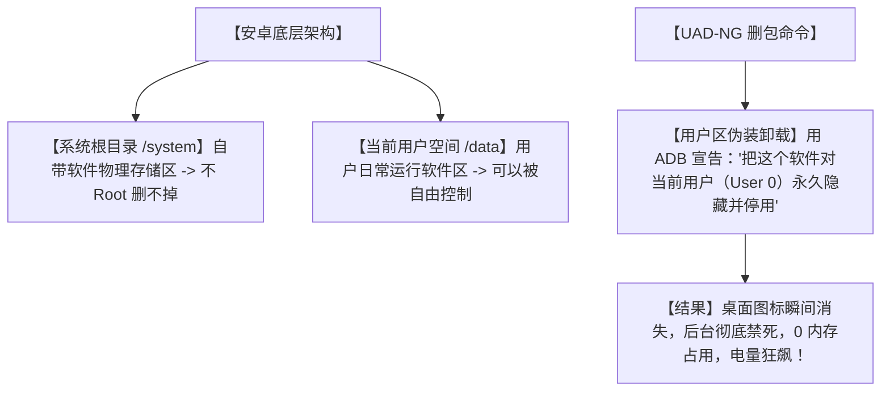

# 📱彻底撕掉系统毒瘤！今天全网疯传的 UAD-NG，无需 Root 还原安卓手机的极简设计！

## 视觉与系统灾难：为什么我们买回来的新手机，全被“删不掉的垃圾”给占领了？


任何一个安卓（Android）手机用户，在开机的一瞬间都会经历这样痛苦的审美灾难：
1. **“删不掉的全家桶”**：手机里预装了 20 多个你一辈子都用不上的自带软件，什么运营商服务、鸡肋的应用商店、各种听歌看视频的官方全家桶，长按它们根本没有“卸载”按钮，像牛皮癣一样死死贴在桌面上。
2. **“疯狂弹窗与后台耗电”**：这些自带的系统级软件，为了KPI天天在后台弹通知、偷跑流量、窃取隐私，即使你强行停止运行，手机一重启，它们又像僵尸一样爬出来，把你的手机卡得像幻灯片，电池用半天就见底。
3. **“极度杂乱的桌面视觉”**：五颜六色、风格极其土气的自带图标，彻底毁掉了你精心挑选的高颜值壁纸和极简风主题。

**这合理吗？这不合理！** 我花真金白银买的手机，凭什么连“删除一个垃圾自带软件”的权利都没有？

今天在 GitHub 狂暴飙升的 **`UAD-NG`**（通用安卓删包神器下一代）直接带你重夺手机统治权！它不需要你冒着手机变砖的风险去搞什么“Root 刷机”，直接在电脑上用最清爽的界面，**一键给你的手机做一场终极“视觉大扫除”！**

---

## 降维打击：大白话拆解，UAD-NG 是怎么实现“免 Root 强删自带软件”的？

UAD-NG 的底层逻辑，其实就是利用了安卓系统的**“双层卸载后门”**。



我们可以用三个“人话”概念来理解 UAD-NG 的硬核魔法：

1. **“用户空间伪装卸载”（ADB User Debloat）**
   安卓的自带软件是存在“系统只读分区（/system）”里的，如果不获取 Root 权限，我们确实没法把它们的物理文件彻底删除。但 UAD-NG 另辟蹊径，它使用电脑的 ADB（安卓调试桥）向手机发出指令：“把这个自带软件对当前用户（User 0）永久注销并屏蔽！”这就好比把人直接送进冷宫禁闭，虽然他物理上还在皇宫，但他再也没法跑出来兴风作浪，后台占用瞬间变成 0！

2. **“云端推荐删包大百科”（Crowdsourced Debloat List）**
   手机里有几百个包名（比如 `com.android.providers.partnerbookmarks`），普通用户根本不知道哪个是垃圾、哪个删了会导致系统崩溃。UAD-NG 内部集成了一个全球网友共同维护的“避坑百科”。它会自动识别你手机的型号，用红、黄、绿三种颜色标出：绿色是“放心删”，黄色是“小心删”，红色是“千万别删”，跟着颜色点就行，绝对不会把手机搞变砖！

3. **“Rust 编写的极致极简 UI” (Rust-powered Clean GUI)**
   它彻底抛弃了以前那些需要打命令行、界面简陋的 ADB 工具。用 Rust 语言和高性能 UI 框架重构后，软件界面极度清爽、操作行云流水。连上手机，所有的软件一目了然，搜索、分类、一键清理都变成了一种视觉享受。

---

## 零基础狂飙：手把手教你给安卓手机“去油除污”

这个项目是跨平台的，无论你是 Mac、Windows 还是 Linux 电脑，都能轻松上手。

### 第一步：准备手机（开启 USB 调试）

1. 打开你手机的 `设置` -> `关于手机`，连续点击 **“版本号”** 7 次，直到系统提示“已开启开发者选项”。
2. 进入 `设置` -> `系统/其他设置` -> `开发者选项`，开启 **“USB 调试”**。
3. 用数据线把手机连接到电脑，在手机弹出的提示框中点击“允许 USB 调试授权”。

### 第二步：运行 UAD-NG 软件

你可以直接去 GitHub 下载对应你电脑系统的二进制包，也可以本地拉取代码运行：

```bash
# macOS 用户如果安装了 Homebrew，可以通过命令行非常方便地启动：
# 安装 adb 工具支持
brew install android-platform-tools

# 克隆并编译 UAD-NG
git clone https://github.com/Universal-Debloater-Alliance/universal-android-debloater-next-generation.git
cd universal-android-debloater-next-generation
cargo run --release
```

### 第三步：一键去油！

打开软件后：
1. **自动识别**：软件会瞬间读出你的手机品牌（如 Xiaomi, Huawei, Samsung）。
2. **过滤推荐**：在筛选框中选择 **`Recommended`**（推荐删除列表，全是公认的垃圾预装）。
3. **选择并删除**：全选这些列表，点击右下角的 **`Uninstall`**。
4. 看着手机屏幕，那些讨厌的自带图标在一秒内齐刷刷全部消失！

---

## 玩出花来：UAD-NG 的 3 个极简实战场景

### 1. 打造“绝对纯净”的安卓极简视觉（Figma 级审美桌面）
你是一个重度极简主义者。用 UAD-NG 把手机里所有的官方自带应用、副屏负一屏推荐、官方音乐和浏览器全部屏蔽。配合无图标文字的主题包，让你的安卓手机桌面只剩下极细的几何线条和纯净的壁纸，美得像一张设计设计稿。

### 2. 拯救老旧安卓平板的“卡顿与发热”
家里有一台三年前买的旧安卓平板，卡得连看视频都费劲。用 UAD-NG 连接后，将所有后台推送服务、系统广告插件、小工具全部禁死。平板的可用运行内存瞬间翻倍，温度骤降，电池续航多出整整两天，当场满血复活成完美的看剧电子书神器！

### 3. 一键配置“防沉迷、零广告”的长辈专用机
给父母买的新手机，里面塞满了各种诱导下载、偷跑流量的预装软件。用 UAD-NG 把所有乱七八糟的软件商城、自带浏览器、资讯推送服务全部剔除。只留下微信、支付宝和电话，从源头上杜绝垃圾广告和各种流氓扣费服务，让长辈用得无比安心。

---

## 价值千金：ADB 极简手机系统调优指令集提示词

如果你在没有运行 UAD-NG 的电脑上，想通过纯命令行快速卸载某个特定的系统毒瘤，我为你准备了这套**“ADB 极简手机调优指令生成提示词”**：

```markdown
# Role: 安卓系统 ADB 调优专家

# Task:
我需要使用电脑上的 ADB 命令行，对我那台免 Root 的安卓手机进行系统级预装软件清理。请为我编写针对【手机品牌】和【特定App/包名】的具体 ADB 运行指令。

# Requirements:
1. **List Commands**: 提供如何列出手机中所有预装包（特别是包含特定关键字如 'bixby', 'miui', 'huawei'）的模糊检索命令。
2. **Safe Uninstall Command**: 给出免 Root 卸载指定包名在“当前用户”下运行的精确命令：`adb shell pm uninstall -k --user 0 <package_name>`。
3. **Reinstall Command**: 给出如果不小心删错了，如何无需重装系统，一键把这个自带 App 找回来的恢复命令：`adb shell cmd package install-existing <package_name>`。
4. **Safety Warnings**: 醒目列出哪几类核心包（如系统桌面、电话框架、键盘输入法）绝对不能删，否则会导致开机黑屏。
```

---

## 多角度辩证分析：它真的很安全吗？

| 维度 | 优势（这很强） | 局限（别神化） |
| :--- | :--- | :--- |
| **安全性** | **高**。因为是免 Root 卸载，一旦你删错了导致软件报错，只需要恢复出厂设置或者用一条 ADB 命令就能完美恢复，绝不会变砖。 | 软件的包名数据库更新有滞后性，对于刚刚发布的最新款系统，某些极个别新包需要手动判断是否安全。 |
| **操作界面** | **极佳**。高颜值 Rust UI，完美支持深色模式，按品牌和安全级别清晰分类。 | 需要使用电脑通过数据线连接，对于没有任何电脑基础的用户来说，开启开发者选项和配置驱动稍显繁琐。 |
| **优化效果** | **极其明显**。后台常驻进程能减少一半以上，运行内存显著空闲，电池寿命明显拉长。 | 无法释放 `/system` 分区的物理存储空间，也就是说虽然软件消失了，但它占用的物理空间并没有腾给你的照片。 |

**总结一句话**：UAD-NG 是所有安卓数字极简主义者的完美救星。它让你用最清爽的姿势，把手机的主导权从强势的厂商手里抢回来，还你一个原本就该如此纯净的手机桌面。

别再忍受漫天飞舞的系统预装和后台广告了，接上你的数据线，开始你的手机大扫除吧！
