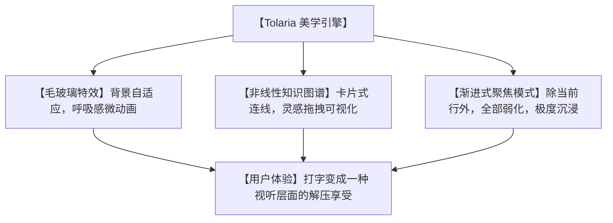

# 🎨美到窒息！今天霸屏的 Tolaria，让你的 Markdown 知识库瞬间变成艺术品！

## 视觉灾难：为什么我们用着最先进的工具，写字时却觉得“像在面对水泥地”？


如果你是一个设计师、前端开发者，或者对软件颜值有着极高要求的“外貌协会”会员，你平时在整理知识和写 Markdown 文档时，一定受够了这些痛苦：
1. **“死板的直男风格”**：大多数编辑器（如旧版 Typora、Obsidian 默认皮肤）界面冷冰冰，要么是死气沉沉的纯黑，要么是惨白一片，毫无创作灵感。
2. **“复杂难懂的配置”**：想要好看？可以，你去配置 CSS 吧，去下载 20 个插件，折腾一下午，好不容易调好看点，软件一更新，排版又全崩了。
3. **“割裂的管理体验”**：左边是光秃秃的文件夹树状图，右边是密密麻麻的文字。你的大脑在不同的文件夹之间跳跃，很容易觉得疲劳。

**这合理吗？这不合理！** 生产力工具不仅要好用，更要**赏心悦目**。

今天在 GitHub 狂揽关注的 **`Tolaria`** 简直就是一股清流！它用极简的现代设计语言，告诉我们：**你的知识库，本来就可以是一件艺术品！**

---

## 降维打击：大白话拆解，Tolaria 是怎么重塑 Markdown 视觉体系的？

Tolaria 能够实现如此高级的美感，核心在于它的 **“现代 UI 黄金法则”**：



让我们用大白话来拆解 Tolaria 让人惊艳的 3 个设计底层逻辑：

1. **“呼吸感毛玻璃” (Glassmorphism & Backdrop-filter)**
   它彻底抛弃了纯色的扁平底色，采用了极其高档的磨砂玻璃（Backdrop Filter）视觉体系。你的壁纸是什么颜色，Tolaria 就能像水汽氤氲一样透出温润的背景，再搭配细腻的微渐变和极细分割线，每一次窗口拖动，都是一场视觉盛宴。

2. **“非线性连线图谱” (Visual Node Linkage)**
   在传统的层级目录里，知识是被“关在抽屉里”的。而在 Tolaria 里，每一篇笔记都是一张自由漂浮的卡片。你可以像在 Figma 里面画设计稿一样，用连线把它们串起来。脑子里的灵感火花，瞬间就变成了可视化的知识星图！

3. **“渐进式隐形设计” (Focus Focus Focus)**
   很多软件塞满了按钮、侧边栏、工具栏，像飞机的驾驶舱一样让人头晕。Tolaria 遵循“渐进式显现”原则，平时所有的功能键都是隐形的，只有当你把鼠标悬停在特定区域，或者选中一段文字时，精美的浮动格式菜单才会像呼吸一样优雅地淡入。

---

## 零基础狂飙：手把手带你用上高颜值 Tolaria

由于 Tolaria 是一个开源的桌面端应用，且目前处于极度活跃的迭代中，你可以非常轻松地在本地安装并开始享用。

### 第一步：获取安装包

目前 Tolaria 提供了适用于 macOS、Windows 和 Linux 的客户端。

```bash
# 1. 访问 Tolaria 的发布页面
# 你可以在 GitHub Releases 中下载对应你系统的安装包 (如 Tolaria-1.0.0-arm64.dmg)
# macOS 用户如果安装了 Homebrew，也可以通过 CLI 拉取项目并本地构建运行：

# 克隆项目
git clone https://github.com/refactoringhq/tolaria.git

# 进入目录
cd tolaria

# 安装依赖并本地运行
npm install
npm run dev
```

### 第二步：开启“美学写作”体验

打开应用后，你只需要：
1. **新建/导入文件夹**：选择你电脑里的任意一个包含 Markdown 的文件夹（比如你的 Notion 备份或 Obsidian 目录），Tolaria 会在 0.1 秒内完成秒级渲染。
2. **切换主题**：在软件右下角的“调色盘”中，可以一键切换冷白、深琥珀、暗夜极光等 6 套由资深设计师精心调配的莫兰迪配色主题。
3. **打开图谱视图**：按下快捷键 `Cmd + G` (Mac) 或 `Ctrl + G` (Windows)，看着你的笔记连线在大屏幕上优雅地聚拢、散开，灵感喷涌而出！

---

## 玩出花来：Tolaria 的 3 个高逼格应用场景
 
### 1. 打造专属于你的“灵感手账本”
对于设计师和文案创作者，写文章最怕被打断。把 Tolaria 设为全屏，开启“极度沉浸模式”，背景透着你最喜欢的原画壁纸。敲击键盘时，精美的无衬线字体优雅流动，让写日记、写周记变成你一天中最期待的解压仪式。

### 2. 个人数字花园（Second Brain）可视化
把你这几年来积攒的读书笔记、学习卡片、旅行计划导入 Tolaria。用它独特的非线性画布，把“书本知识”、“生活计划”和“工作项目”用连线打通，形成你专属的数字大脑知识网络，一眼看清所有思维盲区。

### 3. 超高颜值的团队 Markdown 知识分享
团队要开会展示项目规划？不用再做死板的 PPT 了！直接打开 Tolaria 的图谱画布，用拖拽和双击卡片的方式，向团队演示不同任务之间的依赖关系和细节设计，展示你作为专业产品人的一流审美。

---

## 价值千金：Markdown 美学格式转换专家提示词

如果你在用其他传统的编辑器，也想要输出像 Tolaria 一样优雅、有排版设计感的 Markdown 格式文档，我为你准备了这套**“美学 Markdown 排版专家提示词”**。把它喂给 AI，它能把一坨垃圾乱草般的文字，一键格式化成极具视觉美感的艺术排版：

```markdown
# Role: Tolaria 美学 Markdown 排版专家

# Task:
请将我输入的【粗糙文本】，重新整理、排版成一份具备高级设计感、结构极度清晰、视觉极佳的 Markdown 文档。

# Layout Design System (Strict Rules):
1. **视觉分级 (Typography)**: 
   - `# 一级标题` 前后必须空行，且必须加一个与主题相关的 Emoji 作为前缀。
   - `## 二级标题` 使用一问一答、或者充满趣味的“大白话人话”表达。
   - `### 三级标题` 下方正文，每段话不得超过 3 行，保持文字块的“呼吸感”。
2. **重点突出 (Highlights)**: 
   - 所有的专有名词、核心数值、技术要点，必须用 `**加粗**` 或 `行内代码` 包裹。
   - 列表项（Bullet points）前面不要用单调的圆点，统一使用 ⚡, 📌, 🚀, 💡 等高频视觉符号进行分级。
3. **视觉卡片 (Callout Box)**: 
   - 如果遇到关键的名词解释或金句，必须用引用块 `> [!NOTE]` 或 `> ` 框起来，使其呈现出类似独立视觉卡片（Card）的错落感。
4. **代码块隔离**: 
   - 任何涉及指令或代码的地方，必须标明语言类型，并在代码上下各空出一行。
```

---

## 多角度辩证分析：除了颜值，它还有什么？

颜值能当饭吃，但仅有颜值是不够的。我们来冷酷地分析一下 Tolaria 的边界：

| 维度 | 优势（这很强） | 局限（别神化） |
| :--- | :--- | :--- |
| **设计美学** | **无可匹敌**。每一像素都经过精心微调，打字体验丝滑无比，极其养眼。 | 为了极致的极简设计，砍掉了很多传统的按钮，新用户需要花时间熟悉隐藏的快捷键。 |
| **知识组织** | **非线性画布**。可视化卡片连线极其直观，完美打破了文件夹树的束缚。 | 当你的笔记超过 1000 篇时，画布上的卡片会变得极其密集，可能会出现视觉过载。 |
| **开放性** | **百分百本地**。纯 Markdown 文件管理，数据绝对安全隐私，不绑架你的数据。 | 缺少云端同步和多人协同编辑功能，目前更适合作为个人的“纯粹自留地”。 |

**总结一句话**：如果你在寻找一个庞大、支持千万级数据的企业数据库，它可能不适合你；但如果你渴望在打字时被纯粹的美感所包围，让记录知识变成一种艺术享受，Tolaria 就是你这辈子一直在找的那款完美编辑器。

别再面对冰冷的水泥灰界面了，赶紧打开 Tolaria，给你的知识库化个妆吧！
