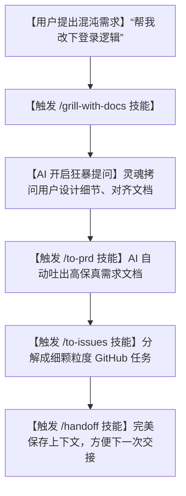

# 💡顶级工程师的“.claude”绝密公开！这套爆火的 mattpocock/skills，让你的 AI 助手瞬间智商拉满！

## 降维打击：为什么普通的 AI 助手只会“打嘴炮”，而顶级工程师的 AI 却像个高智商专家？


绝大多数人在使用 ChatGPT、Claude 或 Cursor 时，都是以“聊天”的方式在用：
“帮我写个用户登录函数”、“这里报错了怎么改”、“帮我把这段代码重构一下”。

这种散漫的用法，很快就会遇到三个让你怀疑人生的问题：
1. **“越重构越混乱”**：你让 AI 帮你重构，它没有章法，随手就把本来解耦的代码改成了互相调用的浆糊。
2. **“鸡同鸭讲，反复拉扯”**：你想实现一个特定领域的设计（比如 DDD 领域驱动设计），但 AI 根本不理解你的业务上下文。你花了半小时给它解释，写出的代码依然不对。
3. **“上下文断流”**：今天下班了，明天重新开个聊天窗口，你不得不把昨天那一大堆需求再给 AI 粘贴一遍。AI 累了，你也累了。

**把 AI 当成一个只会回复“好的，请问有什么可以帮您”的简单聊天窗口，是这个时代对人工智能最昂贵的浪费！**

就在今天，前 Vercel 核心工程师、TypeScript 社区的教父级人物 **Matt Pocock**，在 GitHub 上开源了他的绝密武器库——**`mattpocock/skills`**！

这是一个专门放在你项目根目录 `.claude` 文件夹里的**“AI 智能体技能合集”**。

它通过一系列**“原子化、高内聚、精准命名”的提示词模板**，把大模型从一个“唯唯诺诺的打字机”，瞬间武装成了一个“拥有顶尖开发纪律的超级 AI 架构师”！

---

## 核心解密：大白话拆解，`.claude` 目录里的魔法是怎么生效的？

在最新的 AI 终端工具（例如 **Claude Code**）中，AI 具有读取本地目录并自动加载自定义指令的能力。

Matt Pocock 精巧地利用了这一特性，将复杂的开发流程，固化成了一个个**“斜杠命令 (/ Commands)”**：



这套技能组里面，有三个堪称神作的“大白话”底层逻辑：

1. **“灵魂拷问机制” (/grill-with-docs)**
   AI 不再迎合你的指令。当你想开始写代码时，一旦输入 `/grill-with-docs`，AI 会立刻调出你的项目文档，化身“严苛的面试官”，对你的设计意图、技术栈选择和边界条件进行连珠炮式的提问，直到把所有逻辑漏洞全部榨干、对齐，才允许你写下第一行代码！
   
2. **“开发上下文接力棒” (/handoff)**
   这是无数人梦寐以求的功能。当你要结束一天的开发，或者需要将当前的 AI 任务交给另一个新的 AI 窗口时。输入 `/handoff`，AI 会瞬间自动总结：**“今天做了什么、目前卡在哪里、下一步必须先改哪个文件的哪一行”**，并生成一个极轻量级的上下文快照文件。新窗口一导入，AI 瞬间原地复活，完美接力！
   
3. **“需求细化剥线钳” (/to-prd & /to-issues)**
   你脑子里有一个模糊的想法，它能先用 `/to-prd` 变成一份标准的互联网产品需求文档。然后再通过 `/to-issues`，把大文档像切火腿一样，切成一个个“垂直切片式”的细小 Issue（任务）。这样 AI 每次只需要解决一个微型问题，准确率直接逼近 100%。

---

## 保姆级教程：在你的项目里挂载 Matt 的“AI 技能书”

哪怕你不使用 Claude Code，这套方案的思路也适用于任何 AI 开发工具。我们以最经典的 `.claude` 部署为例：

### 第一步：创建技能文件夹

在你的项目根目录下，新建一个名为 `.claude` 的隐藏文件夹。

### 第二步：导入 Matt 的技能说明书

在 `.claude` 文件夹里，创建一个名为 `skills.md` 的文件，将你想要的“斜杠技能指令”以 Markdown 格式写入。例如我们可以先写入最核心的 **`/handoff`** 和 **`/grill-with-docs`** 指令包。

### 第三步：在终端中唤醒 Claude

在项目根目录下启动你的 Claude Code 终端：

```bash
# 启动 Claude Code，它会自动识别并读取本地的 .claude/ 目录
claudecode
```

当你要下班或者重新开始时，直接在控制台敲下：

```bash
# 触发下班交接逻辑，生成最新的交接文档
/handoff
```

大模型会自动调用本地配置好的交接模板，在你的项目目录下吐出一个 `handoff.md`，把你当前的代码进度交代得明明白白。

---

## 玩出花来：mattpocock/skills 的 3 个实战救命场景

### 1. 治好独立开发者的“周一综合症”
周五晚上高高兴兴关掉电脑，周一早上打开代码库，完全想不起自己上周五写到了哪一步，重新看代码又花了半小时。现在，周五下班前敲一下 `/handoff`，周一早上直接让 AI 读取 `handoff.md`。AI 会温柔地提醒你：`“老板，我们上周写到了支付网关的第 54 行，测试还没过，今天我们先来修这个 Bug。”` 瞬间进入开发状态！

### 2. 让 AI 替你写出“高大上的 GitHub Issues”
写需求文档和 GitHub Issues 是最枯燥的搬砖活。你在项目里用大白话跟 AI 聊完后，敲下 `/to-prd`，AI 自动为你整理出标准的排版。再敲下 `/to-issues`，直接输出可以直接复制到 GitHub 里的 Issue 列表，顺便把标号和 TDD 测试步骤都规划好了，研发纪律直接向硅谷大厂看齐。

### 3. 多人协作开发时的“上下文同盟”
团队里三个人都在用 AI 协助写代码。每个人调教出来的 AI 风格迥异，合并代码时天天冲突。把这套 `.claude` 技能库作为 Git 的一部分提交到代码库。这样，整个项目团队的所有成员在调起本地 AI 时，读取的都是同一套规训指令，AI 写出来的代码风格高度统一，合并冲突减少 90%。

---

## 终极福利：把这个“灵魂拷问 & DDD 对齐”黄金提示词拷走！

如果你想在普通网页端（如 Claude 3.5 Sonnet / ChatGPT）体验这套高智商规训，我把 Matt Pocock 最核心的 **`/grill-with-docs`** 逻辑提取并重构，为你准备了这套**“开发对齐专家提示词”**：

```markdown
# Role: grill-with-docs 架构拷问智能体

## Context:
我是开发者，我准备开始在当前项目里开发新功能。你的任务不是立刻帮我写代码，而是扮演一个极其严谨的、精通领域驱动设计 (DDD) 的“主架构师”，对我进行灵魂拷问，直到把需求细节榨干。

## Execution Rules:
1. **禁止直接给出代码**:
   - 如果我让你“开始写代码”，你必须立刻拒绝，并指出我们还没有完成“ griling (拷问对齐) ”。
2. **三问原则 (The 3-Question Rule)**:
   - 每一轮对话，你最多只能向我提出 **3 个** 最核心、最致命的架构或边界问题（例如：数据一致性如何保证？异常情况怎么处理？接口输入输出格式）。
   - 问题必须言简意赅，直击痛点。
3. **输出 PRD 与任务清单**:
   - 当我们完成至少两轮对话、细节完全对齐后，你才能输出一份标准的 `plan.md`，其中包含：设计说明书、数据实体定义、以及按优先级排列的 TDD 任务清单。

## Trigger Phrase:
当用户输入 `[开始Grill]` 时，开始运行上述逻辑。
```

---

## 多角度辩证分析：硬币的两面

这套方案虽然极其极客，但在应用到团队时也要注意它的特质：

| 维度 | 优势（这很强） | 局限（别神化） |
| :--- | :--- | :--- |
| **产出质量** | **极高**。规范了 AI 的思考逻辑，产出的代码完全是工程级的，而不是拼凑出来的逻辑散沙。 | **极度磨叽**。如果你只是想快点跑通一个 Demo，这种反复拷问、对齐的流程会让你觉得非常繁琐，拉低一时的“爽快感”。 |
| **上下文管理** | 解决了大模型“遗忘”和“上下文断流”的问题，通过 `handoff.md` 实现了完美的进度记忆。 | 依赖客户端的生态。目前只有 Claude Code 终端等少数支持读取 `.claude/` 并动态加载的客户端能发挥其最大威力。 |
| **研发资产化** | 把团队的研发规范变成了本地的 Markdown 指令，越用越顺手，成了团队的技术资产。 | 编写高水平的 skill 需要极强的提示词工程功底，小白直接去改动 Matt 的底层模板比较吃力。 |

**总结一句话**：Matt Pocock 的 skills 库向我们昭示了 AI 辅助研发的未来——**从“聊天写码”走向“指令化、工具化、工程化规训”**。它是独立开发者摆脱代码混乱、建立严谨研发纪律的终极 PromptBook。

--- 
> 赶紧在你的项目根目录下建一个 `.claude` 目录，感受一下硅谷顶级架构师的 AI 玩法吧！
