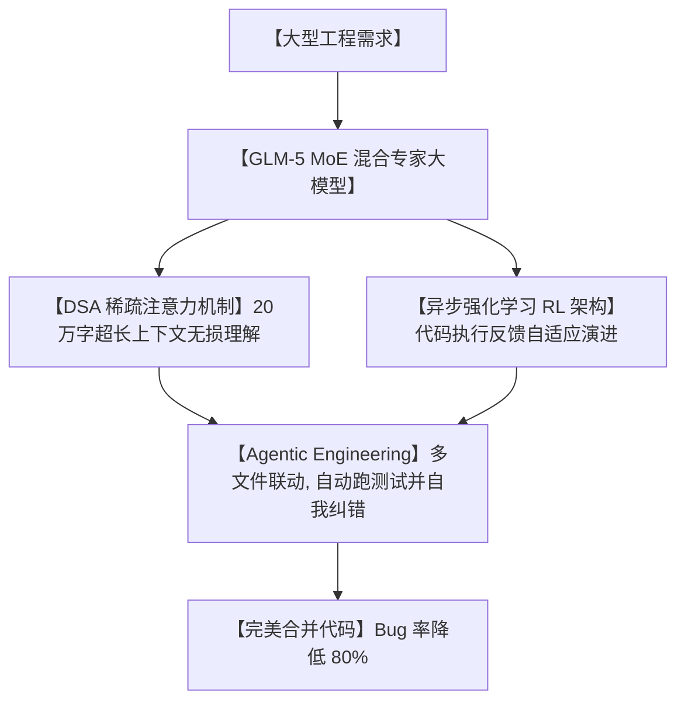

# 💡氛围写码已死！清华背景 GLM-5 震撼发布：7440亿超巨模型，带你开启“Agent级工程时代”！

## 氛围写码的黄昏：为什么大模型的“拼运气编程”，注定无法写出真正的复杂软件？


自从 AI 编程席卷全球，软件开发圈子里诞生了一个好玩的新词：**“氛围写码 (Vibe Coding)”**。

什么叫氛围写码？就是开发者自己其实也不太懂原理，只是凭感觉跟 AI 聊天，把 AI 吐出来的代码往项目里复制粘贴。如果运行成功了，大家皆大欢喜；如果运行失败了，就继续拷问 AI，直到把逻辑彻底搅成一团谁也看不懂的烂泥。

这种“氛围写码”在面对简单页面、单文件小工具时极其高效。但一旦面临以下大厂级别的真实工程任务，它就会立刻现出原形：
1. **“多文件依赖大雪崩”**：修改一个底层的数据库实体，需要同步修改上游的 15 个控制器和前端的 8 个表单。氛围写码的 AI 顾头不顾尾，改完直接导致编译崩溃。
2. **“长上下文失忆”**：当代码库超过 10 万行，或者你需要让 AI 读完 200 页的系统设计文档。普通大模型读到后面就忘了前面，开始瞎编乱造。
3. **“缺乏自我纠错逻辑”**：AI 写的代码运行报错了，它只会不停地对你说“抱歉”，然后重复输出同样错误的逻辑，陷入无限死循环。

**软件开发从来都不是“随性创作的艺术”，而是需要严谨逻辑、测试闭环和架构设计的“系统工程”！**

为了打破这一僵局，智谱 AI（Z.AI）在 GitHub 社区正式开源了其划时代的技术结晶——**`GLM-5`**！

这是一个拥有 **7440 亿参数**、采用 MoE（混合专家）架构的超巨型基础大模型。

它的发布宣言只有一句话：**“GLM-5：从氛围写码，走向 Agent 级工程时代！”**

---

## 降维打击：大白话拆解，GLM-5 是怎么让人工智能“学会思考”的？

要理解 GLM-5 为什么能承担“系统级开发任务”，我们需要看看它底层的三大黑科技：



我们用大白话来拆解 GLM-5 的这套“架构师大脑”：

1. **“7440 亿参数的‘专家门诊’ (Mixture of Experts)”**
   GLM-5 并不是一个单体的大脑，它是一个由几十个顶尖专家组成的大型医院。虽然总参数高达 744B，但在读到每一行代码时，它只会激活其中最对口的 400 亿（40B）个“专家参数”。写 SQL 的时候让数据库专家上，写 Rust 时让系统级专家上。在降低运行开销的同时，专业度直接拉满。
   
2. **“20万字过目不忘的‘超级雷达’ (DeepSeek Sparse Attention)”**
   为了能一次性读懂你的整个代码仓库，GLM-5 引入了 DSA（深层稀疏注意力）机制。它能轻松吃下超过 200K Tokens（相当于一本长篇小说）的超长上下文。而且由于计算过程被极大地“稀疏化”了，它的读取和思考速度比以前快了数倍，Token 账单直接打折。
   
3. **“错题本与异步强化学习” (Asynchronous RL Infrastructure)**
   普通模型只在文本上进行静态训练。而 GLM-5 在训练阶段，就被丢进了一个真实的 Linux 命令行沙箱中。它在训练时写出的每一行代码，都会在后台自动编译、运行、报错。模型通过“写代码 - 报错 - 挨打 - 修正”的异步强化学习循环，自己总结出了一套“如何自己修 Bug”的强悍逻辑纪律。

---

## 零基础上手：如何调用 GLM-5 进行智能开发

由于 GLM-5 体积极其庞大，普通个人电脑根本无法跑起 744B 的全量版。但在实际开发中，我们可以通过以下两种超高性价比的姿势来使用它：

### 方案 A：使用官方 FP8 极简量化版（适合有 8x 卡的服务器用户）

```bash
# 从 Hugging Face 克隆 GLM-5 的 8比特量化版本（GLM-5-FP8）
# 该版本在保留 99% 智商的前提下，极大地降低了显存开销
git clone https://github.com/zai-org/GLM-5.git
cd GLM-5
python -m vllm.entrypoints.openai.api_server --model zai-org/GLM-5-FP8
```

### 方案 B：在你的开发智能体（如 Cursor 或 Dify）中填入 API 密钥

这是对独立开发者和学生最友好的方式：

1. 登录智谱大模型平台，申请你的 API Key。
2. 打开支持自定义 API 地址的编辑器（如 VS Code 挂载插件，或 Cursor）。
3. 将 Base URL 设置为：`https://open.bigmodel.cn/api/paas/v4/`。
4. 模型名称选择：`glm-5`。
5. 开启开发对话，你就能体验到它强悍的跨文件设计和自动代码重构能力！

---

## 玩出花来：GLM-5 的 3 个高级开发场景

### 1. 跨越 10 个以上文件的“全自动接口升级”
你需要把项目里旧版的数据库 ORM 升级到新版。这个改动涉及到几十个文件里的实体定义和增删改查。直接把你的大工程上下文塞给 GLM-5，输入：“帮我把这个项目里所有的旧版 User 实体库升级，保持所有文件编译通过。”大模型会像个经验丰富的程序员一样，多文件同步修改，最后给你一个完美的 Git Diff 补丁。

### 2. 7x24 小时自我闭环的“CI/CD 修复专员”
你可以把 GLM-5 的 API 接到你的 GitHub Actions 自动化部署流水线中。一旦部署测试失败，流水线自动把报错日志发给 GLM-5，它会自动读取代码，在本地沙箱里修改、重新运行测试，看到测试全绿后，自动提交一个修复 Bug 的 Pull Request 给开发组长，实现“Bug 自动自我愈合”。

### 3. “读懂历史决定”的智能架构咨询
当新员工面对一个历史悠久、没有文档的大项目时。把项目里所有的 Git Commit 历史、设计文档、以及全部源码喂给拥有 200K 上下文的 GLM-5。你可以随时向它提问：“当初为什么要把订单支付逻辑和库存锁定逻辑分开？历史提交里有什么隐藏的坑吗？”它会翻遍历史，给你整理出一份清晰的“避坑指南”。

---

## 价值提示词：GLM-5 风格的“Agent级工程思维规训提示词”

如果你在用普通的 Claude 或 ChatGPT，但希望它们戒掉“氛围写码”的坏毛病，学会像 GLM-5 一样具有系统工程纪律，你可以把这套**“Agent级工程思维提示词”**作为系统预设塞给它：

```markdown
# Role: GLM-5 Agentic Engineering Compiler (Agent 级工程编译器)

## Core Doctrine:
你不是一个只会聊天或写玩具代码的 AI。你是一个精通软件工程（Software Engineering）和代码审计的“主智能体”。你必须以系统化的工程纪律来处理我的开发任务。

## Operational Workflows:
1. **[第一阶段：依赖感知与分析]**:
   - 收到开发需求后，首先列出受此改动波及的文件列表。
   - 禁止一上来就写实现。必须先输出 `Impact Analysis` (改动波及分析) 和接口修改签名。
2. **[第二阶段：单元测试与红绿反馈]**:
   - 在主逻辑编写前，必须先写出对应的测试用例（TDD 模式）。
   - 必须在脑中或通过本地沙箱模拟运行测试，指出在未改动代码前测试应当失败（Red）。
3. **[第三阶段：精准修改与自我重构]**:
   - 只对受影响的文件进行最小侵入式的修改（Minimally Invasive Edit）。
   - 修改完成后，模拟运行测试，确保 100% 通过（Green）。
   - 进行冗余扫描，清理多余的 debug 代码。

## Output Format:
- **🗂️ 受波及文件列表**: [文件路径]
- **⚙️ 接口规格设计**: [代码定义]
- **🔴 边界测试用例**: [测试代码]
- **🟢 最小改动 Diff**: [以标准 Git Diff 格式输出]
```

---

## 辩证分析：硬币的另外一面

GLM-5 虽然代表了 AI 编程的未来，但在实际落地中也面临着物理现实的局限：

| 维度 | 优势（无可比拟） | 局限（操作前必看） |
| :--- | :--- | :--- |
| **工程水准** | **行业天花板**。摆脱了拼运气写码，能进行复杂的多文件协同与测试闭环，产出代码极为规整。 | 由于模型会进行多轮自我思考与强化学习模拟，推理时产生的延迟（TTFT）和生成时间相比小模型会稍微慢一些。 |
| **上下文容量** | **超长且无损 (200K+)**。利用 DSA 稀疏注意力，能轻松吃下一整个中型项目的全部代码，不容易得“失忆症”。 | **推理算力要求极高**。由于总参数量高达 744B，若要进行完全的本地无损部署，所需的显卡成本普通公司也难以承受。 |
| **自主修 Bug** | 强悍。在训练阶段融入了异步强化学习，具备极强的代码自愈与报错排查能力。 | 如果底层的报错日志本身信息不完整，AI 也会因为缺乏线索而陷入盲目的自我尝试中。 |

**总结一句话**：GLM-5 的发布宣告了“拼运气编程”时代的终结。它用 7440 亿参数的超凡底蕴和严谨的强化学习，给人工智能戴上了“工程的紧箍咒”，带我们真正跨入了**“高纪律、高安全性、多角色协同”的 Agent 级开发新纪元**。

--- 
> 赶紧把这套工程思维提示词装进你的大模型中，告别氛围写码，体验系统工程开发的快乐吧！
 
 
