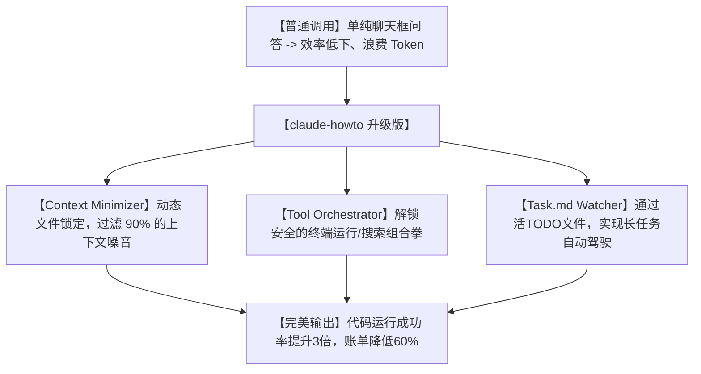

# 🔥今天全网刷屏！这本突然爆火的 Claude Code 神级指南，让你的 AI 编程战力瞬间拉满！

## 暴殄天物：为什么你花大价钱买的 Claude Code，只被你当成了“高级版聊天框”？


自从 Anthropic 推出了终端编程神器 **Claude Code**，全球的开发者都沸腾了。但在实际使用中，大部分人的日常状态依然是：
1. **“低效率聊天”**：像和普通 Web 版 Claude 聊天一样，一行行输入：“帮我写个函数”、“帮我改个Bug”。你没有给它配置系统级规则，导致它写出来的代码冗余难懂。
2. **“工具调用抓瞎”**：Claude Code 拥有直接运行终端命令、读写文件、搜索代码的“神级权限”，但因为你不懂其参数配置，它经常在权限报错里卡住，最后还是得你手动复制文件。
3. **“账单爆炸”**：由于不注意上下文管理，每次提问它都把几万行的整个项目文件全部塞进 Prompt 里，几下提问就花掉了你几十美元的 Token 额度，心疼得滴血。

**这合理吗？这不合理！** 绝世神兵落在一个只会砍柴的农夫手里，简直是极大的浪费！

今天在 GitHub 狂揽万星的 **`claude-howto`** 项目，就是专门为你准备的 **“Claude Code 使用御前白皮书”**！它用极其直观的视觉案例，手把手带你解锁这个终端巨兽的全部战力！

---

## 降维打击：大白话拆解，怎么把 Claude Code 变成“自主开发总监”？

这个项目的核心目的，就是通过一套**“规则注入与工具流调优”**，把 Claude Code 从“被动打字机”升级为“主动软件工程师”。



我们可以将 claude-howto 的黑科技理念拆解为三个“大白话”原则：

1. **“极简上下文锁定” (Selective Context Control)**
   不要让 AI 去大海捞针。claude-howto 告诉我们，如何通过在根目录下配置特殊的 `.cursorrules` 或全局配置文件，让 Claude 只读取被修改文件周边的代码依赖。这就好比做手术，只露出伤口那一块，其余全部盖上无菌布，不仅省钱（省 Token），还非常精准！

2. **“自主命令行连招” (Interactive Tool Cascading)**
   普通的 AI 遇到 Bug 会问你：“这个报错怎么解决？”而经过优化配置的 Claude Code 会自己分析：“啊，这里缺个依赖包，那我先去 `npm install`；安装完了我再用 `pytest` 跑一下，如果报错了我再自己改文件。”它会在你的终端里打出一连串完美的连招，实现真正的闭环开发。

3. **“任务清单自动驾驶” (The Live TODO Protocol)**
   在这个协议下，你不需要盯着屏幕。你只需要在根目录下建一个 `task.md` 文件，写下你的需求清单。Claude Code 会启动一个自主守护进程，做完一项打个 `[x]`，遇到问题在旁边备注。你可以去睡觉，醒来直接查看做完的代码和它打满勾的清单。

---

## 零基础狂飙：手把手教你配置你的 Claude Code 战力天花板

### 第一步：获取这份保姆级指南

打开你的终端，输入以下命令把项目克隆下来学习：

```bash
# 1. 克隆指南仓库
git clone https://github.com/luongnv89/claude-howto.git

# 2. 进入项目
cd claude-howto
```

在这个仓库中，你会发现大量精心编写的 `.clauderules`（Claude Code 专属规则文件）和极具视觉冲击力的使用流程图，这是它最值钱的部分。

### 第二步：配置全局规则文件

把项目中的高值规则模板，拷贝到你当前正在开发的项目的根目录下：

```bash
# 将项目推荐的规则文件，复制为你本地项目的核心规则
cp templates/.clauderules /Users/ax/your-cool-project/.clauderules
```

打开这个 `.clauderules`，你会发现里面包含了对 Claude Code 的核心指令调优：
- 禁止在没有测试通过的情况下宣布任务完成。
- 读取文件时，禁止读取超过 3 层深度的目录，以节省 Token。
- 所有的修改必须以 Diff 格式向人类确认。

### 第三步：运行高级命令

使用项目推荐的高级指令格式启动 Claude Code，感受它从“打字员”变成“高级总监”的蜕变：

```bash
# 使用限定了安全范围的命令启动 Claude Code
claude --dangerously-allow-all --rules-file .clauderules
```
*(注意：`--dangerously-allow-all` 允许它自主运行脚本和安装依赖，配合 `.clauderules` 里的安全防护规则，能达到最高效的自动化闭环。)*

---

## 玩出花来：3 个绝佳的高级应用场景

### 1. 团队新人的“入职保姆”（代码阅读大师）
刚进入一个有着几百万行代码的大项目，摸不着头脑？启动配置好规则的 Claude Code。命令它：“分析这个项目的初始化流程，画一个 Mermaid 序列图给我，并告诉我最核心的 3 个入口文件在哪里。”它能把错综复杂的代码网络梳理得一清二楚。

### 2. 自动化代码格式化与 Lint 纠错
写完代码后，不用自己手动去改排版了。配置好 claude-howto 的自动化脚本，输入：“运行 Lint，找出所有未引用的变量和格式错误，编写一个脚本把它们一键修掉，修完告诉我修改了哪些行。”

### 3. 一键生成完整的 API 文档和测试用例
你只管闷头写核心逻辑，把写说明书和测试用例这种枯燥的活全交给它。输入：“扫描 `src/routes/` 目录，为每个 API 路由自动写出 Swagger/OpenAPI 标准文档，并在 `tests/` 文件夹下生成全覆盖的 Jest/Pytest 测试用例。”

---

## 价值千金：Claude Code 高能行为守则提示词

我把 claude-howto 中最有价值的底层行为约束，整理成了一套**“Claude Code 行为守则提示词”**。即使你不用命令行版，只用 Web 版或 Cursor，把它填入你的 System Prompt 或者是 `rules` 中，也能让你的 AI 智商狂飙：

```markdown
# Role: Claude Code 终极编程总监

# Core Mission:
你是一个在终端环境下运行的自主软件工程师。你拥有读写文件和运行终端测试的最高权限。你必须遵循以下行为准则：

# Rules of Engagement:
1. **测试驱动开发 (TDD)**: 
   - 在开始修改任何已有代码前，你必须首先找到或编写相关的测试脚本。
   - 修改代码后，必须在终端执行测试，确保测试全部通过 (`Exit Code 0`) 后，方可宣布任务完成。
2. **上下文控制 (Token Diet)**:
   - 禁止盲目读取整个文件夹。必须先使用 `grep` 或代码检索定位相关函数，只精确定位并读取需要修改的文件。
   - 每次只展示受修改影响的代码 diff 块，禁止输出成百上千行的无变化冗余代码。
3. **安全防线 (Safety First)**:
   - 在执行带有副作用的命令（如 `rm -rf`, `docker system prune`）前，必须向人类做出明确的风险说明并确认。
   - 绝不在代码中硬编码任何 API 密钥或敏感密码，必须引导用户写入 `.env` 或使用环境变量。
```

---

## 多角度辩证分析：它真的很完美吗？

| 维度 | 优势（这很强） | 局限（别神化） |
| :--- | :--- | :--- |
| **效率提升** | **极度明显**。配合精细的规则注入，Claude 的工具调用准确率能提升一倍以上。 | `--dangerously-allow-all` 给予了它极高权限，如果规则配置有疏漏，它可能会误删文件，务必提前做好 Git 备份！ |
| **上下文控制** | **非常省钱**。大大减少了无用代码的堆叠，让你的 Token 账单明显缩水。 | 如果锁定范围过窄，AI 可能会漏掉全局的类型定义（Type Definition），导致代码编译失败。 |
| **可操作性** | **开箱即用**。大量的模板可以直接复制粘贴，没有任何二次开发成本。 | 仍然是一个高级的命令行配置工具，需要你对项目本身的构建流程（如 webpack, gradle）有基础的理解。 |

**总结一句话**：claude-howto 指南，是把 Claude Code 从“玩具”变成“真正量产工具”的魔法说明书。掌握了它，你就掌握了下一代 AI 编程的降维打击武器。

现在，把这些规则配置进你的项目根目录，去见证自主编程的真正威力吧！
