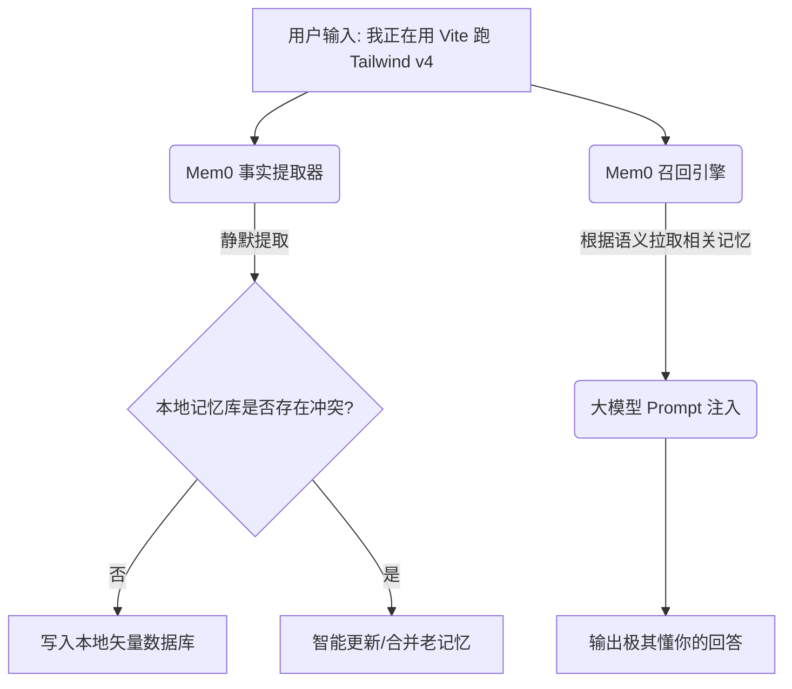

# 狂捞2万星！今天爆火的“智能记忆外挂”Mem0，让你的智能体拥有一辈子不忘的记性！

## 智能体的集体老年痴呆：为什么大模型逻辑满分，对话多了却像得了健忘症？


在开发或使用 AI 智能体时，你一定会遇到这三个让人哭笑不得的瞬间：

1. **“每次新对话都要从头交代背景”**：大模型就像是一个没有长期记忆的机器。每次你点开“New Chat”，它就把你昨天交代过的工作偏好、业务场景、避坑指南全忘光了。你不得不把之前的背景信息反复复制粘贴，累得半死。
2. **“摘要压缩把细节压缩没了”**：市面上很多智能体框架，为了省 Token，会粗暴地把几万字的聊天记录用 AI 压缩成“用户是个程序员，用 Python”这样一句话。当你需要它记住“我上个月在支付模块里自定义的异常类叫 `PayException`”时，它直接当场懵逼。
3. **“答非所问、错漏百出”**：因为缺乏对用户历史偏好的沉淀，AI 的每一次回答都是从“大百科全书”里抽签，给你的答案空有逻辑，却根本不切合你的具体使用习惯。

**大模型智商 180，记性只有 7 秒（金鱼脑）。这种短视的交互，根本无法成为你真正的赛博助理！**

今天，GitHub 上爆火了一个叫 **Mem0**（Mem-Zero）的开源项目，狂卷近 2 万星，彻底终结了智能体的“老年痴呆”！

它的本事强悍得近乎作弊：**它直接给大模型外接了一个“本地智能数据库”，作为它的长期记忆外挂。它支持用户、会话、智能体三层立体记忆，让大模型随着你的使用次数增加，变得越来越聪明、越来越懂你！**

---

## 5分钟大白话拆解：Mem0 到底是怎么给大模型“装脑子”的？

我们用最直截了当的大白话，拆解 Mem0 的“外挂脑”机制。

普通的 RAG（检索增强生成）系统就像是**一个捧着维基百科查答案的临时工**。
你问他一个技术词，他就去书里搜索最像的段落吐给你，但他不记人。你明天来，他还是那一套冷冰冰的教条回答。

而 **Mem0 就像是给你配备了一个“随身贴身秘书”**：

* **事实提取器（Entity & Relation Extractor）**：每当你跟 AI 聊天，Mem0 会在后台静默运行。它会自动把你对话里的事实（比如“我不喜欢 Tailwind v3，我更喜欢原生 CSS Variables”）提取出来，保存到你本地的矢量数据库。
* **立体记忆图谱（Hierarchical Memory）**：
  * **用户层记忆**：你本人的核心目标、职业、编程习惯。
  * **会话层记忆**：这半个小时里，你们在解决哪个具体的 bug。
  * **智能体层记忆**：这个 AI 助手在开发本项目时，积累了哪些自定义类和避坑知识。
* **按需召回（Context Injected）**：当你下次再输入指令时，Mem0 会自动分析你当下的意图，只把最相关的 3 条记忆（比如你最喜欢的编码习惯）作为前置上下文喂给大模型。既省 Token，又懂你！

**它的本质是：事实自提取 + 三层上下文图谱 + 自适应召回引擎。**

---

## 核心技术原理：Mem0 的“记忆写入与召回”流

Mem0 的整个技术闭环非常优雅：



1. **增量记忆合并（Incremental Merging）**：
   当你改变想法（如“我昨天说用 Go，我今天决定换 Rust”）时，Mem0 的大模型事实更新层能自动识别前后逻辑冲突，把老的记忆擦除或归档，只保留最新的更新，避免大模型脑内打架。
2. **轻量级 API 封装**：
   它提供了极其丝滑的 Python 和 Node.js SDK。只需要三行代码，就能给任何大模型（GPT、Claude、DeepSeek）套上这层记忆金刚罩。
3. **多模态与 MCP 支持**：
   Mem0 现已完美支持 Model Context Protocol (MCP)。这意味着你可以把它配置成一个全局工具，让你的 Cursor 或 Claude Code 直接通过 MCP 接口读写这个记忆库，跨软件无缝共享。

---

## 降维打击：Mem0 的三大超爽实战场景

### 场景一：完美的“个性化编程伴侣”
你在两个不同的项目中写代码。项目 A 喜欢用 TypeScript + OOP，项目 B 喜欢用 Go + 函数式。Mem0 会在后台为这两个项目建立不同的智能体记忆。你在项目 A 里，AI 不会写出任何 Go 的语法糖；在项目 B 里，它也不会吐出一行 TypeScript，宛如两个定制专家。

### 场景二：会累积人设的“私人情感伴侣”
很多陪伴类 AI 聊上 50 句就忘了你的名字。接入 Mem0 后，你聊过的所有经历、你透露过的喜怒哀乐，都会在本地以结构化事实沉淀。下次上线，它第一句就是问候你上周感冒好了没有，暖心值直接拉满。

### 场景三：完美记住历史故障的“智能客服”
做客服智能体时，用户常常在三天前反馈过一个 bug，今天来追问进度。普通的客服大模型根本查不到历史。而 Mem0 能瞬间召回三天前的异常日志和排查记录，一秒切入话题，体验极佳。

---

## 详细安装与配置步骤：三步给你的 Agent 外接记忆！

下面以最通用的 Python 架构为例，教大家怎么在代码里给 AI 外接 Mem0 记忆体：

### 第一步：安装 Mem0 核心库

打开你的终端，利用 pip 安装依赖：

```bash
pip install mem0ai
```

### 第二步：初始化并向记忆体中写入事实

新建一个 Python 脚本 `add_memory.py`：

```python
from mem0 import Memory

# 1. 初始化 Memory (默认在本地启动一个轻量级的 Qdrant/Chroma 矢量库)
m = Memory()

# 2. 模拟用户输入，写入用户画像和项目背景
user_id = "developer_alex"
print("🧠 正在静默提取事实并更新记忆库...")

m.add(
    "我非常推崇极简主义，平时写前端只喜欢用原生 CSS 变量，讨厌 Tailwind 繁琐的类名", 
    user_id=user_id
)
m.add(
    "我目前正在开发 'wechat-publisher' 项目，这周的核心任务是搞定微信 API 代理转发", 
    user_id=user_id
)

print("✅ 记忆已存入赛博大脑！")
```

### 第三步：在聊天中智能检索并召回记忆

新建聊天脚本 `chat_with_memory.py`，模拟 AI 怎么精准检索用户偏好：

```python
from mem0 import Memory
import openai
import os

m = Memory()
user_id = "developer_alex"

# 1. 当用户发起新的询问
user_query = "我想给正在写的新网页的按钮做一套样式，帮我写个 Demo"

# 2. 根据用户的询问，Mem0 自动从数据库里检索出相关的记忆
relevant_memories = m.search(query=user_query, user_id=user_id)
memories_text = "\n".join([mem["memory"] for mem in relevant_memories])

print("👀 检索到的相关记忆:\n", memories_text)

# 3. 将记忆注入到大模型的 Prompt 中
system_prompt = f"""
你是一个专业的 Web 前端开发助手。
以下是关于用户的长期个人偏好和当前上下文，你在生成代码时必须严格遵守：
---
{memories_text}
---
"""

# 4. 调用大模型进行个性化回答
client = openai.OpenAI(api_key=os.getenv("OPENAI_API_KEY"))
response = client.chat.completions.create(
    model="gpt-4o",
    messages=[
        {"role": "system", "content": system_prompt},
        {"role": "user", "content": user_query}
    ]
)

print("\n🤖 AI 个性化输出结果:\n", response.choices[0].message.content)
```

你会神奇地发现，大模型输出的 Demo 代码里**完全没有**任何 Tailwind 类名，全部是由优雅的 CSS 原生变量编写，完美击中你的偏好！

---

## 核心价值提示词：智能体记忆分析与冲突消解器

如果你想在纯 Prompt 环境下，用一个前置的大模型扮演“记忆提取官”，可以复制这套精心调优的**记忆分析与冲突消解提示词**：

```markdown
# Role: Agentic Memory Extractor & Conflict Resolver

## Mission
Analyze the current user message and historical memories to extract new atomic facts and resolve logic conflicts.

## Rules
1. **Atomic Fact Extraction**: Extract user preferences, goals, facts, and constraints into brief, independent bullet points (e.g., "User prefers dark mode").
2. **Conflict Resolution**: If the new message directly contradicts an existing memory:
   - Identify the conflict.
   - Delete the outdated memory.
   - Insert the new memory.
3. **No Assumptions**: Do not infer traits that aren't explicitly stated or heavily implied by actions.

## Input Format
- **Existing_Memories**:
  - [id: 1] User uses Go for backend.
  - [id: 2] User works on "wechat-publisher".
- **New_Message**: "Actually, I migrated the backend to Rust today to improve compile times."

## Expected Output
```json
{
  "deleted_ids": [1],
  "added_memories": [
    "User uses Rust for backend",
    "User values compilation speed"
  ]
}
```
```

---

## 辩证批判性分析：Mem0 的阿喀琉斯之踵

在享受过 Mem0 带来的“记性好”之余，也要在实践中注意这几个硬伤：

* **Memory Bloat（记忆垃圾臃肿）**：AI 默认会把你说过的很多废话（例如“今天天气好冷”）也当作事实记入数据库。随着使用时间增加，数据库里会充斥着大量的无用事实，导致上下文召回时噪声极多。需要定期通过管理脚本进行垃圾清理。
* **额外的 Token 开销与延迟**：因为每次对话都要多出“事实提取”和“数据库检索”两步，会增加额外的 API Token 消耗，并在返回前增加几百毫秒的工程延迟。
* **召回精度的偏离**：如果语义搜索算法的阈值设置得不合理，AI 可能会召回一些风马牛不相及的陈旧记忆，反而误导了当下的对话。

但无论如何，**Mem0 成功把 AI 智能体从“一次性玩具”升格为了“能随着陪伴一同成长”的赛博终身伴侣**。如果你也想让自己的 AI 越来越聪明，赶紧把这颗“记忆药丸”给它吞下去吧！
