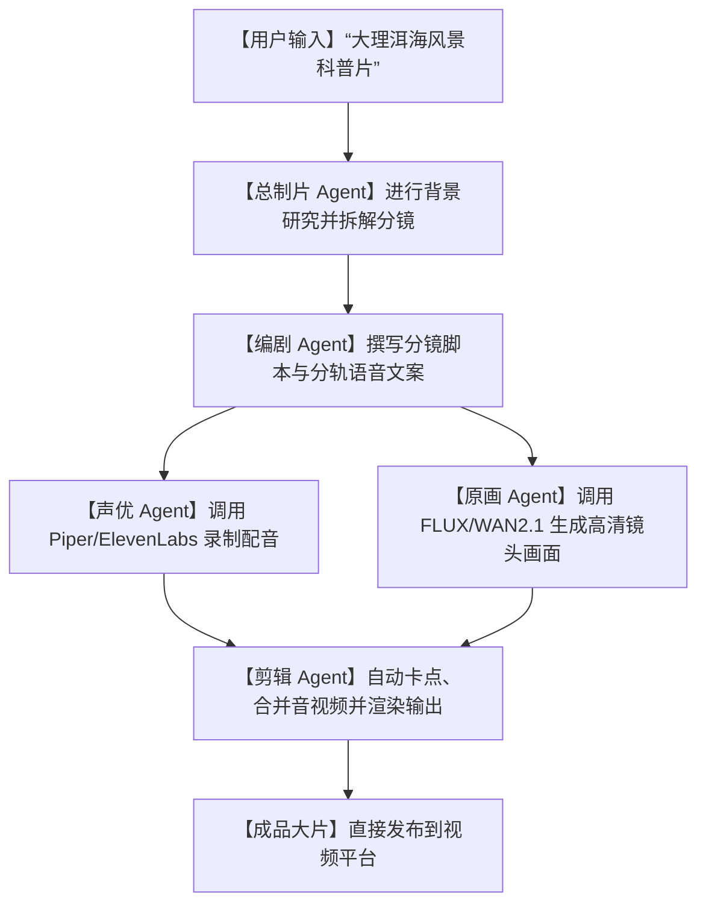

# 🎬震撼来袭！开源首款 AI 视频制片系统 OpenMontage，一键把创意自动生成电影级大片！

## 剪辑噩梦：为什么我们只是想做一个简单的短视频，却要当上“十八般武艺全能”的打工人？


每一个想做自媒体、拍短视频、或者做风景科普解说的博主，在第一天都会被繁琐的剪辑流程折腾得怀疑人生：

1. **“灵感卡壳，文案难产”**：写脚本需要文采，还要考虑镜头语言。写了删、删了写，几个小时过去了，连前奏的 10 秒导语都憋不出来。
2. **“素材荒与昂贵版权”**：好不容易写完了脚本，你得去各种素材网站一张张找配图、找免版权视频。找回来的素材风格乱七八糟，拼在一起像是个拼凑的廉价 PPT。
3. **“剪辑地狱，渲染到死”**：在剪辑软件里对音轨、卡点、调色、加滤镜。普通配置的电脑风扇呼呼狂转，动不动就卡死崩溃，几个小时的心血瞬间化为乌有。

市面上虽然有一些商业 AI 视频生成器，但要么收费贵得像抢钱，要么只给你生成几秒钟毫无逻辑的“随机动画”，根本没法讲好一个完整的故事。

就在今天，GitHub 社区投下了一颗深水炸弹——**`OpenMontage`**！

它是全球首个**开源、多智能体协同（Agentic）的视频制作系统**。它不仅是生成视频的工具，它直接把你的电脑变成了一个拥有**“编剧、导演、声优、剪辑师、后期特效”**的专业电影制片厂！

---

## 降维打击：大白话拆解，OpenMontage 是如何协同多智能体生产视频的？

为什么说 OpenMontage 是对传统 AI 生成的“降维打击”？

因为它不是一上来就去生成视频画面，而是把视频制作当成了一个极其严谨的**“工程化多智能体流水线”**：



我们可以用三个大白话核心概念，来理解 OpenMontage 的底层魔力：

1. **“12条管线与52个专属工具” (Structured Pipeline Execution)**
   系统把视频生产拆成了 12 个独立的步骤。每个步骤都有专门的 AI 智能体负责。比如有的智能体专门负责“写幽默段子”，有的负责“匹配最合适的背景音乐”，还有的负责“用 ffmpeg 对齐音频和画面”。所有智能体各司其职，保证了最后产出的视频绝不是随机拼凑，而是逻辑严密、富有故事性的完整作品。
   
2. **“开源与自由配置的素材库” (Modular AI Architecture)**
   很多视频生成器把用户绑定在昂贵的云端 API 上。OpenMontage 则是全模块化的。你有钱，可以调用顶级的 ElevenLabs 进行真假难辨的配音；你不想花钱，它支持一键切换到本地运行的 Piper TTS。画面生成也可以在本地跑免费开源的 **FLUX** 或最新的 **WAN 2.1** 视频模型，彻底终结了“越做视频越破产”的恶性循环。
   
3. **“AI 智能体的自我审片” (Feedback-Loop QC)**
   在合成视频之前，系统会调起一个“质检智能体（QC Agent）”。它会去检查：“这个画面的长宽比是否统一？”、“配音有没有被背景音乐盖过？”、“字幕有没有错别字？”。一旦发现问题，它会直接命令原画或音频智能体重新生成，直到合规后才交给你。

---

## 零基础上手：手把手搭建你的“个人电影制片厂”

OpenMontage 的搭建需要一些基础的开发环境支持（推荐配置了独立显卡的电脑以进行本地画面渲染）。

### 第一步：克隆仓库并初始化

打开你的终端，运行以下命令：

```bash
# 1. 克隆 OpenMontage 源码
git clone https://github.com/calesthio/OpenMontage.git
cd OpenMontage

# 2. 运行一键配置安装（这会自动检测你的硬件，安装 FFmpeg 和 Python 依赖）
make setup
```

### 第二步：配置你的制作偏好

系统初始化后，会在目录下生成一个 `config.yaml` 配置文件。你可以在上面配置：
* **TTS 引擎**：选择 `local_piper`（本地免费）或 `elevenlabs`（云端高级）。
* **Image 引擎**：选择 `local_flux`（本地显卡运行）或 `stability_api`（云端算力）。

### 第三步：输入创意，一键开机！

只要在命令行中，给总制片人智能体下一行简单的指示：

```bash
# 让系统自动制作一段关于“云南雨林生态”的 1 分钟短视频
openmontage generate --prompt "云南雨林里神奇的野生菌生态，风格幽默风趣" --duration 60
```

此时，你会在终端看到 5 个智能体在疯狂对话：
* `[Screenwriter]`: 正在撰写分镜剧本...
* `[Narrator]`: 正在生成配音音频...
* `[Illustrator]`: 正在用本地 FLUX 模型渲染高清雨林菌类画面...
* `[Editor]`: 正在将画面与音频对齐，压制字幕，添加淡入淡出音效...

几分钟后，在输出目录中，一个高清的、配音画质字幕俱佳的成品 MP4 视频就制作完成了！

---

## 玩出花来：OpenMontage 的 3 个惊人实战场景

### 1. 全自动风景科普与旅游自媒体账号
你只需要把每天的旅游日记、或者某地的风土人情百科链接丢给 OpenMontage。系统会自动提炼核心考点，生成电影级风景空镜头画面，配上深沉饱满的男中音旁白，一键产出高质量的知识博主视频，轻松日更。

### 2. 程序员专属“开源项目视频说明书”
每次写完新代码或开源了新项目，写长文档没人看。把你的 README.md 丢给它，让它制作一段“2分钟炫酷项目演示短视频”。它会自动生成架构图插画、配上活泼的背景音乐和 AI 讲解，让你的开源项目瞬间高大上。

### 3. 给孩子制作专属的“睡前有声童话”
自己写一个童话大纲，让 OpenMontage 生成温馨的皮克斯 3D 动画风格画面，配合温柔的妈妈/爸爸音色配音，制作成 5 分钟的床头童话视频。每天都是新故事，彻底解放讲故事卡壳的父母。

---

## 价值提示词：电影级分镜与镜头语言导演提示词

如果你想在其他 AI 窗口（如 Claude 或 Midjourney）手动模拟 OpenMontage 的制片流程，你可以把这套**“电影分镜导演提示词”**发给 AI，让它帮你规划出完美的画面说明书：

```markdown
# Role: AI Cinematic Director (AI 电影导演)

## Objective:
将一段简单的文字脚本，拆解成适合图像/视频大模型（如 FLUX, SORA, WAN 2.1）渲染的高级电影级分镜剧本（Storyboard）。

## Execution Rules:
1. **镜头美学规范 (Cinematography)**:
   - 禁止使用“一个漂亮的风景”这种模糊词汇。
   - 必须指明焦距与镜头运动（如：`Extreme Close-up (特写)`, `Pan left (左平移)`, `Drone shot (无人机航拍)`）。
   - 规定光影调性（如：`Golden hour light (黄金时刻逆光)`, `Cinematic fog (电影感晨雾)`）。
2. **多模态对齐表 (Audio-Visual Sync)**:
   - 必须以秒为单位，将【视觉画面描述】与【AI 朗读旁白】进行左右表格对照。

## Output Format:
- **分镜 1 [00:00 - 00:05]**:
  - **视觉 Prompt**: [英文原画生成 Prompt, 包含焦距、光影、细节描述]
  - **镜头运动**: [如: Slow zoom-in]
  - **配音文案**: [此处朗读的中文正文]
- **分镜 2 [00:05 - 00:12]**:
  ...
```

---

## 多角度辩证分析：它的光芒与阴影

OpenMontage 虽然彻底革新了视频创作，但它并不是完美的，也有其特定的门槛：

| 维度 | 优势（这很强） | 局限（操作前必看） |
| :--- | :--- | :--- |
| **创作逻辑** | **故事性极佳**。多智能体协同机制，保证了视频有脚本、有转折、有深度，告别随机拼接。 | 因为需要多步运算，生成一段 1 分钟的高清视频，在本地显卡上可能需要渲染 10-20 分钟，无法做到即时输出。 |
| **使用成本** | **完全开源免费**。支持纯本地运行的 TTS 与开源画图/视频模型，无需支付高昂 API 费用。 | 极其考验本地电脑配置。如果要在本地跑出好效果，至少需要一块拥有 16GB 显存以上的 NVIDIA 独立显卡。 |
| **可扩展性** | 内置 52 个工具，支持自由更换配音音色、背景音乐和转场特效，自由度极高。 | 对于小白用户来说，配置本地的 WAN 2.1 或 FLUX 运行环境有一定的环境排错门槛。 |

**总结一句话**：OpenMontage 的开源，把原本掌握在专业传媒公司的“流水线制片能力”，交到了每一个普通人手里。它不仅是创作效率的飞跃，更是独立开发者和内容创作者用创意征服算法时代的“核武器”！

--- 
> 赶紧安装 OpenMontage，把你的奇思妙想，变成让人大开眼界的电影画面吧！
