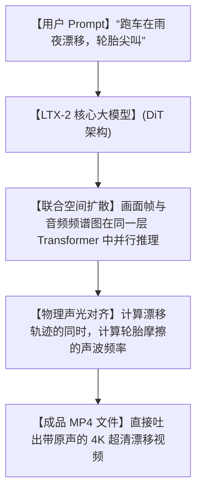

# 🎬音画合一！谷歌投资团队开源 LTX-2，不仅生成 4K 超清视频，连配音特效也一键自动对齐！

## 静音地狱：为什么以往的 AI 视频，听起来总像是在看“聋哑人的默片”？


任何折腾过 AI 视频生成（如 Sora、Runway、Pika）的创作者，都会遭遇这一让人抓狂的流程：

1. **“无声的荒谬感”**：你输入：“海浪拍击礁石，海鸥飞过”。AI 给你生成了一段波澜壮阔的 4K 画面，但整个视频安安静静，没有一丁点声音。这种静止的无声，让视频看起来极度虚假和干瘪。
2. **“后期配音的卡点折磨”**：为了让画面动起来有声，你不得不把视频导入剪辑软件，去素材库里翻找“海浪声”、“鸟叫声”。海浪撞击礁石的那一刹那，你得拿着鼠标在时间轴上精确到毫秒去卡点对齐，对齐十秒钟的视频能耗掉你一包头发。
3. **“声音与画面的情绪割裂”**：你在网上随便配的背景音，音色和情绪很难跟画面完美贴合。风是狂暴的，风声却是温柔的；车是呼啸而过的，轮胎摩擦声却慢了半拍。

**人类对现实世界的感知，从来都是“音画同步、多模态同频”的！只给画面不给声音的 AI 视频，充其量只是个动起来的“赛博 PPT”！**

就在今天，以技术硬核著称的开源团队 Lightricks 扔出了一款降维打击的王炸模型——**`LTX-2`**！

它是全球首个**真正实现了“音画合一、原生同步”的开源视频扩散大模型**。它能在一行 Prompt 之下，以最高 **50 帧每秒（FPS）** 的超清画质，把视频和完美契合、卡点绝对同步的音轨，在同一个模型里一次性吐给你！

---

## 降维打击：大白话拆解，LTX-2 是怎么做到“脑补声音”的？

以往我们做 AI 视频，是找两个完全不认识的 AI：一个只管画画（视频大模型），一个只管配音（音频大模型），最后由人类把他们强行拼在一起。

而 LTX-2 则是用了一种叫 **“联合潜空间扩散 Transformer (Joint Audio-Video Latent DiT)”** 的技术。在它的脑子里，画面和声音是一对“双胞胎”。



我们用大白话来拆解 LTX-2 这一神级创举的底层原理：

1. **“声光在同一个房间里诞生” (Shared Multimodal Space)**
   在 LTX-2 内部，视频的像素点和声音的声波图，被放在了同一个 Transformer 架构里进行计算。也就是说，当模型在脑补“跑车尾部甩尾、地面摩擦起火”的像素时，它旁边的计算单元同时在脑补“橡胶在地面高频摩擦时发出的刺耳尖叫声”。它们在诞生之初就是合体的，所以音画卡点达到了物理级别的绝对同步！
   
2. **“毫秒级的时差对齐” (Precise Frame-Audio Sync)**
   因为是单模型输出，LTX-2 能以每秒 50 帧的高帧率精准对齐声音。比如在视频第 3.24 秒时，雨滴正好打在树叶上，那一帧对应的音频波形里，就会精准出现一声清脆的“啪嗒”雨滴声。彻底告别了后期人工卡点的痛苦。
   
3. **“开源与本地算力驯服” (Open Weights & Local Friendly)**
   Lightricks 不仅开源了完整权重的 LTX-2 模型，还发布了专门针对消费级显卡（如 RTX 4090）优化的量化版本，以及配套的 LoRA 训练脚本。这意味着，你可以不用交昂贵的订阅费，自己在本地电脑上就能随意训练专属的音画生成器。

---

## 零基础上手：在本地跑起你的“音画制作机”

由于 LTX-2 刚刚开源，社区已经迅速推出了支持 ComfyUI 的节点。这里我们介绍最核心的 Python 推理步骤。

### 第一步：创建虚拟环境并安装库

```bash
# 1. 建议使用 conda 开启 Python 3.10 环境
conda create -n ltx2 python=3.10
conda activate ltx2

# 2. 安装 ltx2 官方推理包及 PyTorch 环境
pip install torch torchvision torchaudio --index-url https://download.pytorch.org/whl/cu121
pip install ltx2
```

### 第二步：运行本地音画生成脚本

编写一个极简的生成文件 `generate.py`：

```python
import torch
from ltx2 import LTX2Pipeline

# 1. 加载 LTX-2 预训练模型（自动下载包含音轨生成的模型权重）
pipe = LTX2Pipeline.from_pretrained(
    "Lightricks/LTX-2", 
    torch_dtype=torch.float16
).to("cuda")

# 2. 描述你想看到的画面和想要听到的声音
prompt = "A massive cinematic ocean wave crashes against a rugged cliff under a dark storm, loud thunder and roaring water splashing sound."

# 3. 运行极速推理
# 生成一个长 5 秒、每秒 24 帧、带同步音轨的 MP4 视频
video = pipe(
    prompt=prompt,
    num_frames=120,
    fps=24,
    audio=True # 开启原生音轨生成
)

# 4. 保存为包含同步音视频的 MP4
video.save("beautiful_scene.mp4")
```

只需在终端运行 `python generate.py`，几分钟后打开 `beautiful_scene.mp4`，戴上耳机，你就能听到扑面而来的海浪呼啸声与震撼的雷声！

---

## 玩出花来：LTX-2 的 3 个高级实战场景

### 1. 电影级短片“一步到位”生成
对于想做科幻短片、或者是概念宣传片的导演来说。不用再去找配音师和音效库。用 LTX-2 输入：“飞船在太空中引擎轰鸣，突然遭遇粒子风暴，警报声大作”。AI 会直接给你输出带有低沉引擎声、红光警报闪烁伴随急促蜂鸣声的成品片段，剪辑效率提升 10 倍！

### 2. 沉浸式 ASMR 减压助眠视频制作
现在的助眠视频（如篝火燃烧、春雨打伞）有巨大的播放量。你可以用 LTX-2 批量生成：“静谧森林里一堆篝火在静静燃烧，木柴劈啪作响，细雨微落”。由于音画是物理级同步，火星爆裂的那一瞬间，清脆的木柴炸裂声会精准传入耳朵，比人工后期合成的助眠视频自然无数倍。

### 3. 高保真游戏技能音效与画面演示
游戏开发中需要测试各种华丽的技能表现。可以用 LTX-2 快速生成：“魔法师挥动法杖，一道闪电划破夜空击碎巨石，伴随雷霆万钧的轰鸣与碎石散落声”。这不仅能提供画面参考，甚至连技能打中目标的“音效反馈”都帮你一步到位想好了。

---

## 价值提示词：LTX-2 专属高保真音画导演描述提示词

要让 LTX-2 发挥出最大的音画同步威力，你需要同时在 Prompt 里精确描写【视觉指令】与【听觉指令】。你可以把这套**“音画双轨导演提示词”**发给大模型，让它帮你润色输入：

```markdown
# Role: LTX-2 Multimodal Prompt Director (LTX-2 多模态导演)

## Objective:
将用户的简单创意，改写成最适合 LTX-2 模型理解的、包含了【视觉动态 (Visuals)】和【同步音轨 (Audio Specs)】的双轨融合英文 Prompt。

## Prompt Design Rules:
1. **视觉细化 (Visual Spec)**:
   - 规定摄像机镜头、光影和材质。
   - 强调“动作发生的瞬间”（如: `the instant the glass shatters`），以便音频对齐。
2. **听觉细化 (Audio Spec)**:
   - 使用具体的拟声词和空间感描写（例如: `muffled underwater hum`, `sharp metallic clank`, `cracking fire sparks`）。
   - 明确声音与画面的同步点。

## Output Format:
- **LTX-2 Combined Prompt**: [合并后的一整段英文 Prompt，供直接复制给模型]
- **Director's Note**: [中文说明这一段里，哪些画面点会触发什么样的音效，供预览]
```

---

## 多角度辩证分析：新技术的边界与门槛

LTX-2 虽然堪称奇迹，但在现阶段也必须注意它的落地成本：

| 维度 | 优势（无可比拟） | 局限（操作前必看） |
| :--- | :--- | :--- |
| **音画质量** | **降维打击**。原生音轨生成，物理级卡点对齐，告别后期配音和卡点剪辑的头发折磨。 | 毕竟是初代音画合一模型，生成的音轨主要以“环境白噪音、物理撞击声、引擎轰鸣声”为主，暂时还无法生成复杂的乐器演奏或人声对话。 |
| **开源友好** | 权重完全公开，支持本地显卡运行，提供 LoRA 训练代码，可定制性极强。 | **显存杀手**。要在本地渲染 4K 或者高帧率音视频，至少需要 24GB 显存以上的显卡（如 RTX 3090/4090），门槛较高。 |
| **生产效率** | 一键直接输出成品 MP4 带声音文件，把视频创作的生产链路缩短了 80% 以上。 | 相比于只画图的单模态模型，双模态计算需要消耗更多的推理时间，渲染速度会慢上一些。 |

**总结一句话**：LTX-2 用惊艳的“联合空间扩散”技术，把 AI 视频带入了“有声时代”。它让我们在欣赏美丽好风景的同时，也能听到大自然原汁原味的声响，真正开启了多模态 AI 创作的新纪元！

--- 
> 赶紧下载 LTX-2，戴上耳机，去感受带原声的 4K AI 视频到底有多震撼吧！
 
 
