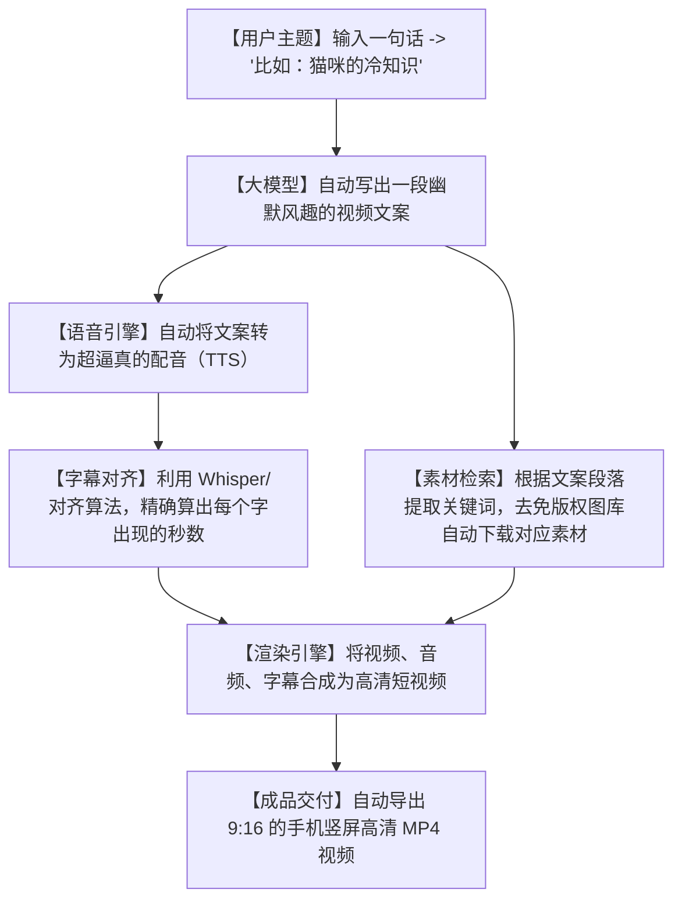

# 🎥一键批量“印钞”！今天霸榜的 MoneyPrinterTurbo，让 AI 自动批量剪出爆款视频！

## 时间地狱：为什么你的“视频梦”，卡在了写文案和剪视频的繁琐里？


不管你是想在抖音、小红书做自媒体副业，还是想给自家的产品拍视频宣传，每天一定会被这几项繁重的工作折磨得痛不欲生：
1. **“文案难产”**：为了写一分钟的视频脚本（约 200 字），你在电脑前抓耳挠腮憋了两个小时，改了 5 版还是觉得干巴巴，毫无吸引力。
2. **“素材地狱”**：好不容易写完文案，你得去各种素材网站搜索配合台词的视频或图片。找个“科技感”素材，翻了 50 页全是收费的水印片，极其浪费精力。
3. **“剪辑劝退”**：打开剪映或 PR，拖入音轨、对齐台词、一行行手打字幕、调配过渡动画……一通折腾下来，腰酸背痛，半天时间就这么荒废了。

**这合理吗？这不合理！** 既然大模型已经无所不能，为什么我们还要手动做这些无脑的机械操作？

今天在 GitHub 榜首疯狂刷屏的 **`MoneyPrinterTurbo`**（直译：印钞机涡轮增压版）彻底解放了所有视频创作者！它能够实现：**你只需要输入一个主题，剩下的一切它全包了！**

---

## 降维打击：大白话拆解，一键生成视频的底层流水线是怎样的？

这个项目的核心逻辑，其实就是把一个**“全自动视频代工厂”**搬到了你的本地电脑。



我们可以用三个“大白话”概念来理解这台“涡轮印钞机”的黑科技：

1. **“智能编剧” (AI Scripting)**
   你只给它一个“程序员熬夜冷知识”，它的大模型接口会立刻变身为“资深短视频导演”，自动运用“黄金 3 秒法则”、“制造冲突”、“高频刺激”等套路，帮你写出分段式的超强脚本。

2. **“精准字幕缝合怪” (Whisper Audio Alignment)**
   传统的 TTS（语音合成）只是输出一个音频，你还得自己去对嘴型、对字幕。MoneyPrinterTurbo 会利用语音转文字的逆向算法，精确标注出每个词在音频里的起止微秒。生成的字幕会像卡拉OK一样，歌词走到哪里，高亮就亮到哪里，分毫不差！

3. **“免版权素材清道夫” (Stock Media Crawler)**
   它内部集成了 Pexels, Pixabay 等全球顶尖的免版权高清图库 API。当台词说到“钱”时，它能瞬间去下载一段高清撒美金视频；说到“猫”，它自动配上一段可爱的猫咪特写。素材绝对高清且合法合规，免去侵权官司！

---

## 零基础狂飙：手把手教你在电脑上配置这台“视频印钞机”

这个项目提供了极其友好的 Web 网页操作界面，即使是不懂代码的纯小白，跟着走也能当场跑起来。

### 第一步：获取代码并安装依赖

在你的终端中运行以下命令：

```bash
# 1. 克隆项目仓库
git clone https://github.com/harry0703/MoneyPrinterTurbo.git

# 2. 进入项目
cd MoneyPrinterTurbo

# 3. 安装项目依赖（推荐在 Python 虚拟环境中运行）
pip install -r requirements.txt
```

### 第二步：配置环境参数

在项目根目录下创建一个 `config.yaml` 或修改 `.env` 配置文件，把你的大模型和图库 API 填进去：

```env
# 大模型配置（推荐使用 DeepSeek 或 Kimi，中文文案写得极好）
LLM_PROVIDER="openai"
LLM_API_KEY="your_api_key_here"
LLM_BASE_URL="https://api.deepseek.com/v1"

# Pexels 图库 API Key (去 pexels.com 免费申请，用来自动下视频素材)
PEXELS_API_KEY="your_pexels_key_here"
```

### 第三步：启动网页界面！

```bash
# 运行启动脚本
python main.py
```

终端会输出一个本地网址（例如：`http://127.0.0.1:8501`）。在浏览器中点开它，你就会看到一个极其精美的可视化操作面板！
- 输入你的视频主题：比如“熬夜的坏处”。
- 选择配音人声：可以选男声、女声、甚至是可爱的童声。
- 点击“开始生成”按钮，泡一杯茶，两分钟后去 output 文件夹里收视频即可！

---

## 玩出花来：MoneyPrinterTurbo 的 3 个实战案例

### 1. 批量生产自媒体科普号（打造粉丝池）
每天用 AI 写出 10 个科普主题（如“地球上最深的海沟”、“人为什么要眨眼”），输入 MoneyPrinterTurbo 进行批量排队生成。一天自动剪出 10 个精致的高清科普短视频，批量发布到小红书和抖音，实现自动吸粉变现。

### 2. 自动化英文出海短视频（赚取美元播放量分成）
配置成英文大模型和 Pexels 英文关键词检索。把国内的热门文案翻译成英文丢进去，选择英文配音。直接批量生成 TikTok 和 YouTube Shorts 的短视频，赚取海外高昂的流量分成。

### 3. 一键为本地商家生成引流视频
搜集本地商家（如火锅店、密室逃脱）的文案，直接输入主题。AI 自动下载诱人的食物视频和聚会视频，自动配上激情四射的文案和字幕，一键出片给商家拿去投放朋友圈广告，轻松赚取视频制作费。

---

## 价值千金：短视频导演级文案生成提示词

如果你不想在本地折腾代码环境，我把 MoneyPrinterTurbo 的底层文案拆解和视频分镜设计逻辑，写成了一套**“短视频导演分镜专家提示词”**。你把它复制给任何大模型，它都会给你生成符合爆款短视频逻辑的分镜脚本：

```markdown
# Role: 爆款短视频导演

# Task:
根据用户提供的【视频主题】，输出一份符合抖音/YouTube Shorts 1分钟传播逻辑的【视频文案与分镜素材对照表】。

# Rules (Strictly Enforced):
1. **文案风格**: 短句发力，节奏明快，高频刺激。使用大白话，禁止用任何“综上所述”、“我们应当”等死板词汇。
2. **黄金3秒**: 第一句话必须是极具冲击力的疑问句或感叹句（例如：“你绝对不敢相信……”），瞬间抓住注意力。
3. **分镜设计**: 将 1 分钟的文案拆解为 6-8 个段落。对于每个段落，你必须在右侧给出【精准免版权检索词】（Pexels Search Queries），方便直接搜图库。

# Output Format (Markdown Table):
| 秒数 | 配音文案 (Voiceover) | 画面素材检索词 (Search Queries) | 画面动作描述 |
| :--- | :--- | :--- | :--- |
| 00-05 | 第一句抓人台词 | `shocked face`, `running man` | 快速推近的镜头 |
| 05-15 | 阐述核心槽点/知识 | `code error`, `stressed developer` | 画面素材切换 |
```

---

## 多角度辩证分析：真的可以躺赚了吗？

| 维度 | 优势（这很强） | 局限（别神化） |
| :--- | :--- | :--- |
| **生成效率** | **200分**。完全颠覆了传统剪辑工作流，从文案到成片一气呵成。 | 因为素材全来自公开免版权图库，如果主题很偏门，AI 匹配的视频画面会显得牛头不对马嘴。 |
| **上手门槛** | **极度友好**。开箱即用的 Web UI，不懂技术的人也能快速操作。 | 无法做出精细的真人出镜、定格动画等深度创意类视频。 |
| **可定制性** | **灵活自由**。配音、大模型、素材源都可以根据你的 API 自定义更换。 | 需要占用不少的宽带去下载高清视频，如果网络很差，生成速度会大幅打折扣。 |

**总结一句话**：MoneyPrinterTurbo 是一款极其强悍的“副业敲门砖”和“效率放大器”。它能让你以一当百，快速铺量，但视频真正的灵魂（独特的创意与深刻的内容），依然握在你的手里。

别再看着别人的播放量眼红了，配置起你的“视频印钞机”，做你自己的短视频工厂吧！
