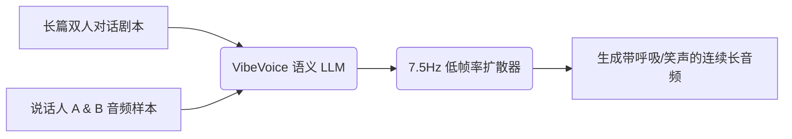

# 声音AI的终极颠覆！微软刚开源的 VibeVoice，让大模型开口讲出极致情感！

## 播客/有声书制作地狱：为什么 AI 声音克隆一大堆，读起长文来却全像“无感情的机器人”？


如果你尝试过用 AI 录制小说、制作双人对话播客、或者给技术教程配音，你一定会遇到这三个折磨人的“有声垃圾体验”：

1. **“气短、断句极其生硬”**：市面上绝大多数 TTS（文本转语音）工具都是“短跑选手”。只要你喂给它的段落超过 5 分钟，声音的语气就会开始逐渐变形，要么语速越来越快，要么像机器人一样喘不过气来。
2. **“无法进行自然互动”**：为了制作双人对话播客，你得分别生成两个人的音频，然后再去剪辑软件里一行行对轨、加呼吸声、加插科打诨的语气词。剪完一期 20 分钟的节目，你累得嗓子没冒烟，眼睛先瞎了。
3. **“中英混杂直接当场宕机”**：很多配音大模型，一旦遇到“我今天给代码做了一次 refactor，提升了 performance”这种夹带英文专业术语的句子，要么直接把英文发音发成塑料拼音，要么干脆当场死机。

**普通的语音合成太假，重型的商业合成太贵。**

就在今天，微软官方在 GitHub 上开源了 **VibeVoice**，瞬间把有声内容创作者的期待值拉到了顶点！

它的核心卖点堪称降维打击：**它是专为“超长音频”和“多角色对话”设计的 Frontier Voice AI。它能连续合成长达 90 分钟的极致情感音频，支持最多 4 人音色同场竞技克隆，并且支持 50 多种语言的 native（母语级）代码切换（Code-switching）！**

---

## 大白话拆解：VibeVoice 凭什么让 AI 说话“有呼吸感”？

我们用最直白的语言来拆解 VibeVoice 的核心黑科技。

以前的语音合成大模型就像是**一个背诵课文的学生**。
他必须看着逗号、句号，把长文章拆成一段段去念（分段推理）。由于每次念的都是短句子，他根本无法理解整篇文章的前后情感逻辑，读出来的声音就非常机械、干瘪。

而 **VibeVoice 就像是一个“捧着剧本的奥斯卡影帝”**：

* **超低帧率架构（7.5 Hz Tokenizer）**：它用极低的帧率把语音“压缩”成了高度抽象的声学和语义标记（Tokens）。这就好比它不是在死记硬背每个字怎么发音，而是在脑子里先画了一张“情感波动图”。
* **90分钟单次推理（Long-Form Synthesis）**：由于它对语音数据进行了高倍率压缩，它能够一口气吃下长达 90 分钟的文字，并在脑子里进行全局规划。这就保证了它在念第一分钟和第九十分钟时，语气、音色和呼吸节奏是完全一致、极其稳定的。
* **下一词扩散对话引擎（Next-Token Diffusion）**：它把“对话流”和“发音细节”结合在一起进行扩散推理。这就好比两个人坐在一起聊天，AI 会自动根据对方的语气，决定自己接下来是用叹气、笑声、还是插嘴来回应。

**它的本质是：极简声学表征 + 超大上下文扩散推理大模型。**

---

## 核心架构设计：VibeVoice 的“多声道”情感工作流

VibeVoice 的内部架构设计非常巧妙：



1. **多音色联合生成（ASR-TTS Unified Loop）**：
   它不仅是 TTS（生成声音），也包含 ASR（识别声音）。在运行多角色对话时，它能通过极少量的音频样本（仅需 3 秒），提取说话人的音色特征并融合成一段双声道对话音频。
2. **50+ 语言的原生中英代码切换（Code-Switching）**：
   它没有“语种切换”的生硬停顿。当读到中文里的英文单词时，它的发音模型会自动无缝以母语级别的口音发出来，听起来极其顺耳。
3. **对话逻辑闭环**：
   大模型在生成语音时，会自动插入“呃”、“哈”、“嗯”等语气助词和呼吸起伏，彻底打破了传统机器人的“冰冷机械感”。

---

## 创作者狂喜：VibeVoice 三大颠覆场景

### 场景一：一键自动生成高品质双人相声/播客
你只需要写好一段关于“对比 Rust 和 Go 语言优缺点”的对话脚本，塞给 VibeVoice。系统就能自动生成一段带背景白噪音、有呼吸声、偶尔会互相打趣插嘴的 20 分钟双人技术播客，直接可以发布到网易云或小宇宙！

### 场景二：情感充沛的超长有声书配音
你写了一本 10 万字的长篇科幻小说。传统的配音软件合成出来会让你听到睡着，而用 VibeVoice 跑一遍，你会发现 AI 在念到紧张剧情时语速会自动加快，在念到悲伤剧情时声音会带上颤音，质感直接媲美专业声优。

### 场景三：无缝的多语言视频译配
你需要把一段中文的技术讲解视频翻译并配音成纯正的英文。VibeVoice 不仅能把翻译好的英文词发出来，还能完美克隆你原本的中文音色和讲话情绪，让外国观众听起来就像是你在用英语演讲一样。

---

## 详细安装与部署步骤：在本地跑起你的“声音大工坊”！

VibeVoice 可以通过本地 GPU 运行。以下是部署和启动流程：

### 第一步：克隆仓库并建立 Python 虚拟环境

```bash
git clone https://github.com/microsoft/VibeVoice.git
cd VibeVoice
python3 -m venv venv
source venv/bin/activate
pip install -r requirements.txt
```

### 第二步：从 Hugging Face 下载微软预训练权重

你需要安装 `huggingface_hub` 并下载对应的模型卡（包含 ASR、TTS 和 7.5Hz Tokenizer）：

```bash
pip install huggingface_hub
huggingface-cli download microsoft/VibeVoice-TTS --local-dir ./models/VibeVoice-TTS
huggingface-cli download microsoft/VibeVoice-ASR --local-dir ./models/VibeVoice-ASR
```

### Third Step: 编写你的语音合成 Python 脚本 `synthesize.py`

在项目根目录下创建一个脚本，演示如何读取音色样本并进行超长双人对话合成：

```python
import torch
from vibevoice import VibeVoiceTTSPipeline

# 1. 初始化 Pipeline
pipeline = VibeVoiceTTSPipeline.from_pretrained("./models/VibeVoice-TTS")
pipeline.to("cuda" if torch.cuda.is_available() else "cpu")

# 2. 准备角色音色样本 (仅需 3 秒的 wav 文件)
speaker1_ref = "./samples/host_male.wav"
speaker2_ref = "./samples/guest_female.wav"

# 3. 编写对话剧本
script = """
[Host]: 大家好，欢迎来到赛博自习室！今天我们来聊聊微软刚刚开源的 VibeVoice。
[Guest]: 没错，听说它能连续合成 90 分钟的音频，而且声音非常 natural，带呼吸声的那种！
[Host]: 哇，那我们以后录播客岂不是可以彻底解放双手了？
"""

# 4. 生成超长语音
print("🎙️ 正在进行 VibeVoice 语义与情感建模...")
audio_output = pipeline.generate_dialogue(
    text=script,
    reference_audios={"Host": speaker1_ref, "Guest": speaker2_ref},
    temperature=0.75,
    max_duration=1200 # 生成 20 分钟以内的音频
)

# 5. 保存音频文件
audio_output.save("my_viral_podcast.wav")
print("🎉 播客音频已成功生成到 my_viral_podcast.wav !")
```

运行 `python3 synthesize.py`，你就能听到一段毫无死板感的双人对话播客了！

---

## 核心价值提示词：VibeVoice 剧本编导大导游

要让大模型写出符合 VibeVoice 扩散推理规律、包含丰富情感和语气指引的精品配音剧本，可以配合使用这套**编导提示词**：

```markdown
# Role: VibeVoice Executive Producer & Script Writer

## Goal
Write an engaging, highly interactive two-person podcast script designed for the VibeVoice text-to-speech engine. 

## Script Formatting Rules
1. **Speaker Tags**: Use strict tags `[SpeakerName]:` at the beginning of each line.
2. **Audio Overview Markers**: Embed emotional and non-verbal cues in brackets. VibeVoice parser reads these as synthesis triggers.
   - Examples: `[sigh]`, `[laughter]`, `[gasps]`, `[pauses]`, `[giggles]`, `[cough]`.
3. **Dialogue Dynamics**:
   - Keep sentences short.
   - Allow speakers to interrupt each other (e.g., end a sentence with "..." and start the next speaker with "...but wait!").
   - Use colloquial interjections: "umm", "like", "you know", "oh wow".
4. **Code-Switching**: Mix technical English terms naturally within Chinese sentences (e.g., "这个 feature 非常 nice，性能提升了 20%").

## Input Topic
Topic: [Insert your topic here, e.g., "Is Next.js overrated?"]
Characters:
- Host (Male, enthusiastic, fast-paced)
- Guest (Female, skeptical, detailed, developer)
```

---

## 辩证客观分析：VibeVoice 还有哪些硬伤和局限？

虽然 VibeVoice 的效果非常惊艳，但在实际玩耍时你必须做好以下心理准备：

* **极其吃显卡（GPU Limitation）**：由于它需要处理长达 90 分钟的声学上下文，对显存（VRAM）的要求极高。在本地运行时，建议至少配备一张拥有 16GB 以上显存的英伟达显卡（如 RTX 4080 或以上），否则编译长文时会频繁报 OOM（显存溢出）错误。
* **负责任的 AI 限制（Safety Guardrails）**：微软开源该项目时，为了防止有人恶意克隆政客或公众人物的声音进行欺诈，在模型中嵌入了严格的声学水印和防伪验证。尝试克隆一些敏感声学样本时，模型可能会触发内置拦截而拒绝合成。
* **冷启动与对齐问题**：如果你的 3 秒音色样本 wav 文件中带有严重的背景杂音或回声，VibeVoice 在克隆时会把这些杂音也一并无限放大，导致合成出来的声音带有浓重的电音感。

但瑕不掩瑜，**VibeVoice 代表了有声内容创作从“拼图剪辑”到“一键出片”的质的飞跃**。如果你也是自媒体、播客主播或有声书创作者，这个微软的良心开源项目，绝对值得你立刻开机体验！
